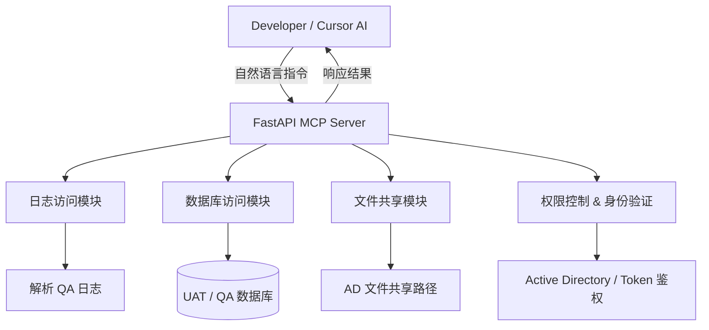

“构建一个基于 AI 辅助的 MCP（Multi-Channel Platform）开发者助手服务器”，目的是为开发人员提供一个能直接通过自然语言与日志、数据库和文件系统交互的统一调试平台。

---

### 🔍 项目概念解释

#### 核心目标：

构建一个 **AI 驱动的多功能开发者调试服务（MCP Server）**，通过自然语言查询方式（如 ChatGPT、Cursor、Copilot 接口）完成如下操作：

* 查询指定日志（例如：` qa inbound log`）
* 查询数据库数据（例如：某个 Claim 的 UAT VEI 数据）
* 访问文件共享（通过 Active Directory 或类似权限控制）
* 集成到 Cursor 等支持 AI 的 IDE，开发者只需“对话”，不需切换上下文

#### 关键组成：

* 🧠 AI 语言接口（如 ChatGPT / OpenAI）
* 🔧 IDE 插件（如 Cursor）
* 🔗 后端 MCP 服务（统一调试网关）
* 📂 日志检索引擎（log reader / ELK 或原始文本解析）
* 🛢 数据库连接池（用于查询 UAT、QA 等环境数据）
* 🔐 Active Directory 文件共享访问（如读取共享路径上的日志或报告）

---

### ✅ 优点（Pros）

| 优点         | 描述                                       |
| ---------- | ---------------------------------------- |
| **极大提升效率** | 开发者无需手动 SSH、登录数据库或文件系统，减少繁琐操作            |
| **降低门槛**   | 新成员不需要熟悉各种系统入口和路径，只需用自然语言提问              |
| **统一平台**   | MCP Server 作为一个统一后端入口，集成所有环境配置与服务        |
| **支持自动化**  | 可集成测试用例、部署验证、错误溯源等自动化任务                  |
| **AI 友好**  | 特别适配 Copilot/Cursor/ChatGPT 使用场景，具备未来适配性 |

---

### ⚠️ 缺点（Cons）

| 缺点              | 描述                                         |
| --------------- | ------------------------------------------ |
| **安全风险较高**      | 涉及数据库、日志、文件系统等多个权限边界，必须配置严密访问控制            |
| **环境配置复杂**      | 每个服务（DB、文件系统、日志路径）在不同环境（UAT/QA/PROD）下的配置繁琐 |
| **日志格式多样**      | 如果未统一日志格式，解析难度大，AI 模型可能无法准确提取错误            |
| **数据库查询标准化挑战**  | 查询数据可能涉及大量关联、视图、权限控制，构建统一查询接口难度大           |
| **对 AI 的依赖性较高** | 如使用自然语言处理失败或语义理解错误，可能导致错误查询或误导开发者          |
| **初期投资大**       | 虽然未来能节省人力，但初期开发与测试阶段投入较大（特别是安全、审计和权限方面）    |

---

### 🧪 适合场景示例

| 场景     | 示例                                                                      |
| ------ | ----------------------------------------------------------------------- |
| 日志快速排查 | “Show me the last 20 errors from inbound in QA”           |
| 数据问题验证 | “Fetch claim XML payload for claim #12345 in UAT”                   |
| 配置检查   | “What is the current environment variable setting for service X in QA?” |
| 文件下载   | “Give me the latest log file from \corp\logs”           |

---

### 🛠 推荐技术栈（以 Python 为例）

* **FastAPI / Flask**：构建 MCP API 服务
* **LangChain / OpenAI API**：处理自然语言理解和指令转换
* **pyodbc / SQLAlchemy**：连接 MSSQL / Oracle 等数据库
* **LDAP3 / pywin32**：访问 Active Directory / 文件共享系统
* **Logtail / Filebeat**：日志收集或定制解析模块
* **Role-based ACL + Token 认证**：细粒度权限控制

---

### 🚀 小结建议

这是一个非常具有前瞻性的“AI + DevOps + Developer Productivity”工具构想，尤其适合大型企业中多环境、多系统并存的复杂场景。

如果你能先构建一些 **“高价值场景” 的最小可行原型（MVP）** —— 比如：

* 能查最近 100 行日志
* 能取指定 claim 数据
* 能列 QA 环境配置

然后逐步扩展权限控制和接口封装，会大大降低项目复杂度。

---

## ✅ 1. Mermaid 架构图（MCP Server）



> 🔍 **说明**：

* 所有用户请求由 FastAPI 接收并分发给子模块
* 权限模块负责验证用户身份并控制访问资源（日志、数据库、文件）
* 支持多环境资源调用（UAT、QA 等）

---

## ✅ 2. 权限控制设计（RBAC + 多资源控制）

### 🌐 设计原则：

* 使用 OAuth2 Bearer Token 或 AD 登录进行身份认证
* RBAC 模型支持不同层级用户权限（如：`log_read`, `db_query`, `fs_access`）
* 各模块在操作前都调用统一 `权限中间件` 进行检查

### 示例权限模型（简化版）：

| 用户角色  | 权限点                           | 可访问资源                          |
| ----- | ----------------------------- | ------------------------------ |
| Dev   | `log:read`, `db:query`        | QA Logs, UAT DB                |
| Lead  | `log:read`, `db:*`, `fs:read` | QA Logs, UAT/QA DB, Log Shares |
| Admin | `*`                           | 所有资源                           |

### 🧱 Token 验证流程：

1. 登录成功后颁发 `JWT Token`
2. 每个请求带上 Token
3. 权限中间件解析 Token 并查询对应权限
4. 权限不足则拒绝访问，返回 `403`

---

## ✅ 3. FastAPI 实现骨架代码（简化版）

```python
from fastapi import FastAPI, Depends, HTTPException
from fastapi.security import OAuth2PasswordBearer
from pydantic import BaseModel

app = FastAPI()
oauth2_scheme = OAuth2PasswordBearer(tokenUrl="token")

# 模拟权限数据库
USER_PERMISSIONS = {
    "alice": ["log:read", "db:query"],
    "bob": ["log:read", "db:query", "fs:read"],
    "admin": ["*"]
}

def get_current_user(token: str = Depends(oauth2_scheme)):
    # 简化逻辑：token 直接作为用户名
    if token not in USER_PERMISSIONS:
        raise HTTPException(status_code=403, detail="Unauthorized")
    return token

def check_permission(user: str, perm: str):
    perms = USER_PERMISSIONS.get(user, [])
    if "*" in perms or perm in perms:
        return True
    raise HTTPException(status_code=403, detail="Permission denied")

@app.get("/logs/latest")
def read_logs(env: str = "qa", user: str = Depends(get_current_user)):
    check_permission(user, "log:read")
    return {"message": f"Reading logs from {env} environment..."}

@app.get("/db/claim/{claim_id}")
def read_claim_data(claim_id: str, user: str = Depends(get_current_user)):
    check_permission(user, "db:query")
    return {"claim_id": claim_id, "data": "VEI info from UAT DB"}

@app.get("/fs/download")
def read_file(path: str, user: str = Depends(get_current_user)):
    check_permission(user, "fs:read")
    return {"file": path, "status": "downloaded"}
```

---

### 🧩 后续建议

| 模块      | 建议技术栈                                     |
| ------- | ----------------------------------------- |
| 身份验证    | OAuth2 / Active Directory + JWT           |
| 日志查询    | ELK stack / 自建 LogReader 工具               |
| DB 查询   | SQLAlchemy + 查询模板库                        |
| 文件访问    | 使用 `pywin32` 或 `smbprotocol` 访问文件共享路径     |
| 自然语言解释层 | OpenAI API + LangChain，或结构化 prompt parser |

---

如需我帮你：

* 添加数据库实时连接查询
* 调用 ChatGPT 自动分析日志行并返回摘要
* 添加更复杂的日志/文件路径配置（如 `YAML + 多环境切换支持`）
