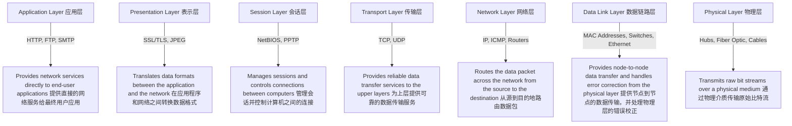

### Machine Learning Algorithms Overview
### 机器学习算法概述

This diagram provides a comprehensive overview of various machine learning algorithms, categorized into different types and their applications.

此图提供了各种机器学习算法的全面概述，按不同类型和应用进行分类。

### Categories of Machine Learning Algorithms
### 机器学习算法类别

#### 1. Supervised Learning
#### 监督学习

- **Classification (分类):**
  - **K-Nearest Neighbors (KNN)**: A simple, instance-based learning algorithm.
  - **Logistic Regression (逻辑回归)**: Used for binary classification problems.
  - **Na

This diagram provides a comprehensive overview of various machine learning algorithms, categorized into different types and their applications.

### Machine Learning Algorithms Overview
### 机器学习算法概述

### Categories of Machine Learning Algorithms
### 机器学习算法类别

#### 1. Supervised Learning
#### 监督学习

- **Classification (分类):**
  - **K-Nearest Neighbors (KNN)**: A simple, instance-based learning algorithm.
  - **Logistic Regression (逻辑回归)**: Used for binary classification problems.
  - **Naive Bayes (朴素贝叶斯)**: Based on Bayes' theorem with strong independence assumptions.
  - **Decision Trees (决策树)**: Tree-like models used for decision making and classification.
  - **Support Vector Machines (SVM, 支持向量机)**: Finds the hyperplane that best separates classes.
  - **Random Forest (随机森林)**: An ensemble of decision trees to improve accuracy.
  - **Gradient Boosting Machines (GBM, 梯度提升机)**: Ensemble method that builds models sequentially.
  - **Neural Networks (神经网络)**: Highly flexible models for various classification tasks.

- **Regression (回归):**
  - **Linear Regression (线性回归)**: Models the relationship between a dependent variable and one or more independent variables.
  - **Polynomial Regression (多项式回归)**: Extends linear regression by considering polynomial relationships.
  - **Ridge Regression (岭回归)**: Linear regression with L2 regularization.
  - **Lasso Regression (套索回归)**: Linear regression with L1 regularization.
  - **Support Vector Regression (SVR, 支持向量回归)**: Uses support vector machines for regression tasks.
  - **Decision Trees (决策树)**: Also applicable for regression tasks.
  - **Random Forest (随机森林)**: Ensemble method for regression.
  - **Gradient Boosting (梯度提升)**: Ensemble method for improving regression accuracy.

#### 2. Unsupervised Learning
#### 无监督学习

- **Clustering (聚类):**
  - **K-Means (K-均值)**: Partitions data into K clusters based on similarity.
  - **DBSCAN (Density-Based Spatial Clustering of Applications with Noise)**: Clusters data based on density.
  - **Hierarchical Clustering (层次聚类)**: Builds a hierarchy of clusters.
  - **Gaussian Mixture Models (GMM, 高斯混合模型)**: Assumes data is generated from a mixture of several Gaussian distributions.

- **Dimensionality Reduction (降维):**
  - **Principal Component Analysis (PCA, 主成分分析)**: Reduces data dimensionality by transforming variables into principal components.
  - **Singular Value Decomposition (SVD, 奇异值分解)**: Factorizes a matrix into singular vectors and values.
  - **Independent Component Analysis (ICA, 独立成分分析)**: Finds independent components from data.
  - **t-Distributed Stochastic Neighbor Embedding (t-SNE, t-SNE分布式邻域嵌入)**: Reduces dimensions while preserving the relationships between data points.
  - **Linear Discriminant Analysis (LDA, 线性判别分析)**: Projects data in a way that maximizes class separability.

- **Association (关联):**
  - **Apriori Algorithm (Apriori算法)**: Identifies frequent itemsets and association rules.
  - **ECLAT Algorithm (ECLAT算法)**: Another algorithm for frequent itemset mining.
  - **FP-Growth Algorithm (FP-Growth算法)**: Efficiently finds frequent patterns without candidate generation.

#### 3. Reinforcement Learning
#### 强化学习

- **Value-Based (基于值的):**
  - **Q-Learning (Q学习)**: Learns the value of actions in each state.
  - **Deep Q-Network (DQN, 深度Q网络)**: Uses deep learning to improve Q-learning.

- **Policy-Based (基于策略的):**
  - **REINFORCE Algorithm (REINFORCE算法)**: A Monte Carlo policy gradient method.
  - **Proximal Policy Optimization (PPO, 近端策略优化)**: Improves training stability and performance.

- **Model-Based (基于模型的):**
  - **AlphaZero**: Learns from self-play using reinforcement learning.
  - **Dyna-Q**: Combines learning, planning, and reacting.

- **Other Algorithms (其他算法):**
  - **Actor-Critic Methods (AC, A2C)**: Combines actor and critic to improve policy learning.
  - **Deep Deterministic Policy Gradient (DDPG, 深度确定性策略梯度)**: Extends DPG with deep learning.
  - **Twin Delayed DDPG (TD3, 双延迟DDPG)**: Addresses some limitations of DDPG.
  - **Soft Actor-Critic (SAC, 软演员评论员)**: Uses entropy regularization to improve exploration.

### Example Code in Node.js
### Node.js示例代码

#### Linear Regression Example
#### 线性回归示例

```javascript
const tf = require('@tensorflow/tfjs-node');

// Generate some synthetic data for training
const xs = tf.tensor2d([1, 2, 3, 4], [4, 1]);
const ys = tf.tensor2d([1, 3, 5, 7], [4, 1]);

// Create a simple linear model
const model = tf.sequential();
model.add(tf.layers.dense({units: 1, inputShape: [1]}));

// Compile the model
model.compile({optimizer: 'sgd', loss: 'meanSquaredError'});

// Train the model
model.fit(xs, ys, {epochs: 500}).then(() => {
    // Use the model to do inference on a data point
    model.predict(tf.tensor2d([5], [1, 1])).print();
});
```

This example uses TensorFlow.js to create and train a simple linear regression model.

该示例使用 TensorFlow.js 创建并训练一个简单的线性回归模型。

---

### Markdown Diagram for OSI Model
### OSI模型的Markdown图表



This markdown diagram illustrates the OSI model layers and their respective functions.

此Markdown图表展示了OSI模型的各层及其各自的功能。
