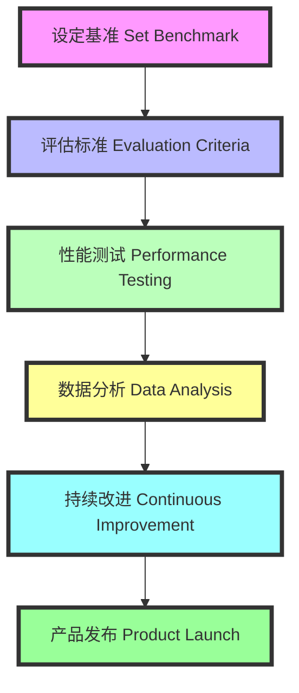

### 在大模型项目中构造好 Benchmark 的重要性 (The Importance of Creating Good Benchmarks in Large Model Projects)

#### Benchmark 的重要性 (Importance of Benchmarks)

1. **产品经理 (Product Manager)**
    - **目标 (Goals):** 成功标准，上线，盈利？
    - **Success Criteria:** Launch, profit?

2. **工程师 (Engineer)**
    - **问题 (Questions):** 哪个模型？精度？
    - **Model Selection:** Accuracy?

3. **性能优化 (Performance Optimization)**
    - **目标 (Goals):** 减少误差，提高效率。
    - **Goals:** Reduce errors, improve efficiency.

#### 示例 (Examples)

1. **产品上线前评估 (Pre-launch Evaluation)**
    - **问题 (Issue):** 确定产品是否满足上线标准。
    - **解决方案 (Solution):** 使用Benchmark测试功能、性能和用户体验。

2. **模型选择 (Model Selection)**
    - **问题 (Issue):** 选择最适合的模型用于生产环境。
    - **解决方案 (Solution):** 比较多个模型的Benchmark结果，选择最佳方案。

3. **性能监控 (Performance Monitoring)**
    - **问题 (Issue):** 持续监控产品性能，识别瓶颈。
    - **解决方案 (Solution):** 定期运行Benchmark，确保产品在各个阶段的高效运行。

4. **优化资源使用 (Optimize Resource Usage)**
    - **问题 (Issue):** 确保资源分配合理，避免浪费。
    - **解决方案 (Solution):** 使用Benchmark数据调整资源分配策略。

5. **客户满意度 (Customer Satisfaction)**
    - **问题 (Issue):** 提高产品的客户满意度。
    - **解决方案 (Solution):** 使用Benchmark分析用户反馈，持续改进产品。

#### Markdown 流程图 (Markdown Flow)

通过以上示例和流程图，可以帮助理解在大模型项目中构造好Benchmark的重要性，以及如何通过Benchmark优化产品性能和用户体验。
