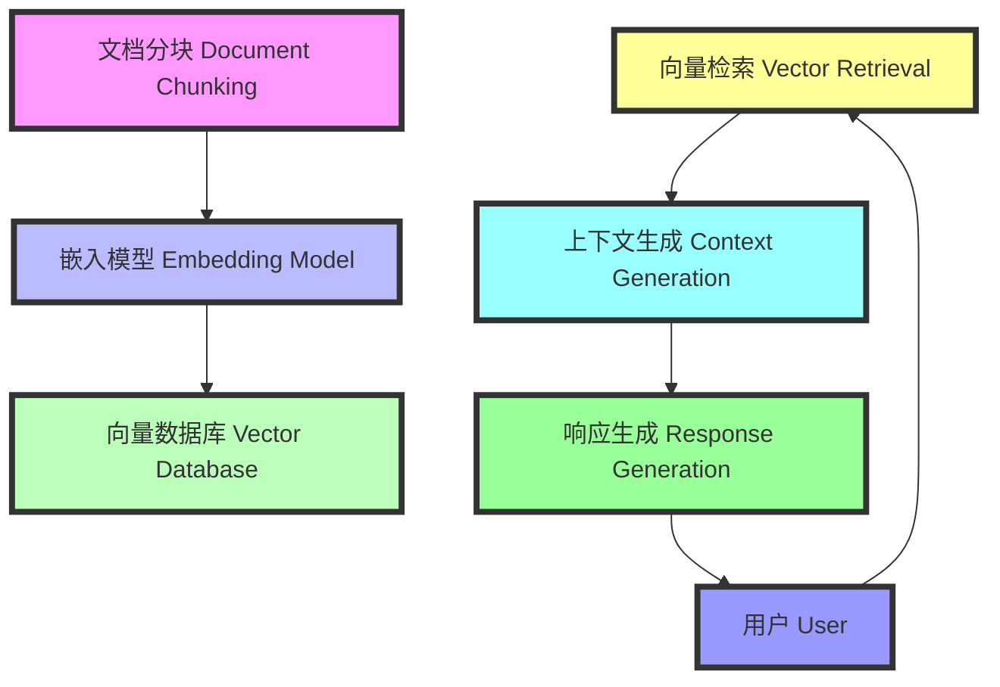

### RAG 实战中常见的问题 (Common Issues in Practical RAG Implementation)

#### 问题 (Issues)

1. **文档格式多样性 (Diversity of Document Formats):**
    - 处理多种格式的文档如PDF、PPT、Excel可能会带来解析和分块的挑战。
    - Handling various document formats like PDF, PPT, and Excel can pose challenges in parsing and chunking.

2. **分块策略 (Chunking Strategy):**
    - 如何合理地将文档分块以提高检索效果是一个重要问题。
    - Deciding on an effective chunking strategy to improve retrieval results is crucial.

3. **嵌入模型选择 (Embedding Model Selection):**
    - 选择合适的嵌入模型来生成向量表示直接影响检索精度。
    - Choosing the right embedding model to generate vector representations directly affects retrieval accuracy.

4. **向量数据库的管理 (Managing Vector Database):**
    - 向量数据库的规模和性能需要精心管理以保证高效检索。
    - The scale and performance of the vector database need to be managed carefully to ensure efficient retrieval.

5. **检索和排序算法 (Retrieval and Ranking Algorithms):**
    - 选择和优化检索及排序算法以提高相关性和响应速度。
    - Selecting and optimizing retrieval and ranking algorithms to enhance relevance and response speed.

6. **上下文生成的准确性 (Accuracy of Context Generation):**
    - 上下文生成的准确性决定了最终响应的质量。
    - The accuracy of context generation determines the quality of the final response.

7. **用户输入的处理 (Handling User Inputs):**
    - 如何有效处理用户输入的问题和需求，以生成有价值的响应。
    - Effectively handling user inputs and requests to generate valuable responses.

8. **大语言模型的性能 (Performance of LLM):**
    - 确保大语言模型在响应生成过程中表现良好且高效。
    - Ensuring that the LLM performs well and efficiently during response generation.

9. **系统响应速度 (System Response Time):**
    - 整个系统的响应速度需要优化以提供即时反馈。
    - Optimizing the system's response time to provide immediate feedback.

10. **数据隐私和安全 (Data Privacy and Security):**
    - 确保用户数据和私有数据在处理过程中的隐私和安全。
    - Ensuring the privacy and security of user data and private data during processing.

#### 示例 (Examples)

1. **法律文件搜索 (Legal Document Search):**
    - **问题 (Issue):** 处理不同格式的法律文件以提供准确的法律解释。
    - **解决方案 (Solution):** 使用多种解析器和优化的嵌入模型来处理多样化的文档格式。

2. **合同审查 (Contract Review):**
    - **问题 (Issue):** 合同内容分块策略影响检索结果的精度。
    - **解决方案 (Solution):** 采用动态分块策略，根据合同内容自动调整分块大小。

3. **法律案例分析 (Legal Case Analysis):**
    - **问题 (Issue):** 向量数据库的规模增长影响检索速度。
    - **解决方案 (Solution):** 使用分布式向量数据库来管理大规模数据，提高检索效率。

4. **法律研究 (Legal Research):**
    - **问题 (Issue):** 用户输入的问题多样且复杂，影响生成响应的准确性。
    - **解决方案 (Solution):** 开发智能问题理解模块，优化用户输入处理。

5. **法规更新通知 (Regulation Update Notification):**
    - **问题 (Issue):** 新法规的即时检索和通知存在延迟。
    - **解决方案 (Solution):** 实时监控法律数据库，优化检索算法以提高响应速度。

#### Markdown 流程图 (Markdown Flow)

通过以上示例和工作流程，可以帮助新手更好地理解 RAG 增强检索系统的工作原理和应用场景。
