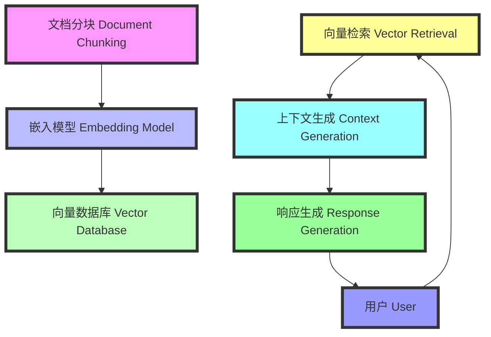

### RAG 增强检索工作流程 (How RAG Enhanced Search Works)

#### 工作流程 (Workflow)

1. **文档分块 (Document Chunking):**
    - 文档被分成多个小块 (Documents are split into smaller chunks)。
    - 每个小块被传送到嵌入模型 (Each chunk is passed to an embedding model)。

2. **嵌入模型 (Embedding Model):**
    - 嵌入模型将每个文档小块转换为向量 (The embedding model converts each document chunk into vectors)。
    - 这些向量被存储在向量数据库中 (These vectors are stored in a vector database)。

3. **向量检索 (Vector Retrieval):**
    - 用户提出问题 (The user poses a question)。
    - 问题被转换为查询向量 (The question is converted into a query vector)。
    - 查询向量在向量数据库中检索最相关的文档向量 (The query vector retrieves the most relevant document vectors from the vector database)。

4. **上下文生成 (Context Generation):**
    - 检索到的文档向量被转换为上下文 (The retrieved document vectors are converted into context)。
    - 上下文与用户问题一起输入到大语言模型 (LLM) 中 (The context is input into the Large Language Model (LLM) along with the user's question)。

5. **响应生成 (Response Generation):**
    - 大语言模型基于输入生成响应 (The LLM generates a response based on the inputs)。
    - 生成的响应提供给用户 (The generated response is provided to the user)。

#### 示例 (Examples)

1. **法律文件搜索 (Legal Document Search):**
    - **场景 (Scenario):** 用户需要找到关于特定法律条款的详细信息。
    - **过程 (Process):**
      1. 提交问题，如“什么是知识产权法？”
      2. 向量数据库检索相关法律文件。
      3. 大语言模型生成详细的法律解释。

2. **合同审查 (Contract Review):**
    - **场景 (Scenario):** 用户希望快速审查合同条款。
    - **过程 (Process):**
      1. 上传合同文档。
      2. 文档分块和向量化。
      3. 提出问题，如“合同中的付款条款是什么？”
      4. 检索相关条款并生成解释。

3. **法律案例分析 (Legal Case Analysis):**
    - **场景 (Scenario):** 律师需要查找类似的法律案例。
    - **过程 (Process):**
      1. 提出问题，如“有没有类似的知识产权侵权案例？”
      2. 检索法律数据库中的相关案例。
      3. 生成总结和分析。

4. **法律研究 (Legal Research):**
    - **场景 (Scenario):** 学生需要了解特定法律概念的背景。
    - **过程 (Process):**
      1. 提出问题，如“民事诉讼的主要步骤是什么？”
      2. 检索相关法律文献。
      3. 生成详细解释。

5. **法规更新通知 (Regulation Update Notification):**
    - **场景 (Scenario):** 公司需要及时了解新法规。
    - **过程 (Process):**
      1. 系统自动扫描法律数据库。
      2. 检索最新法规。
      3. 生成更新通知并发送给相关部门。

#### Markdown 流程图 (Markdown Flow)

通过上述示例和工作流程，可以帮助新手更好地理解 RAG 增强检索系统的工作原理和应用场景。
