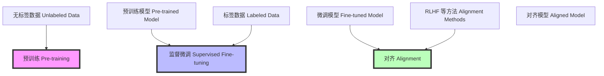

### 大模型预训练和微调 (Understanding Pre-training and Fine-tuning of Large Models)

#### 工作流程 (Workflow)

1. **预训练 (Pre-training):**
    - **步骤 (Steps):**
      1. 使用大量的无标签数据 (Unlabeled Data) 训练模型。
      2. 模型学习基本语言模式和知识 (Learn Basic Language Patterns and Knowledge)。
      3. 得到预训练模型 (Pre-trained Model)。

2. **监督微调 (Supervised Fine-tuning, SFT):**
    - **步骤 (Steps):**
      1. 使用标签数据 (Labeled Data) 对预训练模型进行微调 (Fine-tune the Pre-trained Model)。
      2. 调整模型以学习特定任务的输入和输出 (Adjust the Model to Learn Specific Task Inputs and Outputs)。
      3. 得到微调模型 (SFT Model)。

3. **对齐 (Alignment):**
    - **步骤 (Steps):**
      1. 将模型输出与人类偏好或政策对齐 (Align Model Output with Human Preferences or Policies)。
      2. 使用对齐方法 (例如RLHF) 调整模型 (Use Alignment Methods, e.g., RLHF)。
      3. 得到对齐模型 (Aligned Model)。

#### 示例 (Examples)

1. **法律文件分类 (Legal Document Classification):**
    - **场景 (Scenario):** 预训练模型学习基本的语言模式。
    - **微调 (Fine-tuning):** 使用法律文件分类数据集微调模型。
    - **对齐 (Alignment):** 确保模型输出符合法律专家的分类标准。

2. **合同审查 (Contract Review):**
    - **场景 (Scenario):** 预训练模型学习语言结构。
    - **微调 (Fine-tuning):** 使用标记过的合同数据进行微调。
    - **对齐 (Alignment):** 模型输出与法律规定和合同审查准则对齐。

3. **法律咨询生成 (Legal Advice Generation):**
    - **场景 (Scenario):** 预训练模型掌握基本的语法和知识。
    - **微调 (Fine-tuning):** 使用法律咨询问答数据集进行微调。
    - **对齐 (Alignment):** 输出的法律咨询符合律师的专业意见。

4. **法律案例检索 (Legal Case Retrieval):**
    - **场景 (Scenario):** 预训练模型了解文档和文本关系。
    - **微调 (Fine-tuning):** 使用法律案例数据集进行微调。
    - **对齐 (Alignment):** 确保检索结果与律师需求一致。

5. **合同生成 (Contract Generation):**
    - **场景 (Scenario):** 预训练模型掌握语言模式。
    - **微调 (Fine-tuning):** 使用合同模板和示例数据集进行微调。
    - **对齐 (Alignment):** 输出合同符合法律和客户要求。

#### Markdown 流程图 (Markdown Flow)

通过上述流程和示例，可以更好地理解大模型的预训练和微调过程，以及在法律领域中的实际应用。
