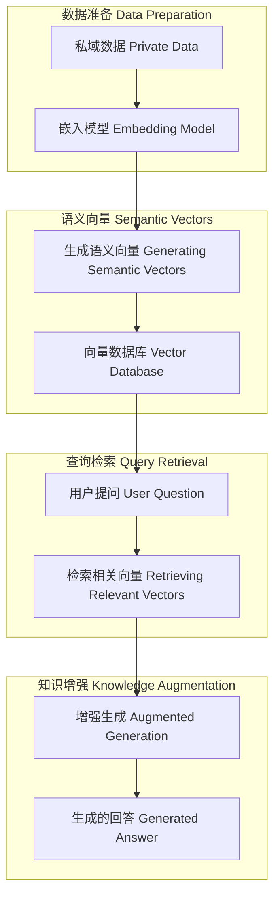

# RAG的基本原理 (The Basic Principles of RAG)

RAG (Retrieval-Augmented Generation) 是一种结合信息检索和生成模型的方法，用于提高生成模型的准确性和可靠性。以下是RAG的工作流程及其详细示例解释：

#### 1. 数据准备 (Data Preparation)

**私域数据 (Private Data):**
- **数据来源 (Data Sources):** 包括MySQL数据库、网页数据（如Chrome浏览器）、办公文件（如Microsoft Office）、视频数据等。
- **示例 (Example):** 
  - 一个公司内部的知识库，包含员工手册、项目文档和视频培训资料。
  - MySQL数据库中存储了公司员工的培训记录和项目进展情况。
  - Chrome浏览器保存了与项目相关的网页书签和在线资源。
  - Office文档中记录了详细的项目说明和技术规范。

**嵌入模型 (Embedding Model):**
- **功能 (Function):** 将私域数据转换为向量表示，便于后续的语义搜索。
- **示例 (Example):**
  - 使用BERT模型将文档内容转换为语义向量表示，比如“如何使用公司VPN”的文档被表示为一个向量数组。

#### 2. 语义向量 (Semantic Vectors)

**生成语义向量 (Generating Semantic Vectors):**
- **过程 (Process):** 嵌入模型将输入的数据转换为高维语义向量，表示数据的核心含义。
- **示例 (Example):**
  - 文档 “如何使用公司VPN” 被转换为向量 [0.011, -0.011, 0.032, ...]。
  - 视频培训资料被处理成文本后，也可以被转换为相应的向量表示。

#### 3. 向量数据库 (Vector Database)

**存储向量 (Storing Vectors):**
- **功能 (Function):** 将生成的语义向量存储在向量数据库中，便于快速检索。
- **示例 (Example):**
  - 使用Faiss或Milvus数据库存储转换后的文档向量。
  - 数据库中存储了不同类型的数据，如文档、网页内容、视频等对应的向量表示。

#### 4. 查询检索 (Query Retrieval)

**问题输入 (Question Input):**
- **用户提问 (User Question):** 用户提出一个问题或查询。
- **示例 (Example):**
  - 用户提问“如何设置公司VPN？”
  - 用户提问“项目进度报告在哪里？”

**检索相关向量 (Retrieving Relevant Vectors):**
- **过程 (Process):** 系统根据用户提问的语义向量在向量数据库中检索最相关的向量。
- **示例 (Example):**
  - 系统找到与用户提问相似度最高的向量，如与“如何使用公司VPN”相关的向量。
  - 对于“项目进度报告在哪里？”的问题，系统会检索到与项目进展相关的文档向量。

#### 5. 知识增强 (Knowledge Augmentation)

**增强生成 (Augmented Generation):**
- **过程 (Process):** 将检索到的相关向量和LLM（大模型）结合，生成详细的回答。
- **示例 (Example):**
  - 系统使用检索到的“如何使用公司VPN”的文档向量，结合LLM生成一个详细的VPN设置指南。
  - 对于“项目进度报告在哪里？”的问题，系统结合检索到的项目进展向量，生成一份项目进度的总结报告。

通过这些详细的步骤和示例，RAG能够利用私域数据提供更加准确和详细的回答，提高用户查询的准确性和实用性。

### 用户案例 (User Cases)

#### 案例1：IT支持 (Case 1: IT Support)

**场景 (Scenario):**
公司内部的IT支持团队需要回答员工提出的各种技术问题。

**用户提问 (User Question):**
“如何连接到公司WiFi？”

**RAG流程 (RAG Process):**
- **数据准备 (Data Preparation):** IT知识库中有关于WiFi连接的文档和指南。
- **嵌入模型 (Embedding Model):** 将WiFi连接指南文档转换为语义向量。
- **语义向量 (Semantic Vectors):** 存储WiFi连接指南的向量。
- **查询检索 (Query Retrieval):** 用户提出“如何连接到公司WiFi”的问题，系统检索相关向量。
- **知识增强 (Knowledge Augmentation):** 系统结合检索到的向量和生成模型，生成详细的WiFi连接步骤。

**生成的回答 (Generated Answer):**
“请按照以下步骤连接到公司WiFi：
1. 打开设备的WiFi设置。
2. 搜索并选择公司WiFi网络。
3. 输入公司提供的WiFi密码。
4. 点击连接，等待设备成功连接到网络。”

#### 案例2：客户支持 (Case 2: Customer Support)

**场景 (Scenario):**
在线零售公司的客户支持团队需要解答客户的常见问题。

**用户提问 (User Question):**
“如何退货？”

**RAG流程 (RAG Process):**
- **数据准备 (Data Preparation):** 客服知识库中有关于退货流程的详细说明和政策文件。
- **嵌入模型 (Embedding Model):** 将退货流程文档转换为语义向量。
- **语义向量 (Semantic Vectors):** 存储退货流程的向量。
- **查询检索 (Query Retrieval):** 用户提出“如何退货”的问题，系统检索相关向量。
- **知识增强 (Knowledge Augmentation):** 系统结合检索到的向量和生成模型，生成详细的退货指南。

**生成的回答 (Generated Answer):**
“要退货，请按照以下步骤操作：
1. 登录您的账户并访问订单历史记录。
2. 选择要退货的订单并点击‘退货’按钮。
3. 填写退货原因并选择退货方式。
4. 打印退货标签并将商品和标签一起放入包裹。
5. 前往最近的邮局或快递点，将包裹寄回我们公司。”

#### 案例3：法律咨询 (Case 3: Legal Consultation)

**场景 (Scenario):**
法律事务所的律师需要快速检索相关的法律条款和案例来回答客户的问题。

**用户提问 (User Question):**
“公司合同纠纷应该如何处理？”

**RAG流程 (RAG Process):**
- **数据准备 (Data Preparation):** 法律知识库中有关于合同法的详细条款和案例。
- **嵌入模型 (Embedding Model):** 将合同法文档和案例转换为语义向量。
- **语义向量 (Semantic Vectors):** 存储合同法条款和相关案例的向量。
- **查询检索 (Query Retrieval):** 律师提出“公司合同纠纷应该如何处理”的问题，系统检索相关向量。
- **知识增强 (Knowledge Augmentation):** 系统结合检索到的向量和生成模型，生成详细的处理指南。

**生成的回答 (Generated Answer):**
“公司合同纠纷的处理步骤如下：
1. 确认合同条款的有效性和约定内容。
2. 调查纠纷的具体原因和双方责任。
3. 尝试通过协商和解，避免诉讼。
4. 如果协商失败，可以向法院提起诉讼，提供相关证据和法律依据。
5. 在诉讼过程中，保持与律师的沟通，确保提供全面的案件信息。”

#### 案例4：合规审核 (Case 4: Compliance Review)

**场景 (Scenario):**
企业合规部门需要审查公司运营是否符合最新的法律法规。

**用户提问 (User Question):**
“我们的数据处理流程是否符合GDPR规定？”

**RAG流程 (RAG Process):**
- **数据准备 (Data Preparation):** 合规知识库中有关于GDPR（通用数据保护条例）的详细条款和要求。
- **嵌入模型 (Embedding Model):** 将GDPR文档和案例转换为语义向量。
- **语义向量 (Semantic Vectors):** 存储GDPR条款和合规案例的向量。
- **查询检索 (Query Retrieval):** 合规部门提出“我们的数据处理流程是否符合GDPR规定”的问题，系统检索相关向量。
- **知识增强 (Knowledge Augmentation):** 系统结合检索到的向量和生成模型，生成详细的合规审核报告。

**生成的回答 (Generated Answer):**
“根据GDPR规定，数据处理流程需满足以下要求：
1. 数据处理需获得数据主体的明确同意。
2. 处理的数据应为特定、明确和合法的目的。
3. 采取适当的技术和组织措施保护数据安全。
4. 数据主体有权访问、修改和删除其个人数据。
5. 公司需设立数据保护官员，负责监督合规情况。”

#### 案例5：知识产权保护

 (Case 5: Intellectual Property Protection)

**场景 (Scenario):**
律师事务所的知识产权律师需要为客户提供商标注册和侵权保护的建议。

**用户提问 (User Question):**
“如何保护我的商标免受侵权？”

**RAG流程 (RAG Process):**
- **数据准备 (Data Preparation):** 知识产权知识库中有关于商标法的详细条款和案例。
- **嵌入模型 (Embedding Model):** 将商标法文档和案例转换为语义向量。
- **语义向量 (Semantic Vectors):** 存储商标法条款和相关案例的向量。
- **查询检索 (Query Retrieval):** 知识产权律师提出“如何保护我的商标免受侵权”的问题，系统检索相关向量。
- **知识增强 (Knowledge Augmentation):** 系统结合检索到的向量和生成模型，生成详细的商标保护建议。

**生成的回答 (Generated Answer):**
“保护商标免受侵权的步骤如下：
1. 注册商标：确保商标在相关国家和地区正式注册。
2. 监测市场：定期监测市场，发现潜在的侵权行为。
3. 采取法律行动：发现侵权行为后，立即向侵权方发出停止侵权通知书。
4. 诉讼保护：如果侵权方不停止侵权行为，可以向法院提起商标侵权诉讼。
5. 维持商标：定期使用和维护商标，确保商标持续有效。”

#### 案例6：合同审查 (Case 6: Contract Review)

**场景 (Scenario):**
法律事务所的律师需要审查客户的商业合同，以确保其符合相关法律法规。

**用户提问 (User Question):**
“这份商业合同是否有潜在的法律风险？”

**RAG流程 (RAG Process):**
- **数据准备 (Data Preparation):** 法律知识库中有关于商业合同的详细条款和审查指南。
- **嵌入模型 (Embedding Model):** 将商业合同文档和审查指南转换为语义向量。
- **语义向量 (Semantic Vectors):** 存储商业合同条款和审查指南的向量。
- **查询检索 (Query Retrieval):** 律师提出“这份商业合同是否有潜在的法律风险”的问题，系统检索相关向量。
- **知识增强 (Knowledge Augmentation):** 系统结合检索到的向量和生成模型，生成详细的合同审查报告。

**生成的回答 (Generated Answer):**
“根据商业合同审查指南，这份合同可能存在以下法律风险：
1. 合同条款不明确，可能导致履约纠纷。
2. 违约责任未明确规定，需补充违约条款。
3. 合同期限和终止条件不清晰，建议详细规定。
4. 涉及知识产权的条款需进一步明确，保护双方权益。
5. 建议增加争议解决条款，明确争议解决方式和管辖地。”

### Markdown Flow Diagram

