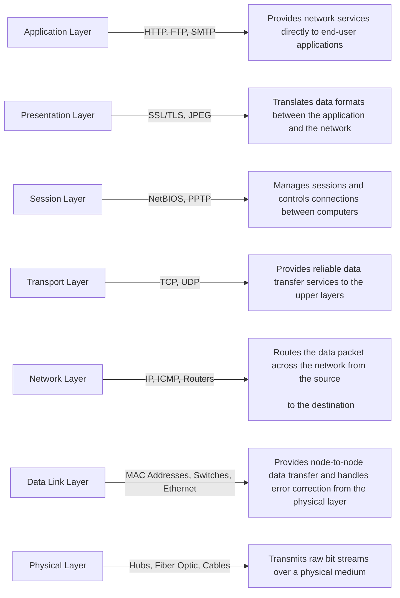

# API Usage Strategy

Developing and implementing an effective API usage strategy is critical for optimizing performance, ensuring security, and maintaining scalability of your applications.

---

### 1. **Authentication and Authorization**

- **Token-based Authentication**: Use tokens (e.g., JWT) to authenticate API requests.
  - **Example**: Implementing OAuth 2.0 for secure access.
  - **Node.js Code**:
    ```javascript
    const express = require('express');
    const jwt = require('jsonwebtoken');
    const app = express();

    app.post('/login', (req, res) => {
      const user = { id: 1 }; // Example user
      const token = jwt.sign({ user }, 'secret_key');
      res.json({ token });
    });

    const authenticateToken = (req, res, next) => {
      const token = req.header('Authorization').split(' ')[1];
      if (!token) return res.sendStatus(401);
      jwt.verify(token, 'secret_key', (err, user) => {
        if (err) return res.sendStatus(403);
        req.user = user;
        next();
      });
    };

    app.get('/protected', authenticateToken, (req, res) => {
      res.send('This is a protected route');
    });

    app.listen(3000, () => console.log('Server started on port 3000'));
    ```

---

### 2. **Rate Limiting**

- **Purpose**: Prevent abuse and ensure fair use of API resources.
  - **Example**: Limiting each user to 1000 API calls per hour.
  - **Node.js Code**:
    ```javascript
    const rateLimit = require('express-rate-limit');

    const limiter = rateLimit({
      windowMs: 60 * 60 * 1000, // 1 hour
      max: 1000, // limit each IP to 1000 requests per windowMs
      message: 'Too many requests, please try again later.'
    });

    app.use(limiter);
    ```

---

### 3. **Caching**

- **Purpose**: Improve performance by storing responses for commonly requested data.
  - **Example**: Using Redis to cache API responses.
  - **Node.js Code**:
    ```javascript
    const redis = require('redis');
    const client = redis.createClient();

    app.get('/data', (req, res) => {
      const key = 'data';
      client.get(key, (err, data) => {
        if (data) {
          return res.json(JSON.parse(data));
        } else {
          const fetchedData = { example: 'data' }; // Example data
          client.setex(key, 3600, JSON.stringify(fetchedData)); // Cache for 1 hour
          res.json(fetchedData);
        }
      });
    });
    ```

---

### 4. **Logging and Monitoring**

- **Purpose**: Track usage, detect issues, and ensure system health.
  - **Example**: Using ELK stack (Elasticsearch, Logstash, Kibana) for monitoring.
  - **Node.js Code**:
    ```javascript
    const morgan = require('morgan');
    const fs = require('fs');
    const path = require('path');

    const accessLogStream = fs.createWriteStream(path.join(__dirname, 'access.log'), { flags: 'a' });

    app.use(morgan('combined', { stream: accessLogStream }));
    ```

---

### 5. **Versioning**

- **Purpose**: Manage changes and maintain backward compatibility.
  - **Example**: Using URL path versioning (e.g., `/api/v1/resource`).
  - **Node.js Code**:
    ```javascript
    const express = require('express');
    const app = express();

    app.get('/api/v1/resource', (req, res) => {
      res.send('This is version 1 of the resource');
    });

    app.get('/api/v2/resource', (req, res) => {
      res.send('This is version 2 of the resource');
    });

    app.listen(3000, () => console.log('Server started on port 3000'));
    ```

---

### 6. **Documentation**

- **Purpose**: Provide clear and comprehensive API usage guidelines.
  - **Example**: Using Swagger or OpenAPI for documentation.
  - **Node.js Code**:
    ```javascript
    const swaggerUi = require('swagger-ui-express');
    const swaggerDocument = require('./swagger.json');

    app.use('/api-docs', swaggerUi.serve, swaggerUi.setup(swaggerDocument));
    ```

---

### 7. **Error Handling**

- **Purpose**: Ensure meaningful error messages and codes are returned.
  - **Example**: Returning `404 Not Found` for non-existent resources.
  - **Node.js Code**:
    ```javascript
    app.use((req, res, next) => {
      res.status(404).send('Not Found');
    });

    app.use((err, req, res, next) => {
      console.error(err.stack);
      res.status(500).send('Something broke!');
    });
    ```

---

### 8. **Security**

- **Purpose**: Protect APIs from threats like SQL injection, XSS, and DDoS attacks.
  - **Example**: Implementing HTTPS and input validation.
  - **Node.js Code**:
    ```javascript
    const helmet = require('helmet');
    const express = require('express');
    const app = express();

    app.use(helmet());
    const rateLimit = require('express-rate-limit');
    const limiter = rateLimit({
      windowMs: 15 * 60 * 1000,
      max: 100
    });

    app.use(limiter);

    const xss = require('xss-clean');
    app.use(xss());

    app.listen(3000, () => console.log('Server started on port 3000'));
    ```

---

### 9. **API Counting Strategy**

- **Purpose**: Track API usage for analytics, billing, and rate limiting.
  - **Example**: Using a counter to track the number of API requests made by each user.
  - **Node.js Code**:
    ```javascript
    const redis = require('redis');
    const client = redis.createClient();

    app.use((req, res, next) => {
      const user = req.header('User');
      client.incr(user, (err, count) => {
        if (err) return next(err);
        console.log(`User ${user} has made ${count} requests`);
        next();
      });
    });

    app.get('/resource', (req, res) => {
      res.send('This is a resource');
    });

    app.listen(3000, () => console.log('Server started on port 3000'));
    ```

---

### 10. **Handling Enormous User API Counting**

- **Purpose**: Efficiently manage API usage for millions of users.
  - **Example**: Using sharding and clustering to handle enormous user counts.
  - **Node.js Code**:
    ```javascript
    const { createClient } = require('redis');
    const express = require('express');
    const app = express();

    const redis = createClient({ url: 'redis://localhost:6379' });

    redis.connect().catch(console.error);

    const incrCounter = async (user) => {
      try {
        const count = await redis.incr(user);
        return count;
      } catch (err) {
        console.error(err);
        throw err;
      }
    };

    app.use(async (req, res, next) => {
      const user = req.header('User');
      try {
        const count = await incrCounter(user);
        console.log(`User ${user} has made ${count} requests`);
        next();
      } catch (err) {
        next(err);
      }
    });

    app.get('/resource', (req, res) => {
      res.send('This is a resource');
    });

    app.listen(3000, () => console.log('Server started on port 3000'));
    ```

---

### 11. **Handling Unknown User API Counting**

- **Purpose**: Efficiently manage API usage for users without unique identifiers.
  - **Example**: Using IP addresses to count API requests for users without authentication tokens.
  - **Node.js Code**:
    ```javascript
    const redis = require('redis');
    const client = redis.createClient();

    app.use((req, res, next) => {
      const ip = req.ip;
      client.incr(ip, (err, count) => {
        if (err) return next(err);
        console.log(`IP ${ip} has made ${count} requests`);
        next();
      });
    });

    app.get('/resource', (req, res) => {
      res.send('This is a resource');
    });

    app.listen(3000, () => console.log('Server started on port 3000'));
    ```

---

### Complete Diagram



---

### Summary

By following these strategies and using the provided Node.js code examples, you can ensure your API is robust, secure, and scalable. Additionally, you can efficiently manage API usage for both known and unknown users, ensuring your application performs well under various conditions.
