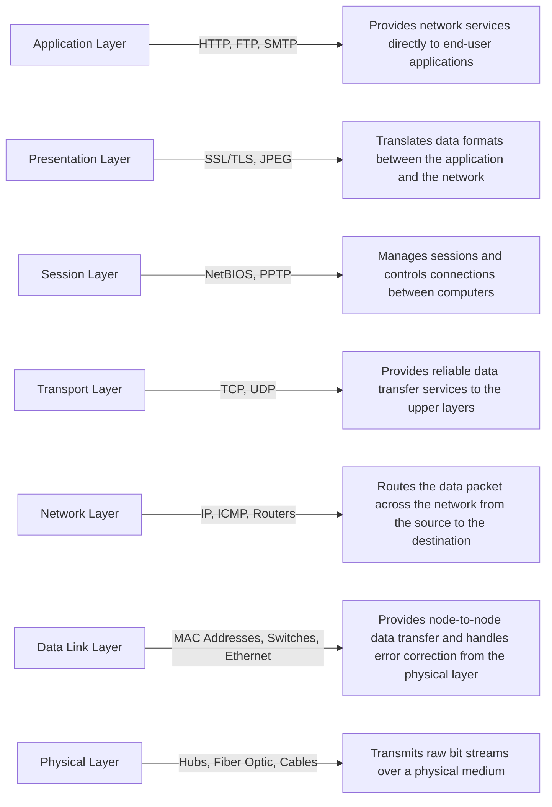

# API使用策略
Developing and implementing an effective API usage strategy is critical for optimizing performance, ensuring security, and maintaining scalability of your applications.

开发和实施有效的API使用策略对于优化性能、确保安全性和保持应用程序的可扩展性至关重要。

#### 1. **Authentication and Authorization**
#### 1. **认证和授权**

- **Token-based Authentication (基于令牌的认证)**: Use tokens (e.g., JWT) to authenticate API requests.
  - **Example (例子)**: Implementing OAuth 2.0 for secure access.
  - **Node.js Code (Node.js代码)**:
    ```javascript
    const express = require('express');
    const jwt = require('jsonwebtoken');
    const app = express();

    app.post('/login', (req, res) => {
      // Authenticate user
      const user = { id: 1 }; // Example user
      const token = jwt.sign({ user }, 'secret_key');
      res.json({ token });
    });

    const authenticateToken = (req, res, next) => {
      const token = req.header('Authorization').split(' ')[1];
      if (!token) return res.sendStatus(401);
      jwt.verify(token, 'secret_key', (err, user) => {
        if (err) return res.sendStatus(403);
        req.user = user;
        next();
      });
    };

    app.get('/protected', authenticateToken, (req, res) => {
      res.send('This is a protected route');
    });

    app.listen(3000, () => console.log('Server started on port 3000'));
    ```

#### 2. **Rate Limiting**
#### 2. **速率限制**

- **Purpose (目的)**: Prevent abuse and ensure fair use of API resources.
  - **Example (例子)**: Limiting each user to 1000 API calls per hour.
  - **Node.js Code (Node.js代码)**:
    ```javascript
    const rateLimit = require('express-rate-limit');

    const limiter = rateLimit({
      windowMs: 60 * 60 * 1000, // 1 hour
      max: 1000, // limit each IP to 1000 requests per windowMs
      message: 'Too many requests, please try again later.'
    });

    app.use(limiter);
    ```

#### 3. **Caching**
#### 3. **缓存**

- **Purpose (目的)**: Improve performance by storing responses for commonly requested data.
  - **Example (例子)**: Using Redis to cache API responses.
  - **Node.js Code (Node.js代码)**:
    ```javascript
    const redis = require('redis');
    const client = redis.createClient();

    app.get('/data', (req, res) => {
      const key = 'data';
      client.get(key, (err, data) => {
        if (data) {
          return res.json(JSON.parse(data));
        } else {
          // Fetch data from database
          const fetchedData = { example: 'data' }; // Example data
          client.setex(key, 3600, JSON.stringify(fetchedData)); // Cache for 1 hour
          res.json(fetchedData);
        }
      });
    });
    ```

#### 4. **Logging and Monitoring**
#### 4. **日志和监控**

- **Purpose (目的)**: Track usage, detect issues, and ensure system health.
  - **Example (例子)**: Using ELK stack (Elasticsearch, Logstash, Kibana) for monitoring.
  - **Node.js Code (Node.js代码)**:
    ```javascript
    const morgan = require('morgan');
    const fs = require('fs');
    const path = require('path');

    // Create a write stream (in append mode)
    const accessLogStream = fs.createWriteStream(path.join(__dirname, 'access.log'), { flags: 'a' });

    // Setup the logger
    app.use(morgan('combined', { stream: accessLogStream }));
    ```

#### 5. **Versioning**
#### 5. **版本控制**

- **Purpose (目的)**: Manage changes and maintain backward compatibility.
  - **Example (例子)**: Using URL path versioning (e.g., `/api/v1/resource`).
  - **Node.js Code (Node.js代码)**:
    ```javascript
    const express = require('express');
    const app = express();

    app.get('/api/v1/resource', (req, res) => {
      res.send('This is version 1 of the resource');
    });

    app.get('/api/v2/resource', (req, res) => {
      res.send('This is version 2 of the resource');
    });

    app.listen(3000, () => console.log('Server started on port 3000'));
    ```

#### 6. **Documentation**
#### 6. **文档**

- **Purpose (目的)**: Provide clear and comprehensive API usage guidelines.
  - **Example (例子)**: Using Swagger or OpenAPI for documentation.
  - **Node.js Code (Node.js代码)**:
    ```javascript
    const swaggerUi = require('swagger-ui-express');
    const swaggerDocument = require('./swagger.json');

    app.use('/api-docs', swaggerUi.serve, swaggerUi.setup(swaggerDocument));
    ```

#### 7. **Error Handling**
#### 7. **错误处理**

- **Purpose (目的)**: Ensure meaningful error messages and codes are returned.
  - **Example (例子)**: Returning `404 Not Found` for non-existent resources.
  - **Node.js Code (Node.js代码)**:
    ```javascript
    app.use((req, res, next) => {
      res.status(404).send('Not Found');
    });

    app.use((err, req, res, next) => {
      console.error(err.stack);
      res.status(500).send('Something broke!');
    });
    ```

#### 8. **Security**
#### 8. **安全**

- **Purpose (目的)**: Protect APIs from threats like SQL injection, XSS, and DDoS attacks.
  - **Example (例子)**: Implementing HTTPS and input validation.
  - **Node.js Code (Node.js代码)**:
    ```javascript
    const helmet = require('helmet');
    const express = require('express');
    const app = express();

    app.use(helmet()); // Helmet helps you secure your Express apps by setting various HTTP headers

    const rateLimit = require('express-rate-limit');
    const limiter = rateLimit({
      windowMs: 15 * 60 * 1000, // 15 minutes
      max: 100 // limit each IP to 100 requests per windowMs
    });

    app.use(limiter); // Apply rate limiting

    const xss = require('xss-clean');
    app.use(xss()); // Prevent XSS attacks

    app.listen(3000, () => console.log('Server started on port 3000'));
    ```

#### 9. **API Counting Strategy**
#### 9. **API计数策略**

- **Purpose (目的)**: Track API usage for analytics, billing, and rate limiting.
  - **Example (例子)**: Using a counter to keep track of the number of API requests made by each user.
  - **Node.js Code (Node.js代码)**:
    ```javascript
    const redis = require('redis');
    const client = redis.createClient();

    app.use((req, res, next) => {
      const user = req.header('User');
      client.incr(user, (err, count) => {
        if (err) return next(err);
        console.log(`User ${user} has made ${count} requests`);
        next();
      });
    });

    app.get('/resource', (req, res) => {
      res.send('This is a resource');
    });

    app.listen(3000, () => console.log('Server started on port 3000'));
    ```

#### 10. **Handling Enormous User API Counting**
#### 10. **处理庞大用户API计数**

- **Purpose (目的)**: Efficiently manage and count API usage for millions of users.
  - **Example (例子)**: Using sharding and clustering to handle enormous user counts.
  - **Node.js Code (Node.js代码)**:
    ```javascript
    const { createClient } = require('redis');
    const express = require('express');
    const app = express();

    const redis = createClient({
      url: 'redis://localhost:6379',
      // Add your cluster configuration here
    });

    redis.connect().catch(console.error);

    const incrCounter = async (user) => {
      try {
        const count = await redis.incr(user);
        return count;
      } catch (err) {
        console.error(err);
        throw err;
      }
    };

    app.use(async (req, res, next) => {
      const user = req.header('User');
      try {
        const count = await incrCounter(user);
        console.log(`User ${user} has made ${count} requests`);
        next();
      } catch (err) {
        next(err);
      }
    });

    app.get('/resource', (req, res) => {
      res.send('This is a resource');
    });

    app.listen(3000, () => console.log('Server started on port 3000'));
    ```

- **Purpose (目的)**
#### 11. **Handling Unknown User API Counting**
#### 11. **处理未知用户API计数**

- **Purpose (目的)**: Efficiently manage and count API usage for users who do not have a unique identifier.
  - **Example (例子)**: Using IP addresses to count API requests for users without authentication tokens.
  - **Node.js Code (Node.js代码)**:
    ```javascript
    const redis = require('redis');
    const client = redis.createClient();

    app.use((req, res, next) => {
      const ip = req.ip;
      client.incr(ip, (err, count) => {
        if (err) return next(err);
        console.log(`IP ${ip} has made ${count} requests`);
        next();
      });
    });

    app.get('/resource', (req, res) => {
      res.send('This is a resource');
    });

    app.listen(3000, () => console.log('Server started on port 3000'));
    ```

### Complete Diagram



### Summary
### 总结

By following these strategies and using the provided Node.js code examples, you can ensure your API is robust, secure, and scalable. Additionally, you can efficiently manage API usage for both known and unknown users, making sure your application performs well under various conditions.

通过遵循这些策略并使用提供的Node.js代码示例，您可以确保您的API是健壮、安全和可扩展的。此外，您还可以有效管理已知和未知用户的API使用情况，确保您的应用程序在各种条件下都能良好运行。
