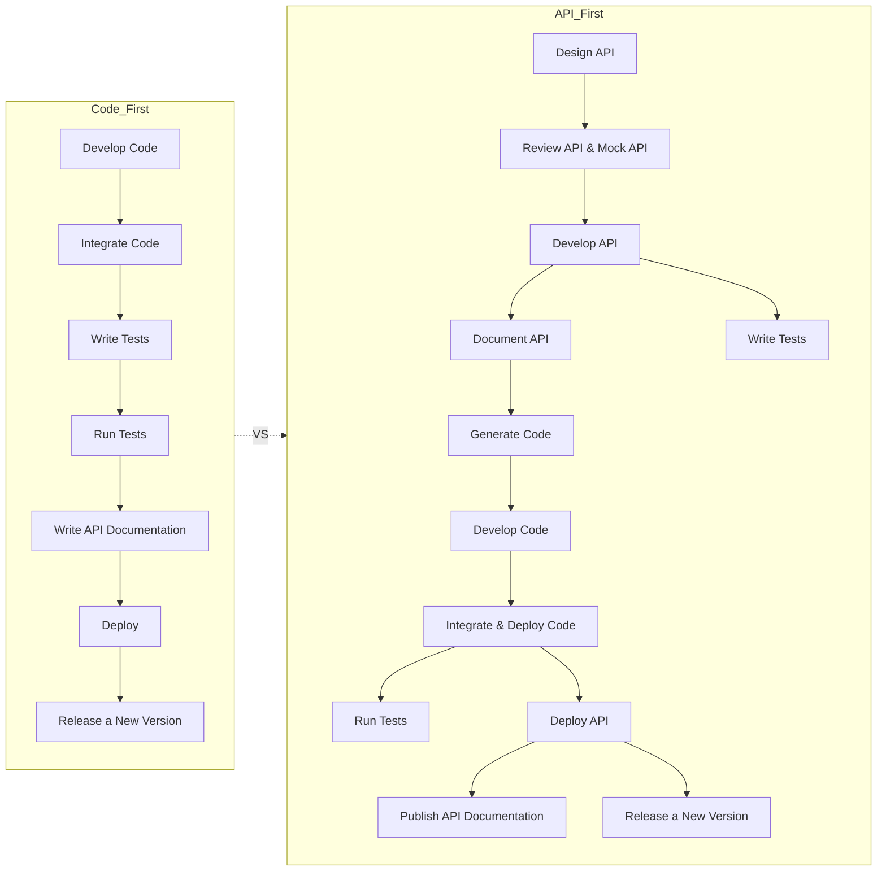

### **Code-First vs. API-First Development**

In modern software development, **Code-First** and **API-First** are two common approaches. Below is an explanation of their key differences and why API-First is a recommended strategy.

---

### **Comparison Between Code-First and API-First**

---

### **Code-First Development**

In the Code-First approach, the team starts by writing **code directly**, followed by integrating it, testing, and then documenting the API. 

1. **Process**:
   - Begins with coding without a defined API design.
   - Testing and documentation are usually done in later stages.
   - Integration challenges arise when multiple teams work on interdependent services.

2. **Challenges**:
   - Service boundaries and communication standards are defined late, leading to potential rework.
   - Lack of consistent API standards slows down cross-team collaboration.
   - Sudden changes or issues discovered late in the development cycle increase costs and risks.

---

### **API-First Development**

In the API-First approach, the team starts with **API design**, defining the interfaces and service boundaries upfront. This is followed by API reviews, mock testing, and development. 

1. **Process**:
   - Starts with **API Design**, which serves as the foundation for development.
   - APIs are reviewed and validated using mock APIs before writing actual code.
   - Testing, documentation, and coding proceed simultaneously, ensuring consistency.
   - The API is deployed, documented, and then released as a fully functional service.

2. **Benefits**:
   - **Improved Collaboration**:
     - APIs act as a common language for cross-team communication, enabling parallel development.
     - Early definition of APIs reduces coordination costs.
   - **Reduced Complexity**:
     - Mock APIs allow early validation of communication between services, minimizing integration issues.
   - **Higher Quality Development**:
     - Clear boundaries result in a smoother development process with fewer surprises.
     - Tests can be designed and executed alongside development, ensuring quality.
   - **Support for TDD (Test-Driven Development)**:
     - Testing is tightly integrated with API design, ensuring robust functionality and stable deliverables.

---

### **Why Choose API-First Development?**

1. **Handles Microservices Complexity**:
   Microservice architectures decouple functionality into separate services, but they also introduce complex inter-service communication. API-First design clarifies service boundaries before development begins, reducing the risk of errors.

2. **Fosters Team Collaboration**:
   Functional teams can focus on their services while using APIs as a universal language for communication. API standards prevent repeated discussions and misunderstandings.

3. **Improves Software Quality and Productivity**:
   - By resolving uncertainties early, API-First ensures smoother development.
   - Reduces late-stage surprises, improving overall delivery quality.

4. **Integrates TDD (Test-Driven Development)**:
   Once APIs are defined, test cases can be developed concurrently with code, enhancing the reliability of services.

---

### **Conclusion**

Adopting the **API-First** approach offers several advantages:
- Clearly defined service boundaries minimize rework and shorten development cycles.
- Teams can collaborate more effectively and work independently on their respective services.
- Late-stage risks and surprises are significantly reduced.
- TDD integration improves software quality and developer satisfaction.

API-First design is particularly well-suited for modern microservice architectures, ensuring high-quality deliverables, faster development, and smoother scaling of services. It allows organizations to handle complexity more effectively while aligning technical efforts with business goals.
