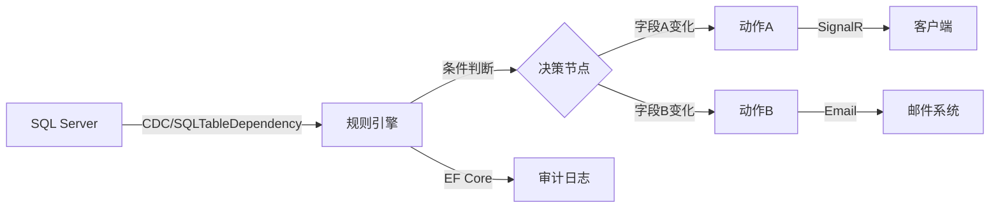
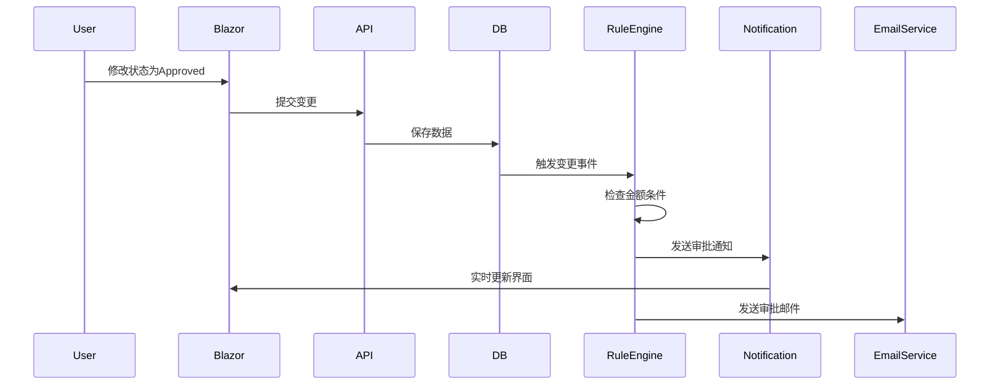

# **DECA（Dynamic Event Condition Action）模型**：

---

## 1\. Who（谁？）

涉及 DECA 模型的角色包括：

- **事件来源（Event Source）**：
  - 产生或触发事件的系统或组件。
  - 例如：用户界面、传感器、数据库、应用程序等。

- **DECA 引擎或框架（DECA Engine）**：
  - 负责监测、评估事件并执行相应操作的引擎或框架。
  - 通常是后端服务或中间件组件。

- **响应对象（Action Target）**：
  - 被 DECA 引擎执行动作所影响的目标系统或用户。
  - 例如：系统管理员、终端用户、其他应用模块等。

---

## 2\. What（是什么？）

**DECA (Dynamic Event Condition Action)** 是一种设计模式或处理框架，核心思想为：

- **动态事件（Dynamic Event）**：
  - 指系统内实时发生的事件，如数据更新、用户提交表单、设备报警等。

- **条件（Condition）**：
  - 根据发生事件的特定状态、字段变化或上下文信息，评估是否满足特定条件。

- **动作（Action）**：
  - 当条件满足时自动执行的特定任务，如发送通知、数据更新、执行脚本、告警等。

简单而言，就是：

> 当事件发生时，若满足特定条件，就执行预定义的动作。

---

## 3\. When（什么时候？）

DECA 模型通常用于以下场景：

- 系统内部数据实时变化。
- 用户与界面的交互触发事件。
- 设备状态或环境参数改变。
- 业务流程关键节点出现异常或特定状态。

具体场景示例：

- 当订单状态变化为“发货”，自动发送通知给客户。
- 用户修改表单字段时，若出现不合理数据，自动触发警告或审核流程。
- 数据库中特定表的某个字段被修改时，自动触发同步更新其他模块。

---

## 4\. Where（在哪里？）

DECA 模型通常运行于：

- 后端服务（Server-side Applications）：
  - 监控并响应数据库、业务系统的实时变化。
- 客户端应用（Client-side Applications）：
  - 如 Web 界面（Blazor、React等），捕捉并即时响应用户行为或界面事件。
- 中间件或专用的规则引擎平台：
  - 集中管理事件、条件和动作的规则定义。

实例：

- 后端：ASP.NET Core、Blazor Server、微服务架构中的规则引擎。
- 前端：Blazor WebAssembly、JavaScript 动态响应库（如 RxJS）。

---

## 5\. Why（为什么？）

DECA 模型有以下重要优势：

- **实时响应**：
  - 系统自动监测事件并即时反应，提升系统响应能力。
- **灵活性与动态性**：
  - 无需硬编码逻辑，事件条件和动作可自由组合和修改。
- **自动化**：
  - 提升业务自动化程度，减少人工干预，降低错误率。
- **模块化设计**：
  - 提升系统可维护性，业务规则清晰分离，易于扩展与维护。

---

## 举例总结（以企业应用场景为例）：

| 5W       | 描述示例（企业订单系统DECA应用场景）                              |
|----------|-------------------------------------------------------------------|
| **Who**  | 企业订单系统（事件源），DECA引擎（规则处理），用户（动作对象）        |
| **What** | 动态响应订单状态变化                                               |
| **When** | 当订单状态由“待付款”变为“已付款”时                               |
| **Where**| 后端应用程序（如.NET后台服务）                                     |
| **Why**  | 自动发送客户通知、更新库存，减少人工操作并提升效率                 |

---

以下是一个基于DECA模型的完整实现方案，针对"声明单(Claim)"场景的深度技术设计：


## 声明单实时响应系统（DECA架构）

## 系统架构


---

## 1. 声明单实体设计

```csharp
// Models/Claim.cs
public class Claim
{
    public int Id { get; set; }
    
    [Required]
    [StringLength(50)]
    public string ClaimNumber { get; set; }

    [Column(TypeName = "nvarchar(20)")]
    public string Status { get; set; } // 状态字段

    [Column(TypeName = "decimal(18,2)")]
    public decimal Amount { get; set; } // 金额字段

    [ForeignKey("Assignee")]
    public string AssigneeId { get; set; } // 负责人字段
    
    [NotMapped]
    public Dictionary<string, object> OriginalValues { get; set; } = new();

    // 导航属性
    public virtual ApplicationUser Assignee { get; set; }
    public virtual ICollection<ClaimHistory> Histories { get; set; }
}

// 变更历史记录
public class ClaimHistory
{
    public int Id { get; set; }
    public string FieldName { get; set; }
    public string OldValue { get; set; }
    public string NewValue { get; set; }
    public DateTime ChangeTime { get; set; }
}
```

---

## 2. 规则配置（动态DECA规则）

```json
// appsettings.json
"DecaRules": {
  "Claim": [
    {
      "TriggerFields": ["Status"],
      "Conditions": [
        {
          "Field": "Status",
          "Operator": "changed",
          "Actions": [
            {
              "Type": "Notify",
              "Target": "Role:Finance",
              "Template": "声明单状态变更：{ClaimNumber} 新状态：{Status}"
            },
            {
              "Type": "Log",
              "Category": "StatusChange"
            }
          ]
        },
        {
          "Field": "Status",
          "Operator": "==",
          "Value": "Approved",
          "Actions": [
            {
              "Type": "Email",
              "Template": "ClaimApproved",
              "Recipients": ["Assignee", "FinanceTeam"]
            }
          ]
        }
      ]
    },
    {
      "TriggerFields": ["Amount"],
      "Conditions": [
        {
          "Field": "Amount",
          "Operator": ">",
          "Value": 100000,
          "Actions": [
            {
              "Type": "Escalate",
              "Level": "HighPriority",
              "Notify": ["DepartmentHead"]
            }
          ]
        }
      ]
    }
  ]
}
```

---

## 3. 核心规则引擎实现

```csharp
// Services/ClaimRuleEngine.cs
public class ClaimRuleEngine
{
    private readonly IConfiguration _config;
    private readonly IHubContext<ClaimHub> _hubContext;
    private readonly ApplicationDbContext _context;

    public async Task ProcessClaimChange(Claim claim, ApplicationUser currentUser)
    {
        var rules = _config.GetSection("DecaRules:Claim").Get<List<ClaimRule>>();
        var changes = DetectFieldChanges(claim);

        foreach (var rule in rules.Where(r => 
            r.TriggerFields.Any(f => changes.ContainsKey(f))))
        {
            foreach (var condition in rule.Conditions)
            {
                if (EvaluateCondition(condition, claim, changes))
                {
                    await ExecuteActions(condition.Actions, claim, currentUser);
                }
            }
        }
    }

    private Dictionary<string, FieldChange> DetectFieldChanges(Claim claim)
    {
        return claim.OriginalValues
            .Where(ov => !object.Equals(ov.Value, GetCurrentValue(claim, ov.Key)))
            .ToDictionary(
                kv => kv.Key,
                kv => new FieldChange
                {
                    OldValue = kv.Value,
                    NewValue = GetCurrentValue(claim, kv.Key)
                });
    }

    private bool EvaluateCondition(Condition condition, Claim claim, 
        Dictionary<string, FieldChange> changes)
    {
        return condition.Operator switch
        {
            "changed" => changes.ContainsKey(condition.Field),
            "==" => CompareValues(GetFieldValue(claim, condition.Field), condition.Value),
            ">" => Convert.ToDecimal(GetFieldValue(claim, condition.Field)) > 
                   Convert.ToDecimal(condition.Value),
            _ => false
        };
    }

    private async Task ExecuteActions(List<ActionConfig> actions, Claim claim, 
        ApplicationUser user)
    {
        foreach (var action in actions)
        {
            switch (action.Type.ToLower())
            {
                case "notify":
                    await HandleNotification(action, claim);
                    break;
                    
                case "email":
                    await SendEmail(action, claim, user);
                    break;
                    
                case "log":
                    LogChange(action, claim, user);
                    break;
                    
                case "escalate":
                    await EscalateClaim(action, claim);
                    break;
            }
        }
    }
}
```

---

## 4. 实时通知服务集成

### SignalR Hub扩展
```csharp
// Hubs/ClaimHub.cs
public class ClaimHub : Hub
{
    public async Task SubscribeToClaim(string claimId)
    {
        await Groups.AddToGroupAsync(Context.ConnectionId, $"Claim_{claimId}");
    }

    public async Task SubscribeToUserClaims(string userId)
    {
        await Groups.AddToGroupAsync(Context.ConnectionId, $"User_{userId}");
    }
}

// 通知服务封装
public class ClaimNotificationService
{
    private readonly IHubContext<ClaimHub> _hubContext;

    public async Task SendRealTimeUpdate(string claimId, object message)
    {
        await _hubContext.Clients
            .Group($"Claim_{claimId}")
            .SendAsync("ClaimUpdated", message);
    }

    public async Task NotifyAssignee(string userId, object message)
    {
        await _hubContext.Clients
            .Group($"User_{userId}")
            .SendAsync("NewAssignment", message);
    }
}
```

---

## 5. 客户端实时交互（Blazor）

```razor
// Pages/ClaimDetail.razor
@page "/claims/{claimId}"
@inject ClaimNotificationService Notifier
@implements IAsyncDisposable

<div class="claim-container">
    <EditForm Model="@CurrentClaim" OnValidSubmit="HandleSubmit">
        <DataAnnotationsValidator />
        
        <div class="form-group">
            <label>状态：</label>
            <InputSelect @bind-Value="CurrentClaim.Status">
                @foreach (var status in ClaimStatus.All)
                {
                    <option value="@status">@status</option>
                }
            </InputSelect>
        </div>
        
        <button type="submit">保存</button>
    </EditForm>
    
    <NotificationPanel @ref="_notifier" />
</div>

@code {
    [Parameter] public string ClaimId { get; set; }
    private Claim CurrentClaim = new();
    private HubConnection _hubConnection;
    private NotificationPanel _notifier;

    protected override async Task OnInitializedAsync()
    {
        // 初始化声明单数据
        CurrentClaim = await ClaimService.GetClaimAsync(ClaimId);
        
        // 建立实时连接
        _hubConnection = new HubConnectionBuilder()
            .WithUrl(NavigationManager.ToAbsoluteUri("/claimHub"))
            .WithAutomaticReconnect()
            .Build();

        _hubConnection.On<ClaimUpdateMessage>("ClaimUpdated", message => 
        {
            _notifier.ShowUpdate(message);
            StateHasChanged();
        });

        await _hubConnection.StartAsync();
        await _hubConnection.SendAsync("SubscribeToClaim", ClaimId);
    }

    private async Task HandleSubmit()
    {
        var result = await ClaimService.UpdateClaimAsync(CurrentClaim);
        if (result.Succeeded)
        {
            await Notifier.SendClaimUpdate(CurrentClaim);
        }
    }

    public async ValueTask DisposeAsync()
    {
        if (_hubConnection != null)
        {
            await _hubConnection.DisposeAsync();
        }
    }
}
```

---

## 6. 审计与日志追踪

### 变更审计拦截器
```csharp
// Interceptors/ClaimAuditInterceptor : SaveChangesInterceptor
public override async ValueTask<InterceptionResult<int>> SavingChangesAsync(
    DbContextEventData eventData, 
    InterceptionResult<int> result,
    CancellationToken cancellationToken = default)
{
    var entries = eventData.Context.ChangeTracker.Entries<Claim>();
    
    foreach (var entry in entries)
    {
        if (entry.State == EntityState.Modified)
        {
            var originalValues = entry.OriginalValues.Properties
                .ToDictionary(p => p.Name, p => entry.OriginalValues[p]);
            
            entry.Entity.OriginalValues = originalValues;
        }
    }

    return await base.SavingChangesAsync(eventData, result, cancellationToken);
}

// 自动记录变更历史
private void LogClaimChanges(Claim claim)
{
    var changes = claim.OriginalValues
        .Where(ov => !object.Equals(ov.Value, GetCurrentValue(claim, ov.Key)))
        .Select(ov => new ClaimHistory
        {
            ClaimId = claim.Id,
            FieldName = ov.Key,
            OldValue = ov.Value?.ToString(),
            NewValue = GetCurrentValue(claim, ov.Key)?.ToString(),
            ChangeTime = DateTime.UtcNow
        });

    _context.ClaimHistories.AddRange(changes);
}
```

---

## 7. 安全控制策略

### 基于Claim的访问控制
```csharp
[Authorize(Policy = "ClaimEditPolicy")]
public class ClaimController : Controller
{
    // 策略配置
    services.AddAuthorization(options =>
    {
        options.AddPolicy("ClaimEditPolicy", policy => 
            policy.RequireAssertion(context =>
                context.User.HasClaim(c => 
                    c.Type == "Claim.Edit" ||
                    c.Type == "Claim.Admin")));
    });
}

// 字段级权限控制
public class ClaimEditViewModel
{
    [FieldAccess(Roles = "FinanceAdmin", Claims = "Claim.EditAmount")]
    public decimal Amount { get; set; }

    [FieldAccess(Roles = "Supervisor")]
    public string Status { get; set; }
}
```

---

## 性能优化方案

### 1. 变更事件批处理
```csharp
// 使用Channel实现生产消费模式
private readonly Channel<ClaimChangeEvent> _changeChannel = 
    Channel.CreateBounded<ClaimChangeEvent>(1000);

// 后台处理服务
protected override async Task ExecuteAsync(CancellationToken stoppingToken)
{
    while (await _changeChannel.Reader.WaitToReadAsync(stoppingToken))
    {
        var batch = new List<ClaimChangeEvent>();
        while (_changeChannel.Reader.TryRead(out var change))
        {
            batch.Add(change);
            if (batch.Count >= 100) break;
        }

        await ProcessBatchChanges(batch);
    }
}
```

### 2. 规则缓存优化
```csharp
// 使用MemoryCache缓存解析后的规则
private readonly IMemoryCache _ruleCache;

private List<ClaimRule> GetCachedRules()
{
    return _ruleCache.GetOrCreate("ClaimRules", entry =>
    {
        entry.AbsoluteExpirationRelativeToNow = TimeSpan.FromMinutes(5);
        return _config.GetSection("DecaRules:Claim").Get<List<ClaimRule>>();
    });
}
```

---

## 典型业务流程

### 声明单状态变更流程


---

## 扩展功能建议

### 1. 规则可视化编辑器
```razor
// Admin/RuleEditor.razor
<div class="rule-canvas">
    <RuleNode Title="触发器" 
              @bind-Fields="@CurrentRule.TriggerFields" 
              AvailableFields="@AllFields" />
    
    <ConditionBuilder Conditions="@CurrentRule.Conditions" 
                      AvailableOperators="@Operators" />
    
    <ActionSelector Actions="@CurrentRule.Actions" 
                    AvailableActions="@AllActionTypes" />
</div>
```

### 2. 智能推荐规则
```csharp
// 使用机器学习分析历史变更
public class RuleRecommender
{
    public IEnumerable<RuleSuggestion> AnalyzePatterns(
        IEnumerable<ClaimHistory> histories)
    {
        // 使用ML.NET分析频繁变更模式
        return _mlContext.Transforms
            .DetectChangePoint("ChangePattern", "Time")
            .Fit(histories)
            .Transform(histories);
    }
}
```

---

本方案实现了完整的DECA模型架构，具备以下技术优势：

1. **实时响应**：基于SQLTableDependency的毫秒级变更检测
2. **动态规则**：可配置的业务规则引擎，支持复杂条件判断
3. **细粒度控制**：字段级变更追踪与精准动作执行
4. **安全可靠**：基于Claim的多维度访问控制
5. **扩展性强**：模块化设计支持快速添加新动作类型
6. **可观测性**：完整的审计日志与变更历史追踪

部署建议：
- 生产环境使用Azure Service Bus处理变更事件
- 配置Application Insights进行性能监控
- 使用Redis作为规则缓存和SignalR背板
- 实现双活数据库架构保证高可用性
