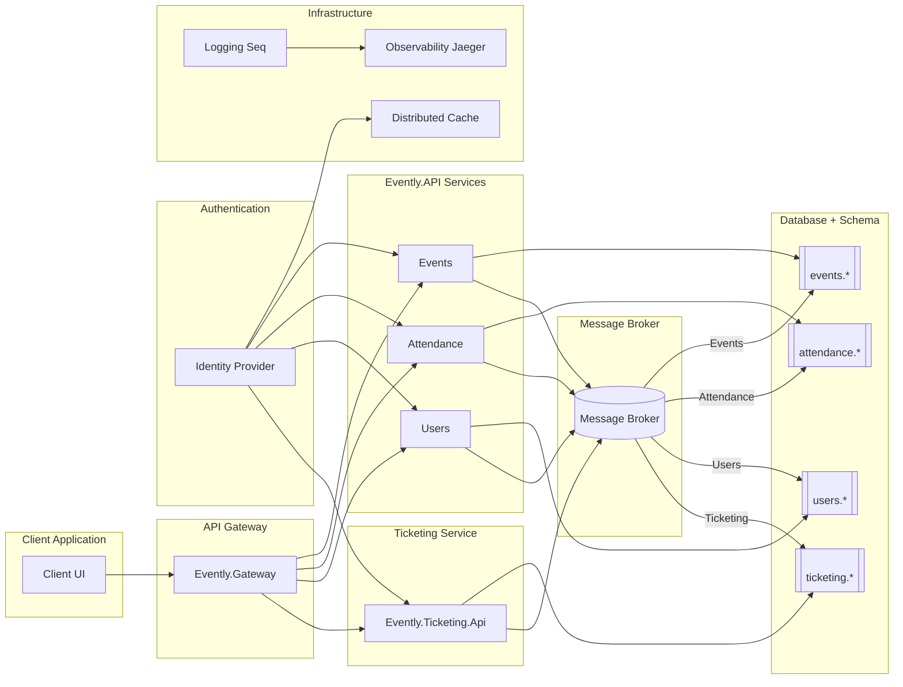

以下系统架构图：

此图反映了以下关键点：

- 客户端通过 API Gateway 与后端交互。
- 后端由多个服务组成（Events, Attendance, Users, Ticketing）。
- 身份验证由 Identity Provider 提供，并使用分布式缓存优化访问。
- 每个服务均与消息代理通信，并发布特定 schema 的消息。
- 使用分布式日志与可观察性工具（如 Seq, Jaeger）监控系统运行状态。

需要我为你生成实际图像或进一步解释某个部分吗？
