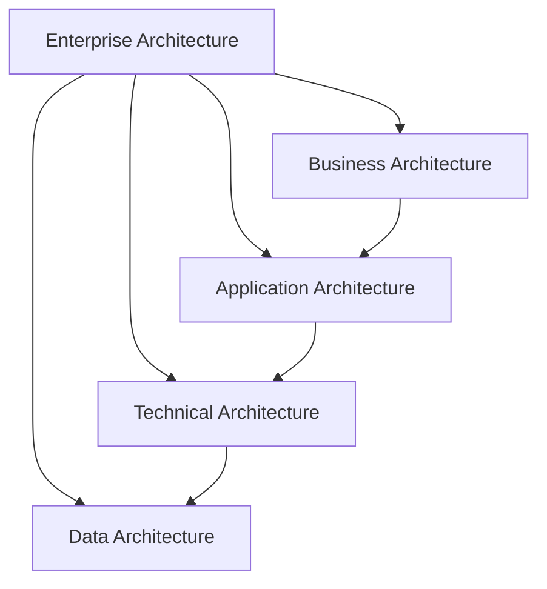

### Key Points and Detailed Explanation of the Four Main Layers in "Enterprise Architecture"

---

### Flowchart Explanation:
1. **EA (Enterprise Architecture)** is the top-level framework that encompasses all other architectures.
2. **BA (Business Architecture)** defines strategic goals and business processes, serving as the starting point for other architectures.
3. **AA (Application Architecture)** outlines the software systems needed to support business processes.
4. **TA (Technical Architecture)** provides the technical infrastructure for running applications.
5. **DA (Data Architecture)** serves as the foundation, offering reliable data management for all layers.

---

### 1. **Business Architecture**
- **Key Points**:
  - Describes the core business functions and processes of the enterprise.
  - Defines strategic goals, key performance indicators (KPIs), and how business capabilities achieve these goals.
  - Ensures alignment between business needs and technical solutions.

- **Detailed Explanation**:
  Business Architecture focuses on the enterprise's commercial objectives and operating models. By clearly defining the business architecture, enterprises can ensure that technical systems and resources effectively support their operational goals. For instance, in a retail business, the business architecture might encompass customer management, inventory management, and sales processes.

---

### 2. **Application Architecture**
- **Key Points**:
  - Defines the software applications required by the enterprise and their interrelationships.
  - Focuses on how applications support business functions.
  - Covers the interactions between applications and their integration with the technical architecture.

- **Detailed Explanation**:
  Application Architecture emphasizes the software structure of the enterprise. It ensures that applications operate efficiently, reliably, and meet changing business demands. For example, a company's application architecture might include an ERP system, a CRM system, and their data exchanges.

---

### 3. **Technical Architecture**
- **Key Points**:
  - Involves the underlying technical infrastructure, including hardware, networks, and middleware.
  - Provides support for running applications and storing data.
  - Ensures system performance, reliability, and security.

- **Detailed Explanation**:
  Technical Architecture lays out the blueprint of the enterprise's technical environment. It includes servers, storage, networks, and software components that support these hardware resources. A robust technical architecture helps enterprises quickly adapt to market changes and supports flexible application architecture.

---

### 4. **Data Architecture**
- **Key Points**:
  - Describes the enterprise's data flow, storage, and management strategies.
  - Defines the structure, sources, and destinations of data.
  - Ensures data integrity, security, and availability.

- **Detailed Explanation**:
  Data Architecture is the foundation of enterprise architecture, determining how data is collected, stored, managed, and used to meet business needs. For instance, the data architecture of an e-commerce platform might include user data, transaction data, and product data management, along with analysis and visualization.

---

### Summary
These four layers progress from strategy to technology, forming an interconnected system:
- **Business Architecture** defines the goals.
- **Application Architecture** provides the tools to achieve the goals.
- **Technical Architecture** offers the environment to run these tools.
- **Data Architecture** supports all layers with reliable data management.

By integrating these architectural layers, enterprises can systematically and efficiently achieve their strategic goals.
