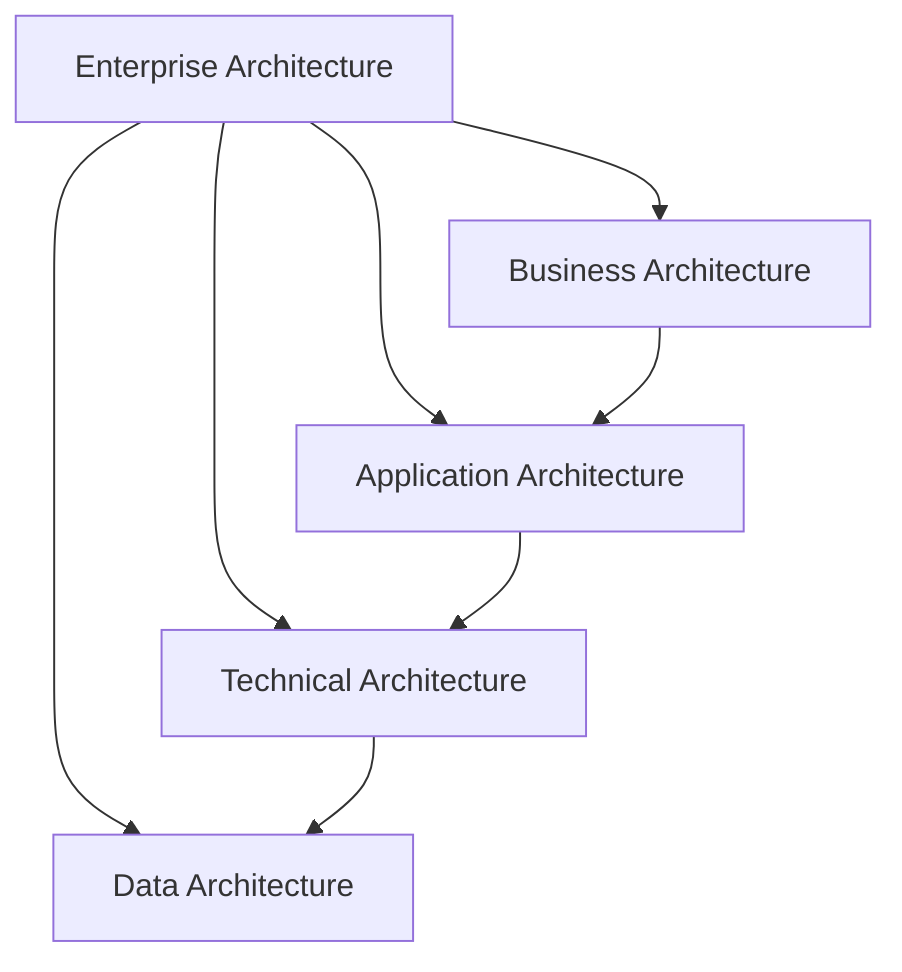
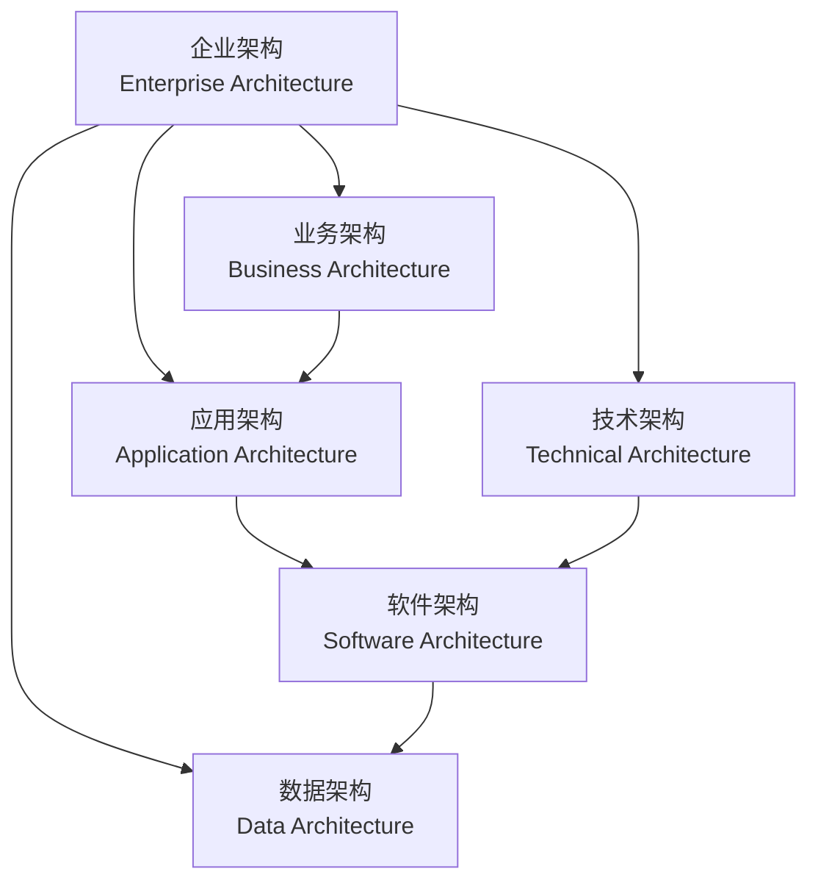

### Key Points and Detailed Explanation of the Four Main Layers in "Enterprise Architecture"

---

---

在上述图片中，“**软件架构（Software Architecture）**”并未明确单独标出，但它通常属于**应用架构（Application Architecture）**和**技术架构（Technical Architecture）**的交集部分。

### 详细分析：
1. **应用架构（Application Architecture）**：
   - 定义软件系统如何支持业务功能。
   - 涉及软件的功能设计、模块划分以及应用程序之间的交互。
   - 软件架构在这里体现为应用系统的设计模式，例如微服务架构、单体架构等。

2. **技术架构（Technical Architecture）**：
   - 涉及支持软件运行的底层技术，例如服务器、网络、中间件等。
   - 软件架构也依赖技术架构中的硬件和技术环境（如容器、虚拟化）来运行和交付。

### **软件架构的位置**
- 软件架构横跨应用架构和技术架构之间：
  - 它定义了软件的结构设计（如模块、组件、接口、依赖关系）。
  - 它需要应用架构提供的功能需求支持，同时依赖技术架构提供的底层技术支持。
  - 因此，软件架构可以被视为连接**应用架构**和**技术架构**的桥梁。

在企业架构的整体框架中，**软件架构**可以作为应用和技术之间的具体实现部分来理解。

### 流程图解释：

1. **EA (企业架构)**：顶层框架，包含所有架构层。
2. **BA (业务架构)**：定义战略目标和业务需求，是软件需求的来源。
3. **AA (应用架构)**：
   - 定义应用系统如何支持业务需求。
   - 提供软件架构的功能性支持。
4. **TA (技术架构)**：
   - 提供运行软件的底层技术环境（硬件、网络、平台）。
   - 软件架构依赖技术架构运行。
5. **SA (软件架构)**：
   - 位于应用架构和技术架构之间，起到桥梁作用。
   - 负责设计应用程序的模块、接口和组件，并确保它们在技术环境中运行。
6. **DA (数据架构)**：
   - 提供数据支撑，软件架构设计需要依赖数据模型和管理策略。

---

### **总结**：
- **软件架构（Software Architecture）** 是 **应用架构（Application Architecture）** 的具体实现，同时依赖 **技术架构（Technical Architecture）** 提供的环境支持。
- 它连接业务需求（从应用架构中获取）和底层技术（从技术架构中获取），同时利用数据架构来管理和处理数据流。

---

### Flowchart Explanation:
1. **EA (Enterprise Architecture)** is the top-level framework that encompasses all other architectures.
2. **BA (Business Architecture)** defines strategic goals and business processes, serving as the starting point for other architectures.
3. **AA (Application Architecture)** outlines the software systems needed to support business processes.
4. **TA (Technical Architecture)** provides the technical infrastructure for running applications.
5. **DA (Data Architecture)** serves as the foundation, offering reliable data management for all layers.

---

### 1. **Business Architecture**
- **Key Points**:
  - Describes the core business functions and processes of the enterprise.
  - Defines strategic goals, key performance indicators (KPIs), and how business capabilities achieve these goals.
  - Ensures alignment between business needs and technical solutions.

- **Detailed Explanation**:
  Business Architecture focuses on the enterprise's commercial objectives and operating models. By clearly defining the business architecture, enterprises can ensure that technical systems and resources effectively support their operational goals. For instance, in a retail business, the business architecture might encompass customer management, inventory management, and sales processes.

---

### 2. **Application Architecture**
- **Key Points**:
  - Defines the software applications required by the enterprise and their interrelationships.
  - Focuses on how applications support business functions.
  - Covers the interactions between applications and their integration with the technical architecture.

- **Detailed Explanation**:
  Application Architecture emphasizes the software structure of the enterprise. It ensures that applications operate efficiently, reliably, and meet changing business demands. For example, a company's application architecture might include an ERP system, a CRM system, and their data exchanges.

---

### 3. **Technical Architecture**
- **Key Points**:
  - Involves the underlying technical infrastructure, including hardware, networks, and middleware.
  - Provides support for running applications and storing data.
  - Ensures system performance, reliability, and security.

- **Detailed Explanation**:
  Technical Architecture lays out the blueprint of the enterprise's technical environment. It includes servers, storage, networks, and software components that support these hardware resources. A robust technical architecture helps enterprises quickly adapt to market changes and supports flexible application architecture.

---

### 4. **Data Architecture**
- **Key Points**:
  - Describes the enterprise's data flow, storage, and management strategies.
  - Defines the structure, sources, and destinations of data.
  - Ensures data integrity, security, and availability.

- **Detailed Explanation**:
  Data Architecture is the foundation of enterprise architecture, determining how data is collected, stored, managed, and used to meet business needs. For instance, the data architecture of an e-commerce platform might include user data, transaction data, and product data management, along with analysis and visualization.

---

### Summary
These four layers progress from strategy to technology, forming an interconnected system:
- **Business Architecture** defines the goals.
- **Application Architecture** provides the tools to achieve the goals.
- **Technical Architecture** offers the environment to run these tools.
- **Data Architecture** supports all layers with reliable data management.

By integrating these architectural layers, enterprises can systematically and efficiently achieve their strategic goals.
