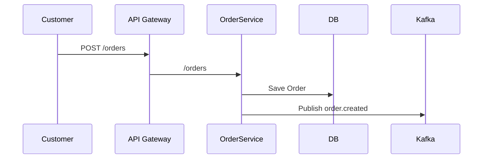

# **微服务项目** 的 **Technical Design Document（TDD）模板**，

适用于企业级开发，支持 CI/CD、容器化部署、服务通信规范等内容。

---

## ✅【Technical Design Document Template – Microservices Architecture】

---

### 🧾 1. Document Overview

* **Project Name**: `e.g., Order Management Service`
* **Author**: `Name`
* **Date**: `YYYY-MM-DD`
* **Version**: `v1.0`
* **Reviewed By**: `Name(s)`

---

### 📘 2. Objective

简要说明此服务的目标与范围：

> “This service is responsible for managing customer orders, including order creation, update, retrieval, and event publishing to downstream services such as Inventory and Shipping.”

---

### 🧱 3. High-Level Architecture Diagram

* 插入系统架构图（微服务、网关、数据库、消息队列等）
* 使用工具：Lucidchart、draw\.io、Mermaid 等

---

### 🧩 4. Microservice Context

| Item                    | Description                           |
| ----------------------- | ------------------------------------- |
| **Service Name**        | `OrderService`                        |
| **Domain Context**      | `Bounded Context: Order Management`   |
| **Communication Style** | RESTful API + Async Events (Kafka)    |
| **Dependent Services**  | InventoryService, PaymentService      |
| **Exposed APIs**        | /orders, /orders/{id}, /orders/status |

---

### 📂 5. API Design

**5.1. REST API Spec (OpenAPI style)**

```yaml
POST /orders
Request Body:
{
  "customerId": "string",
  "items": [{"productId": "string", "quantity": int}]
}

Response:
201 Created
{
  "orderId": "string",
  "status": "CREATED"
}
```

**5.2. Async Event Example (Kafka Topic)**

```json
Topic: order.created
Payload:
{
  "orderId": "123",
  "timestamp": "2025-06-26T12:34:56Z",
  "status": "CREATED"
}
```

---

### 🧮 6. Data Model

**Entities & Tables**

* **Order**

  * order\_id (UUID)
  * customer\_id (UUID)
  * status (enum)
  * created\_at
* **OrderItem**

  * order\_item\_id
  * order\_id (FK)
  * product\_id
  * quantity

---

### 🏗 7. Internal Architecture

| Layer           | Responsibility                  |
| --------------- | ------------------------------- |
| Controller      | Handle HTTP requests            |
| Service         | Business logic                  |
| Repository      | DB access (e.g., JPA/EF/Dapper) |
| Event Publisher | Send messages to Kafka          |

可使用 Sequence Diagram 描述：



---

### 🔐 8. Security

* **Authentication**: JWT with OAuth2
* **Authorization**: Role-based (Admin, Customer)
* **Data Security**: Encryption at rest, HTTPS enforced
* **Rate Limiting**: Configurable via API Gateway

---

### 🛠 9. DevOps & Deployment

| Item          | Tool                       |
| ------------- | -------------------------- |
| Container     | Docker                     |
| Orchestration | Kubernetes                 |
| CI/CD         | GitHub Actions / GitLab CI |
| Monitoring    | Prometheus + Grafana       |
| Logging       | ELK Stack                  |

---

### 🧪 10. Testing Strategy

| Layer         | Tool                          |
| ------------- | ----------------------------- |
| Unit Test     | JUnit / xUnit                 |
| Integration   | Testcontainers + REST-assured |
| Contract Test | Pact                          |
| Load Test     | k6 / JMeter                   |

---

### 🧯 11. Error Handling & Retry

| Scenario         | Strategy                |
| ---------------- | ----------------------- |
| DB Failure       | Retry + Fallback        |
| Kafka Failure    | Dead Letter Queue (DLQ) |
| Validation Error | HTTP 400 Bad Request    |

---

### 📅 12. Timeline / Milestones

* Design Approval: `2025-06-28`
* MVP Delivery: `2025-07-10`
* Production Release: `2025-08-01`

---

### 📝 13. Appendix

* OpenAPI Spec file
* ER diagram
* Kafka topic contracts
* Links to GitHub repo / Docker Hub

---

## Example: **Technical Design Document (TDD)**

---

**Project Name**: Order Management Microservice
**Author**: John Doe
**Date**: 2025-06-26
**Version**: v1.0
**Reviewed By**: Jane Smith (Architect)

---

### 1. Objective

The Order Management Microservice is designed to handle creation, retrieval, update, and tracking of customer orders. It acts as a core part of the e-commerce system, interfacing with Inventory, Payment, and Shipping services.

---

### 2. High-Level Architecture

* **Frontend** → API Gateway → **OrderService (C#)**
* OrderService uses PostgreSQL for persistence.
* Events published to Apache Kafka.
* Deployed via Docker containers to Kubernetes.

---

### 3. Microservice Context

| Item          | Description                                |
| ------------- | ------------------------------------------ |
| Service Name  | OrderService                               |
| Domain        | Order Management                           |
| Communication | REST API, Kafka Events                     |
| Dependencies  | InventoryService, PaymentService           |
| Tech Stack    | .NET 8, EF Core, Kafka, PostgreSQL, Docker |

---

### 4. API Design

#### 4.1 REST Endpoints

**POST /api/orders**
Create a new order

Request Body:

```json
{
  "customerId": "uuid",
  "items": [
    { "productId": "uuid", "quantity": 2 }
  ]
}
```

Response:

```json
{
  "orderId": "uuid",
  "status": "CREATED"
}
```

**GET /api/orders/{id}**
Fetch order details by ID

#### 4.2 Kafka Event

Topic: `order.created`

```json
{
  "orderId": "uuid",
  "timestamp": "2025-06-26T14:45:00Z",
  "status": "CREATED"
}
```

---

### 5. Data Model

**Order**

* OrderId (Guid)
* CustomerId (Guid)
* Status (enum: CREATED, PAID, SHIPPED)
* CreatedAt (DateTime)

**OrderItem**

* OrderItemId (Guid)
* OrderId (FK)
* ProductId (Guid)
* Quantity (int)

---

### 6. Internal Architecture

* **Controller**: OrderController.cs
* **Service Layer**: OrderService.cs
* **Repository**: OrderRepository.cs (EF Core)
* **EventPublisher**: KafkaProducer.cs
* **DTOs**: OrderDto.cs, CreateOrderRequest.cs

---

### 7. Security

* JWT Authentication via IdentityServer
* Role-based authorization (Admin, Customer)
* HTTPS enforced

---

### 8. Deployment

* Dockerfile for building container
* Kubernetes YAML for deployment
* Secrets managed via Kubernetes Secrets
* CI/CD via GitHub Actions (build, test, push image)

---

### 9. Testing Strategy

| Layer       | Tool                  |
| ----------- | --------------------- |
| Unit        | xUnit                 |
| Integration | Testcontainers-dotnet |
| Contract    | PactNet               |
| Load        | k6 (external script)  |

---

### 10. Error Handling

* 400: Validation errors
* 404: Order not found
* 500: Unexpected server errors
* Kafka retry with exponential backoff + DLQ

---

### 11. Timeline

| Milestone       | Date       |
| --------------- | ---------- |
| Design Sign-off | 2025-06-28 |
| Dev Start       | 2025-07-01 |
| Code Freeze     | 2025-07-20 |
| Release         | 2025-08-01 |

---

### 12. Appendix

* Link to GitHub Repo: `https://github.com/org/orderservice`
* OpenAPI Spec: `openapi.yaml`
* ERD Diagram: `erd.png`
* Kafka Contract JSON: `order.created.schema.json`

