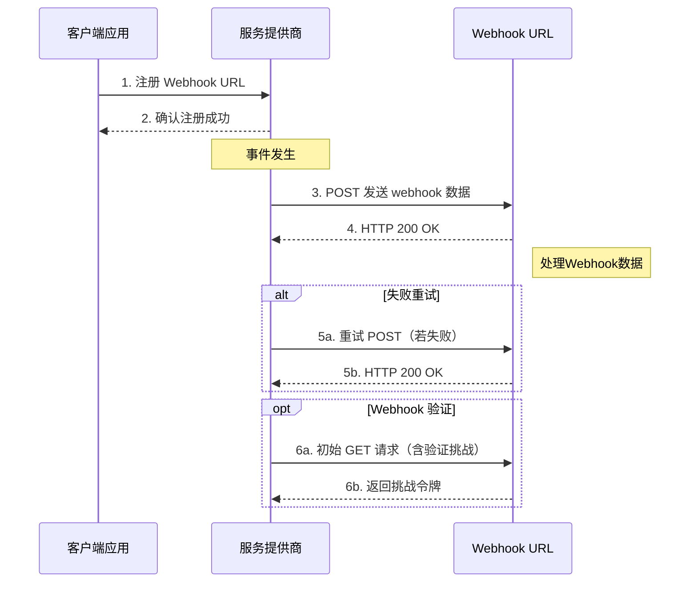
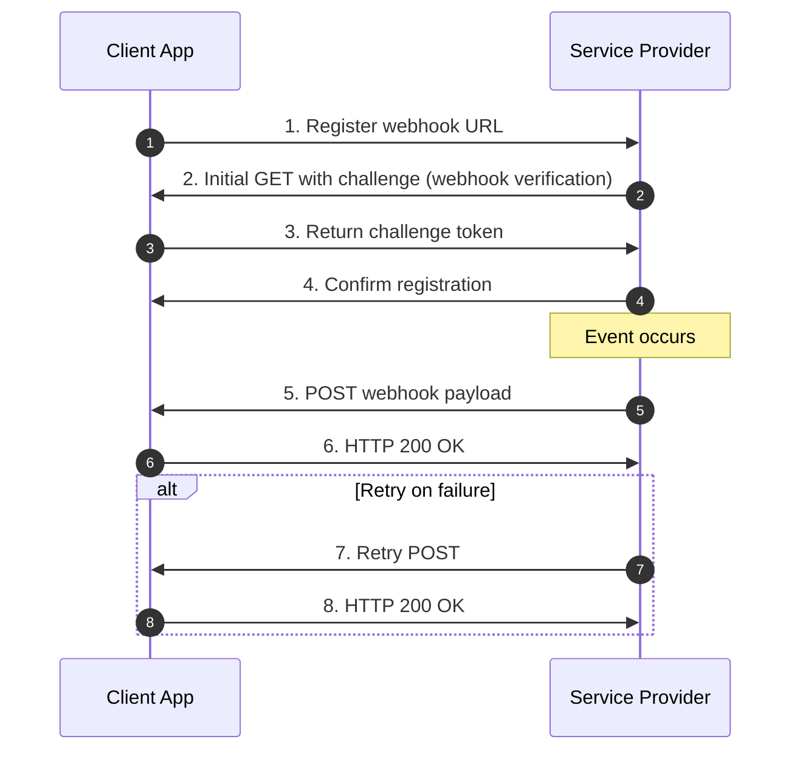

# Webhook：

## 1\. Who（谁？）

Webhook 涉及两个主要角色：

- **服务提供方（Service Provider）**：
  - 事件或数据的生产者，负责发送通知。
  - 例如：支付平台（如PayPal、Stripe）、社交平台（如GitHub、Slack）、邮件服务（如SendGrid）等。

- **客户端（Webhook Receiver/Consumer）**：
  - 注册Webhook，接收并处理服务提供方发送的事件数据。
  - 例如：用户自己搭建的网站后端、自动化处理服务（如Zapier、IFTTT）、客户的业务系统。

---

## 2\. What（是什么？）

Webhook 本质上是一种**自动化的HTTP回调（callback）机制**：

- 服务提供方发生某个事件时，通过 HTTP 请求将数据（Payload）主动推送到用户指定的URL。
- 通常采用 HTTP POST 方法进行通信，数据格式通常为 JSON 或 XML。

举例说明：

- 当你在 GitHub 上提交代码（push）时，GitHub 可以自动将 push 事件详情通过Webhook发送到你的服务器，以便自动化构建、部署或通知。

---

## 3\. When（什么时候？）

Webhook 被触发的时机取决于服务提供方的事件定义，典型情景包括：

- 数据发生变化（例如数据库记录更新）。
- 用户执行特定操作（如付款成功、提交表单）。
- 系统状态变化（如服务器启动、系统告警）。

具体实例：

- 支付平台（Stripe）：付款成功或退款发生时。
- GitHub：代码被推送或 issue/comment 创建时。
- Slack：特定关键词在频道出现时触发通知。

---

## 4\. Where（在哪里？）

Webhook 数据被发送到用户预先定义的 **Webhook URL**：

- 这是用户自己架设的服务器地址或第三方集成服务地址。
- 客户端需确保该地址可公开访问，以便服务提供商顺利推送数据。

示例：

- 客户端的Webhook URL 可能是：  
  `https://myapp.example.com/webhooks/payment`

---

## 5\. Why（为什么？）

Webhook 有以下重要的使用理由和优势：

- **实时性**：无需定期轮询数据更新（避免使用轮询的高延迟、浪费资源）。
- **高效性**：服务端主动推送信息，降低双方通信开销，提高性能。
- **自动化**：自动执行数据处理和后续动作，如自动部署、自动发送通知。
- **松耦合**：服务提供商与客户端系统无需强依赖，增加系统的灵活性和可维护性。

---

## 举例总结：

以GitHub 为例，5Ws 总结：

| 5W      | 描述示例（GitHub）                                       |
|---------|-----------------------------------------------------------|
| **Who** | GitHub（服务提供方）、用户的CI/CD系统（客户端）           |
| **What**| 自动发送代码push事件到用户系统                            |
| **When**| 当用户执行代码提交（push）到GitHub时                      |
| **Where**| 用户预先注册在GitHub上的Webhook URL，例如CI服务器地址    |
| **Why** | 实时通知CI服务器进行自动构建和部署，确保高效自动化流程    |

---

以上是 Webhook 使用经典的 5Ws 方法的完整说明，可以帮助你迅速掌握并记忆Webhook的核心要点。

--

以下是基于上述 Mermaid 序列图的逐步中文详细解释：

### 步骤 1: 注册 Webhook URL
- **客户端应用（ClientApp）** 主动发起请求，向 **服务提供商（ServiceProvider）** 注册自己的 Webhook 地址。
- 目的是告诉服务提供商：“未来有事件发生时，请将事件相关信息发送到我提供的地址”。

### 步骤 2: 确认注册成功
- 服务提供商收到客户端的注册请求后，会返回一个确认信息，告诉客户端：“你的 Webhook 地址注册成功了，我后续会向此地址发送数据”。

---

### 事件触发阶段（事件发生）
- 此时，服务提供商内部发生某些值得通知的事件，比如数据变化、新订单产生、或其他触发Webhook机制的事件。

---

### 步骤 3: POST 发送 webhook 数据
- 服务提供商通过 HTTP POST 请求，将事件的具体数据（称为 payload）发送到之前客户端注册的 Webhook URL。
- 这一步属于事件通知的核心环节，确保客户端能实时接收到事件信息。

### 步骤 4: HTTP 200 OK（成功响应）
- Webhook URL 收到 POST 请求后，若成功处理了该数据，则返回 HTTP 状态码 200，告知服务提供商：“我已经成功接收到你发来的数据，并且处理完成了”。
- 这一步非常重要，因为服务提供商依靠这个响应判断数据是否成功传达。

### 【右侧注释】：处理 Webhook 数据
- 此时，客户端系统针对接收到的数据，执行自己的业务逻辑，比如更新数据库、触发消息通知、执行自动化操作等。

---

### 替代路径（alt）：失败重试机制（Retry on failure）

在正常情况下，如果 Webhook URL 没有返回 200 OK（可能是网络原因、客户端处理错误等），服务提供商会启动失败重试策略：

- **步骤 5a：重试 POST 请求（Retry POST if failed）**
  - 服务提供商会再次尝试发送之前未成功传达的数据到Webhook URL。

- **步骤 5b：HTTP 200 OK**
  - 若客户端此次成功收到并处理请求，则再次返回 HTTP 状态码 200 OK，告诉服务提供商此次重试成功完成。

- 重试机制确保事件数据可靠地到达客户端，防止信息丢失。

---

### 可选路径（opt）：Webhook 验证（Webhook verification）

部分服务提供商在正式启用 Webhook 前，会验证 Webhook 地址的真实性和可用性：

- **步骤 6a：初始 GET 请求（含验证挑战）**
  - 服务提供商发送一个带有 challenge（挑战令牌）的 GET 请求到客户端的 Webhook URL。
  - 目的是确保客户端对该 URL 有控制权，防止任意地址注册。

- **步骤 6b：返回挑战令牌**
  - 客户端收到挑战请求后，必须立即返回该挑战令牌。
  - 服务提供商收到正确的挑战令牌后，就确认 Webhook 地址有效并可信。

---

以上是整个 Webhook 流程每个环节的详细解释与作用。

### simplify diagram

This diagram:
1. Starts with webhook registration and verification (steps 1-4)
2. Shows the event-triggered payload delivery (steps 5-6)
3. Includes a retry mechanism for failed deliveries (steps 7-8)
4. Uses Mermaid's `autonumber` feature to automatically sequence the steps
5. Maintains the key elements from the original sketch (webhook verification, confirmation, retries) while organizing them in logical order
