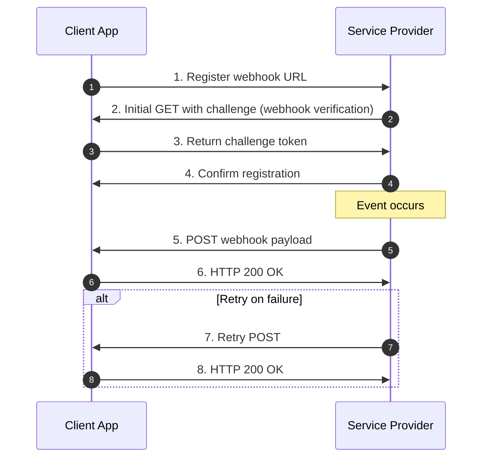

This diagram:
1. Starts with webhook registration and verification (steps 1-4)
2. Shows the event-triggered payload delivery (steps 5-6)
3. Includes a retry mechanism for failed deliveries (steps 7-8)
4. Uses Mermaid's `autonumber` feature to automatically sequence the steps
5. Maintains the key elements from the original sketch (webhook verification, confirmation, retries) while organizing them in logical order
