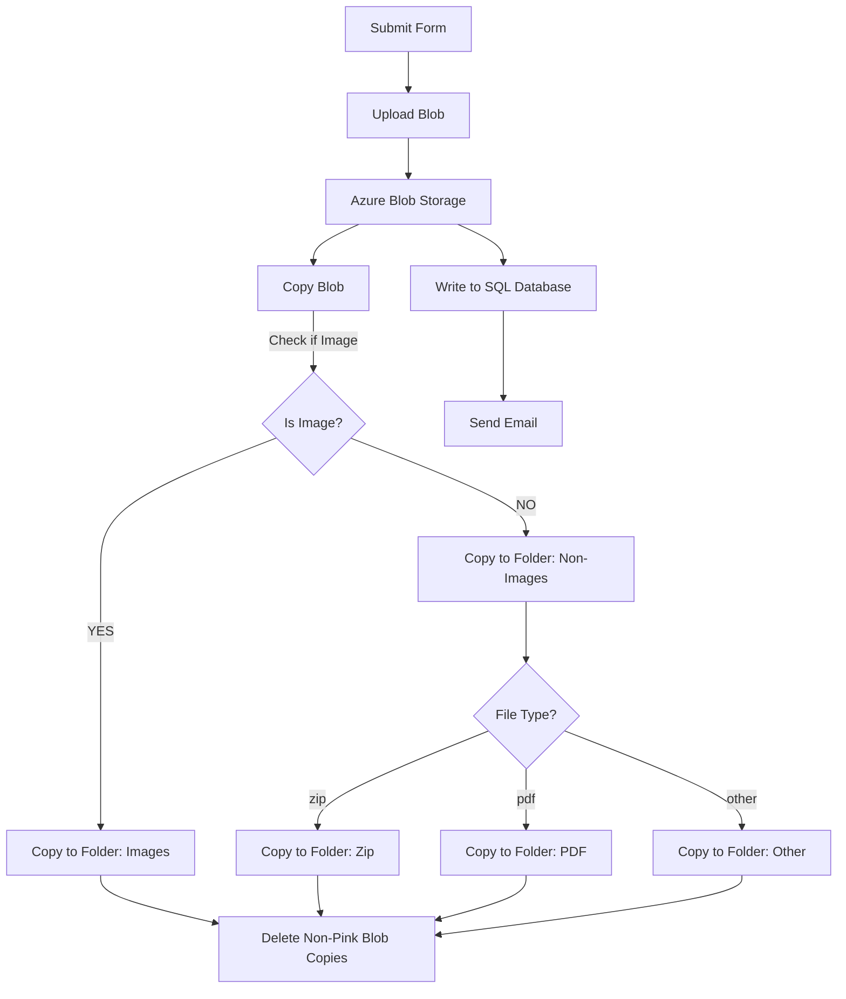
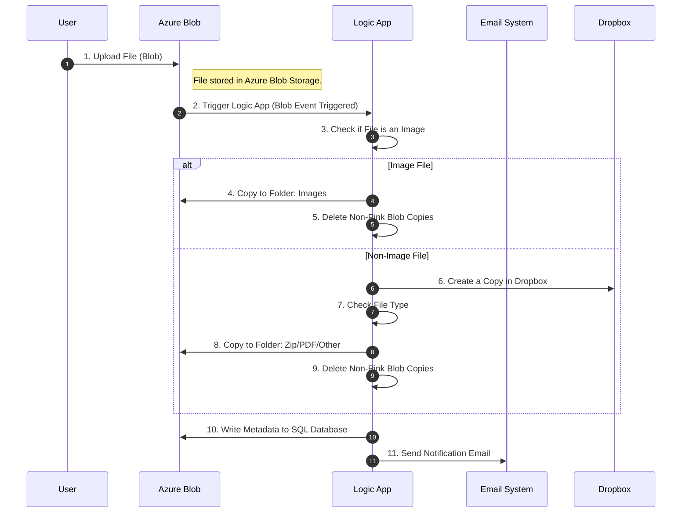

### Introduction to Azure Logic Apps

**Azure Logic Apps** is a powerful service for building integration solutions, enabling seamless connectivity between applications and services.

#### **Features and Benefits**:

1. **Built-in Connectors**  
   - Provides over 200 built-in connectors to connect popular services like Office 365, Dynamics 365, Azure services, and third-party services.  
   - Eliminates the need for complex API configurations.

2. **Serverless Architecture**  
   - Logic Apps operate in a **Serverless** mode, removing concerns about server management and scaling.  
   - Developers focus only on business logic while Azure handles infrastructure.

3. **Drag-and-Drop Development**  
   - Includes a **visual designer** that allows developers to create workflows with simple drag-and-drop actions, eliminating the need for extensive coding.  
   - Simplifies the development process and accelerates onboarding.

4. **Monitoring and Logging**  
   - Offers **real-time monitoring** and detailed logging to help developers quickly debug and resolve issues.  
   - Ensures high availability and observability of workflows.

5. **Auto-Scaling and High Availability**  
   - Built-in **Auto Scaling** dynamically allocates resources based on demand, preventing resource wastage.  
   - Guarantees stability even during traffic spikes.

6. **Cost Efficiency**  
   - Pay-as-you-go pricing model ensures users pay only for executed workflows.  
   - Reduces upfront costs and maintenance expenses.

#### **Use Cases**:

- Automating enterprise workflows (e.g., approval processes, sending notifications).  
- Data integration (e.g., consolidating data from multiple sources).  
- Integrating with external services or APIs.  
- Event-driven tasks (e.g., triggering operations when new data arrives).

Azure Logic Apps is an ideal tool for enterprise integration and automation, known for its simplicity, flexibility, and efficiency.

---



---



---

### Detailed Step-by-Step Explanation of the Sequence Diagram

#### **Actors in the Sequence Diagram**
- **User**: The person or system uploading the file.
- **Azure Blob**: Cloud storage service where files are initially uploaded.
- **Logic App**: Azure's workflow automation service that processes the file.
- **Email System**: Service responsible for sending notifications.
- **Dropbox**: External service used for storing additional copies of non-image files.

---

#### **Step 1: File Upload by User**
1. **User->>Blob: Upload File (Blob)**  
   - The user uploads a file to Azure Blob Storage.  
   - The file could be an image, document, or any other type.  

2. **Note right of Blob: File stored in Azure Blob Storage**  
   - Once uploaded, the file is saved in Azure Blob Storage for further processing.  

---

#### **Step 2: Logic App Triggered**
3. **Blob->>LogicApp: Trigger Logic App (Blob Event Triggered)**  
   - The upload event in Azure Blob Storage automatically triggers a Logic App workflow.  
   - This starts the process of analyzing and categorizing the uploaded file.  

4. **LogicApp->>LogicApp: Check if File is an Image**  
   - The Logic App checks the file type to determine whether it is an image.  
   - This decision determines the subsequent steps.

---

#### **Image File Path**
5. **LogicApp->>Blob: Copy to Folder: Images**  
   - If the file is an image, it is copied to a designated folder named "Images" within Azure Blob Storage.  

6. **LogicApp->>LogicApp: Delete Non-Pink Blob Copies**  
   - Any redundant or unrelated blob copies in other folders are deleted to maintain storage efficiency.  

---

#### **Non-Image File Path**
7. **LogicApp->>Dropbox: Create a Copy in Dropbox**  
   - If the file is not an image, a copy of the file is created and uploaded to a Dropbox folder for backup or additional processing.

8. **LogicApp->>LogicApp: Check File Type**  
   - The Logic App analyzes the file type to determine its category (e.g., ZIP, PDF, or other formats).  

9. **LogicApp->>Blob: Copy to Folder: Zip/PDF/Other**  
   - Depending on the file type:
     - **ZIP files**: Copied to the "Zip" folder.
     - **PDF files**: Copied to the "PDF" folder.
     - **Other files**: Copied to the "Other" folder within Azure Blob Storage.

10. **LogicApp->>LogicApp: Delete Non-Pink Blob Copies**  
    - Similar to the image path, redundant or unrelated blob copies are deleted.  

---

#### **Step 3: Final Processing**
11. **LogicApp->>Blob: Write Metadata to SQL Database**  
    - Metadata about the file (e.g., file name, size, upload timestamp) is written to an SQL database.  
    - This ensures proper record-keeping and retrieval capabilities for the uploaded files.  

12. **LogicApp->>Email: Send Notification Email**  
    - A notification email is sent to the user to confirm that the file processing is complete.  
    - This email could include details such as file type, storage location, and any processing notes.  

---

### **Flow Numbers Summary**
1. User uploads a file to Azure Blob Storage.  
2. Blob triggers the Logic App workflow.  
3. Logic App checks if the file is an image.  
4. If an image:
   - Copy to "Images" folder.
   - Delete non-pink blob copies.  
5. If not an image:
   - Create a copy in Dropbox.
   - Check the file type and categorize:
     - ZIP -> "Zip" folder.
     - PDF -> "PDF" folder.
     - Other -> "Other" folder.  
   - Delete non-pink blob copies.  
6. Write metadata to the SQL database.  
7. Send notification email to the user.  

---

### **How to Use Mermaid in VSCode**:
1. Install the **Markdown Preview Mermaid Support** plugin in VSCode.
2. Insert the above code blocks (wrapped in ```mermaid```).
3. Preview the diagrams directly in VSCode.
