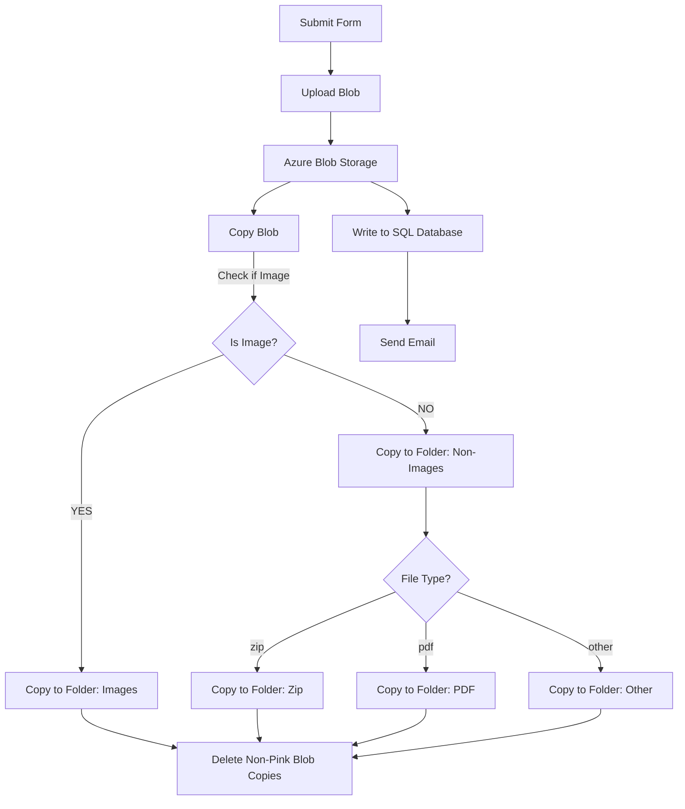
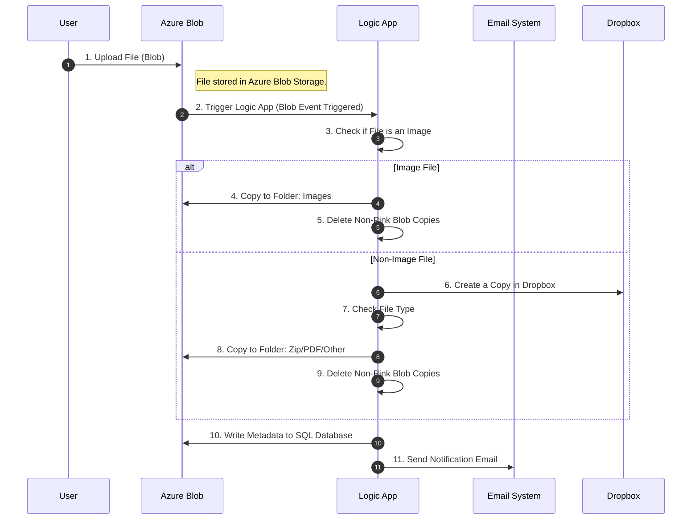

### Introduction to Azure Logic Apps

**Azure Logic Apps** is a powerful service for building integration solutions, enabling seamless connectivity between applications and services.

#### **Features and Benefits**:

1. **Built-in Connectors**  
   - Provides over 200 built-in connectors to connect popular services like Office 365, Dynamics 365, Azure services, and third-party services.  
   - Eliminates the need for complex API configurations.

2. **Serverless Architecture**  
   - Logic Apps operate in a **Serverless** mode, removing concerns about server management and scaling.  
   - Developers focus only on business logic while Azure handles infrastructure.

3. **Drag-and-Drop Development**  
   - Includes a **visual designer** that allows developers to create workflows with simple drag-and-drop actions, eliminating the need for extensive coding.  
   - Simplifies the development process and accelerates onboarding.

4. **Monitoring and Logging**  
   - Offers **real-time monitoring** and detailed logging to help developers quickly debug and resolve issues.  
   - Ensures high availability and observability of workflows.

5. **Auto-Scaling and High Availability**  
   - Built-in **Auto Scaling** dynamically allocates resources based on demand, preventing resource wastage.  
   - Guarantees stability even during traffic spikes.

6. **Cost Efficiency**  
   - Pay-as-you-go pricing model ensures users pay only for executed workflows.  
   - Reduces upfront costs and maintenance expenses.

#### **Use Cases**:

- Automating enterprise workflows (e.g., approval processes, sending notifications).  
- Data integration (e.g., consolidating data from multiple sources).  
- Integrating with external services or APIs.  
- Event-driven tasks (e.g., triggering operations when new data arrives).

Azure Logic Apps is an ideal tool for enterprise integration and automation, known for its simplicity, flexibility, and efficiency.

---



---



---

### **Detailed Flow Breakdown**:

#### **Step 1: Upload Blob File**
1. User submits a file via a form.
2. The file is uploaded and stored in **Azure Blob Storage**.

#### **Step 2: Logic App Triggered**
3. An event in Azure Blob triggers the **Logic App** workflow.
4. The Logic App checks if the file is an image:
   - **If the file is an image**:
     - It is copied to the **Images folder**.
     - All non-pink Blob copies are deleted.
   - **If the file is not an image**:
     - A copy is created in **Dropbox**.
     - The Logic App determines the file type:
       - **Zip File**: Copied to the **Zip folder**.
       - **PDF File**: Copied to the **PDF folder**.
       - **Other File Types**: Copied to the **Other folder**.
     - All non-pink Blob copies are deleted.

#### **Step 3: Data Storage and Notifications**
5. Metadata about the file is written to an **SQL database**.
6. A notification email is sent to the user.

---

### **How to Use Mermaid in VSCode**:
1. Install the **Markdown Preview Mermaid Support** plugin in VSCode.
2. Insert the above code blocks (wrapped in ```mermaid```).
3. Preview the diagrams directly in VSCode.
