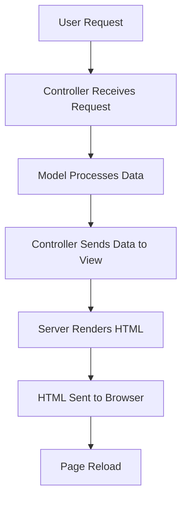
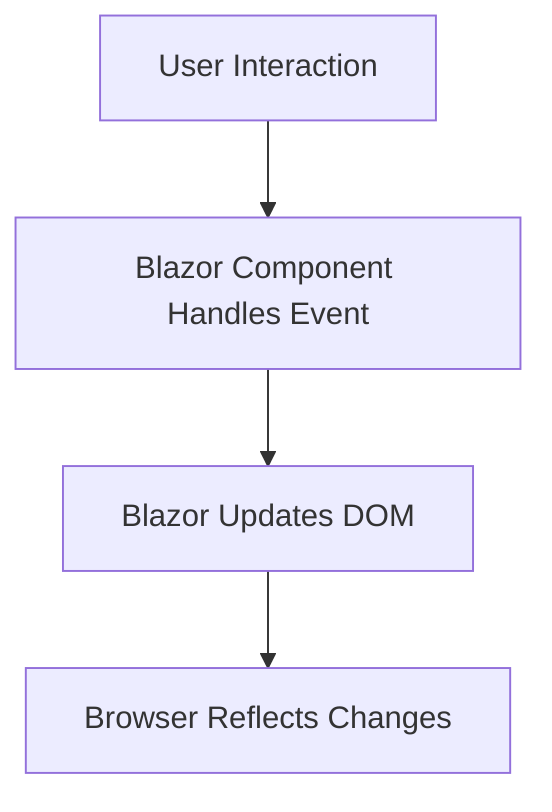

### MVC vs Blazor

Below is a detailed comparison of **C# .NET MVC (Model-View-Controller)** and **C# .NET Blazor**.

#### C# .NET MVC Workflow:

#### C# .NET Blazor Workflow:

---

### **Comparison Table**

| **Aspect**                  | **C# .NET MVC**                                   | **C# .NET Blazor**                               |
|-----------------------------|-------------------------------------------------|-------------------------------------------------|
| **Architecture**            | Follows the Model-View-Controller pattern.       | Component-based architecture (similar to SPA).  |
| **Rendering**               | Server-side rendering of HTML.                   | Client-side rendering (Blazor WebAssembly) or Server-side rendering (Blazor Server). |
| **Technology Used**         | Primarily HTML, Razor views, and JavaScript.     | Razor components with C# for both logic and UI updates. |
| **Page Interaction**        | Each interaction requires a server round trip.   | Real-time updates in the DOM with minimal server interaction. |
| **Performance**             | Slower due to full-page reloads for updates.     | Faster as only necessary DOM changes are applied. |
| **Client-Side Support**     | Requires JavaScript for client-side logic.       | Can handle client-side logic with C# (reduces JavaScript dependency). |
| **Development Focus**       | Split between server-side (C#) and front-end (HTML/JavaScript). | Unified C# development for front-end and back-end. |
| **State Management**        | Managed on the server or using custom solutions. | Built-in state management (e.g., `@State` and SignalR for real-time updates). |
| **Scalability**             | Well-suited for traditional server-rendered applications. | Better suited for modern, interactive single-page applications (SPAs). |
| **Real-Time Updates**       | Needs additional frameworks like SignalR or WebSockets. | Real-time DOM updates built into Blazor (SignalR integrated in Blazor Server). |
| **Learning Curve**          | Easier for those familiar with MVC patterns.     | Requires understanding of component-based architecture and lifecycle. |

---

### **Detailed Explanation**

#### **C# .NET MVC**
1. **Request-Response Model**:
   - User requests trigger server-side processing through controllers.
   - Data is fetched/processed via models.
   - The server sends an HTML page back to the browser, requiring a full reload.
   
2. **Key Features**:
   - Highly structured approach with clear separation of concerns.
   - Relies heavily on server-side logic.
   - Works well for traditional, form-based web apps.

3. **Challenges**:
   - Frequent server round trips increase latency.
   - Limited interactivity without JavaScript.

---

#### **C# .NET Blazor**
1. **Component-Based Development**:
   - Blazor allows developers to build reusable UI components using C# and Razor syntax.
   - Components manage their own state and lifecycle.

2. **Real-Time Updates**:
   - Blazor dynamically updates the DOM without reloading the page.
   - With Blazor WebAssembly, the logic runs entirely in the browser.
   - Blazor Server uses SignalR for real-time communication between client and server.

3. **Key Features**:
   - Eliminates the need for JavaScript for most client-side interactions.
   - Enables SPA-like functionality with full-stack C#.

4. **Challenges**:
   - Blazor Server requires persistent server connections (may impact scalability).
   - Blazor WebAssembly has larger initial payloads as it downloads the .NET runtime to the browser.

---

### **Use Cases**

| **Framework**       | **Best Suited For**                                                                 |
|----------------------|-------------------------------------------------------------------------------------|
| **C# .NET MVC**      | Traditional, server-driven web applications where SEO and full-page rendering matter. |
| **C# .NET Blazor**   | Modern, interactive web apps with SPA-like functionality or real-time updates.      |

---

### **Conclusion**
- Use **C# .NET MVC** for:
  - Applications requiring high SEO support.
  - Simpler server-driven architectures.
- Use **C# .NET Blazor** for:
  - Single-page applications (SPA) with real-time interactivity.
  - Applications needing unified C# code for client and server.

Blazor is ideal for modernizing applications, while MVC remains a reliable choice for traditional web development.
