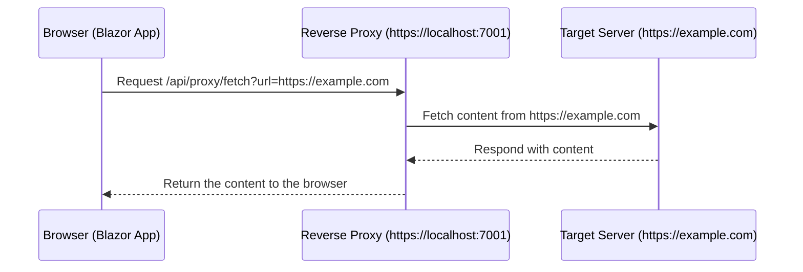

### **.NET Core Web API project** as a reverse proxy to bypass **Same-Origin Policy** (CORS) issues. 

Here’s how you can set this up:

---

### **Key Setup**
1. **Blazor App**:
   - Runs on `https://localhost:5001`.
   - Communicates with the Web API proxy for cross-origin requests.
2. **Web API Proxy**:
   - Runs on a separate port (e.g., `https://localhost:7001`).
   - Acts as a reverse proxy, fetching content from external sources and returning it to the Blazor app.

---

### **Step-by-Step Guide**

#### **1. Create a New .NET Core Web API Project**

1. Open a terminal and create a new Web API project:
   ```bash
   dotnet new webapi -n ReverseProxyAPI
   cd ReverseProxyAPI
   ```

2. Install required dependencies:
   ```bash
   dotnet add package Microsoft.AspNetCore.Cors
   ```

3. Open the `Program.cs` file and set up CORS:

   ```csharp
   var builder = WebApplication.CreateBuilder(args);

   // Add services to the container
   builder.Services.AddCors(options =>
   {
       options.AddPolicy("AllowBlazor", policy =>
       {
           policy.WithOrigins("https://localhost:5001")  // Blazor app origin
                 .AllowAnyHeader()
                 .AllowAnyMethod();
       });
   });

   builder.Services.AddControllers();
   builder.Services.AddHttpClient();  // Add HttpClient for proxy functionality

   var app = builder.Build();

   // Enable CORS for the Blazor app
   app.UseCors("AllowBlazor");

   // Configure the HTTP request pipeline
   app.UseHttpsRedirection();
   app.UseAuthorization();
   app.MapControllers();

   app.Run();
   ```

---

#### **2. Add the Proxy Logic**

1. Create a `ProxyController`:

   - Navigate to the `Controllers` folder.
   - Create a new file called `ProxyController.cs`.

   ```csharp
   using Microsoft.AspNetCore.Mvc;
   using System.Net.Http;
   using System.Threading.Tasks;

   namespace ReverseProxyAPI.Controllers
   {
       [ApiController]
       [Route("api/[controller]")]
       public class ProxyController : ControllerBase
       {
           private readonly HttpClient _httpClient;

           public ProxyController(HttpClient httpClient)
           {
               _httpClient = httpClient;
           }

           [HttpGet("fetch")]
           public async Task<IActionResult> Fetch([FromQuery] string url)
           {
               if (string.IsNullOrEmpty(url))
                   return BadRequest("URL is required.");

               try
               {
                   // Fetch the content from the external URL
                   var response = await _httpClient.GetAsync(url);
                   response.EnsureSuccessStatusCode();

                   // Read and return the response content
                   var content = await response.Content.ReadAsStringAsync();
                   return Content(content, response.Content.Headers.ContentType?.ToString() ?? "text/html");
               }
               catch (HttpRequestException ex)
               {
                   return BadRequest($"Error fetching the URL: {ex.Message}");
               }
           }
       }
   }
   ```

---

#### **3. Run the Web API Proxy**

1. Run the Web API project:
   ```bash
   dotnet run
   ```

2. Verify it runs on `https://localhost:7001` (or another port, as displayed in the terminal).

---

#### **4. Configure the Blazor App**

In your Blazor Server app:

1. **Set up the iframe** in a Razor page (e.g., `ProxyPage.razor`):

   ```razor
   @page "/proxy"
   <h3>Cross-Origin Proxy Example</h3>

   <!-- Use the proxy API to fetch external content -->
   <iframe src="https://localhost:7001/api/proxy/fetch?url=https://example.com" 
           width="800" 
           height="600" 
           style="border: 1px solid black;">
   </iframe>
   ```

2. **Run your Blazor app**:
   - The iframe will load content from the Web API proxy (`https://localhost:7001`), which in turn fetches content from `https://example.com`.

---

### **How It Works**
1. The Blazor app (`https://localhost:5001`) makes a request to the proxy (`https://localhost:7001`).
2. The proxy (`ProxyController`) fetches content from the external site (`https://example.com`).
3. The proxy returns the content to the Blazor app as if it originated from the proxy, bypassing Same-Origin Policy.

---

### **Important Notes**
1. **CORS Configuration**:
   - The Web API proxy explicitly allows the Blazor app’s origin (`https://localhost:5001`).
   - Adjust the `WithOrigins` value in `Program.cs` if your Blazor app uses a different URL in production.

2. **Security**:
   - Validate the incoming `url` parameter to prevent misuse of the proxy.
   - Add a whitelist for allowed domains to ensure only trusted sources can be proxied.

   Example:
   ```csharp
   private readonly List<string> _allowedDomains = new List<string>
   {
       "example.com",
       "another-domain.com"
   };

   private bool IsUrlAllowed(string url)
   {
       var uri = new Uri(url);
       return _allowedDomains.Contains(uri.Host);
   }
   ```

   Validate the URL in the `Fetch` method:
   ```csharp
   if (!IsUrlAllowed(url))
       return BadRequest("This URL is not allowed.");
   ```

3. **Performance**:
   - If the external content doesn’t change often, implement caching in the proxy to reduce load.

---

Here’s a detailed guide to understanding and implementing a **Reverse Proxy** in your .NET Core Web API project to bypass the Same-Origin Policy, including the **Mermaid diagram** for the workflow.

---

### **Why Reverse Proxy Works**

#### **What is Same-Origin Policy?**
The Same-Origin Policy is a browser security measure that prevents a web page from making requests to a different domain. To be considered “same-origin,” the **protocol**, **domain**, and **port** must match.

Example:
- A page on `https://example.com` can access `https://example.com/api/data`.
- The same page cannot access `https://another-domain.com/api/data` because the domains are different.

---

#### **How Reverse Proxy Solves This**
A **Reverse Proxy** acts as an intermediary between the browser and the target server. Instead of the browser directly requesting resources from the target server, the proxy fetches the resources and serves them as if they came from the same origin.

**Key Idea**: 
- The browser interacts only with the proxy (which is on the same origin), and the proxy interacts with the target server on behalf of the browser.

---

### **Reverse Proxy Workflow**



---

### **Steps to Implement a Reverse Proxy**

#### **1. Create a New .NET Core Web API Project**

1. Create a new project:
   ```bash
   dotnet new webapi -n ReverseProxyAPI
   cd ReverseProxyAPI
   ```

2. Add the required dependencies:
   ```bash
   dotnet add package Microsoft.AspNetCore.Cors
   ```

---

#### **2. Configure the Web API**

1. Open `Program.cs` and configure CORS and other services:

   ```csharp
   var builder = WebApplication.CreateBuilder(args);

   // Add services
   builder.Services.AddCors(options =>
   {
       options.AddPolicy("AllowBlazor", policy =>
       {
           policy.WithOrigins("https://localhost:5001")  // Blazor app origin
                 .AllowAnyHeader()
                 .AllowAnyMethod();
       });
   });
   builder.Services.AddControllers();
   builder.Services.AddHttpClient();

   var app = builder.Build();

   // Enable CORS
   app.UseCors("AllowBlazor");

   // Middleware configuration
   app.UseHttpsRedirection();
   app.UseAuthorization();
   app.MapControllers();

   app.Run();
   ```

---

#### **3. Add a Proxy Controller**

1. In the `Controllers` folder, create a file called `ProxyController.cs`:

   ```csharp
   using Microsoft.AspNetCore.Mvc;
   using System.Net.Http;
   using System.Threading.Tasks;

   namespace ReverseProxyAPI.Controllers
   {
       [ApiController]
       [Route("api/[controller]")]
       public class ProxyController : ControllerBase
       {
           private readonly HttpClient _httpClient;

           public ProxyController(HttpClient httpClient)
           {
               _httpClient = httpClient;
           }

           [HttpGet("fetch")]
           public async Task<IActionResult> Fetch([FromQuery] string url)
           {
               if (string.IsNullOrEmpty(url))
                   return BadRequest("URL is required.");

               try
               {
                   // Fetch content from the target URL
                   var response = await _httpClient.GetAsync(url);
                   response.EnsureSuccessStatusCode();

                   // Return the content to the client
                   var content = await response.Content.ReadAsStringAsync();
                   return Content(content, response.Content.Headers.ContentType?.ToString() ?? "text/html");
               }
               catch (HttpRequestException ex)
               {
                   return BadRequest($"Error fetching the URL: {ex.Message}");
               }
           }
       }
   }
   ```

---

#### **4. Run the Web API Proxy**

1. Run the Web API project:
   ```bash
   dotnet run
   ```

2. Verify it is running on `https://localhost:7001`.

---

#### **5. Configure the Blazor App**

1. Open your Blazor Server project.
2. Add an iframe to a Razor page (e.g., `ProxyPage.razor`):

   ```razor
   @page "/proxy"
   <h3>Reverse Proxy Example</h3>

   <!-- Use the reverse proxy -->
   <iframe src="https://localhost:7001/api/proxy/fetch?url=https://example.com" 
           width="800" 
           height="600" 
           style="border: 1px solid black;">
   </iframe>
   ```

3. Run the Blazor app (`https://localhost:5001`) and navigate to the proxy page. The iframe will load content from `https://example.com` through the proxy.

---

### **Why This Works**

1. **Request Origin**:
   - The browser sends requests to the reverse proxy at `https://localhost:7001`, which is explicitly allowed by CORS.
2. **Server-Side Fetching**:
   - The proxy fetches content from the target server (`https://example.com`) on behalf of the browser.
   - The server-side request is not subject to Same-Origin Policy.
3. **Transparent Response**:
   - The proxy forwards the content to the browser as if it originated from the same origin (`localhost:7001`).

---

### **Advantages of Reverse Proxy**

| **Feature**            | **Description**                                           |
|-------------------------|-----------------------------------------------------------|
| **Bypass Same-Origin**  | Allows fetching data from cross-origin servers.           |
| **Enhanced Security**   | Hides the target server from direct client access.        |
| **Flexibility**         | Can modify, filter, or cache responses.                   |
| **Supports VPN**        | Proxy can fetch data through a VPN on the server.         |

---

### **Summary**

- A **reverse proxy** fetches data from cross-origin servers and serves it to the browser as if it’s from the same origin.
- This setup includes:
  1. A **Web API project** for proxying requests.
  2. **CORS configuration** to allow communication between the Blazor app and proxy.
  3. Integration with the Blazor app using an iframe.

This solution bypasses Same-Origin Policy restrictions while maintaining security and flexibility. If you need additional help or enhancements, feel free to ask!

---

### **Summary**
This approach creates a secure and flexible reverse proxy with a separate .NET Core Web API project. The Web API handles the cross-origin communication, while the Blazor app focuses on rendering the content seamlessly.

If you have further questions or need adjustments, let me know!
