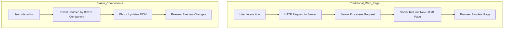

### C#.NET Blazor

#### What is Blazor?

**Blazor** is a modern web framework developed by Microsoft that allows developers to build interactive web applications using **C#** instead of JavaScript. It is part of the **ASP.NET Core** framework and enables the creation of rich user interfaces (UIs) based on reusable components. These components are typically defined in files with a `.razor` extension, which combine HTML markup with C# code, enhancing developer productivity through a syntax known as Razor.

Blazor supports two main hosting models:

1. **Blazor Server**: In this model, the application runs on the server, and UI updates are sent to the client over a SignalR connection. This allows for a responsive user experience while keeping the server in control of the application state.

2. **Blazor WebAssembly**: This model allows the application to run directly in the browser using WebAssembly, enabling client-side execution of C# code. This approach provides a more traditional single-page application (SPA) experience.

One of the key advantages of Blazor is its ability to leverage existing .NET libraries and tools, making it an attractive option for developers familiar with the .NET ecosystem. It also promotes a component-based architecture, which is beneficial for building scalable and maintainable applications.

---

Here is a Mermaid flowchart comparing the workflows of traditional web pages and Blazor components:

**Explanation:**

### Traditional Web Page

1. **User Interaction**: The user performs an action on the webpage, such as clicking a link or submitting a form.
2. **HTTP Request to Server**: The browser sends an HTTP request to the server to process the user's action.
3. **Server Processes Request**: The server executes the necessary backend logic to handle the request.
4. **Server Returns New HTML Page**: After processing, the server sends back a new HTML page to the browser.
5. **Browser Renders Page**: The browser loads and displays the new page, replacing the previous content.

### Blazor Components

1. **User Interaction**: The user interacts with the webpage elements.
2. **Event Handled by Blazor Component**: The Blazor component captures the event and processes it using C# code on the client-side (Blazor WebAssembly) or server-side (Blazor Server).
3. **Blazor Updates DOM**: Blazor computes the changes needed in the Document Object Model (DOM) and updates it accordingly.
4. **Browser Renders Changes**: The browser reflects the updated DOM elements without reloading the entire page.

**Key Differences:**

- **Page Reloads**: Traditional web pages often require a full page reload for new content, leading to slower interactions. Blazor updates only the necessary parts of the page, resulting in a smoother user experience.
- **Client-Side Processing**: Blazor allows for client-side event handling using C#, reducing the need for JavaScript and minimizing server calls.
- **Performance**: By handling interactions on the client-side and updating the DOM directly, Blazor applications can offer faster response times compared to traditional server-rendered pages.

**Benefits of Blazor:**

- **Unified Development**: Developers can use C# across both client and server, streamlining the development process.
- **Rich Interactive UI**: Enables building complex and dynamic user interfaces with ease.
- **Reduced Server Load**: Less frequent full-page requests to the server can lead to better scalability.

**Conclusion:**

The flowchart illustrates how Blazor components enhance web application performance and user experience by minimizing server interactions and leveraging client-side processing. Traditional web pages, while effective, can be less responsive due to the need for frequent full-page reloads.
