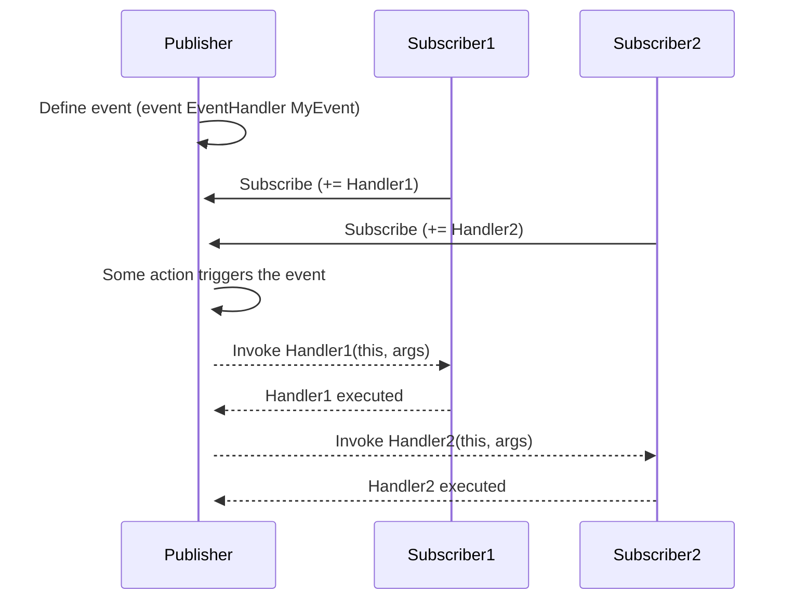

Sure! Here's the complete explanation of **.NET Events**, translated into English with deep insights and behind-the-scenes mechanisms:

---

## 1. What Is an Event in .NET?

An **event** in .NET is a core part of the **publish-subscribe pattern** that enables **decoupled communication** between objects. It allows one object to **raise a signal** that other objects can respond to by subscribing handlers.

### Simple Example:

```csharp
public class Alarm
{
    public event EventHandler Ring;

    public void Trigger()
    {
        Console.WriteLine("Alarm triggered!");
        Ring?.Invoke(this, EventArgs.Empty);
    }
}

class Program
{
    static void Main()
    {
        var alarm = new Alarm();
        alarm.Ring += OnAlarmRing;

        alarm.Trigger();
    }

    static void OnAlarmRing(object sender, EventArgs e)
    {
        Console.WriteLine("Alarm received, take action!");
    }
}
```

---

## 2. Behind the Scenes: What Happens Under the Hood?

### 🔧 How `event` Works Internally

An `event` in C# is syntactic sugar for:

```csharp
// The compiler translates this:
public event EventHandler Ring;

// Into something like this:
private EventHandler ring;

public event EventHandler Ring
{
    add { ring += value; }
    remove { ring -= value; }
}
```

* `event` ensures **encapsulation** — subscribers can add/remove handlers, but **cannot invoke the event** directly from outside.
* If you just use `public EventHandler Ring;`, outside code could call `Ring()` directly — this is not safe.

### 🔗 Events Use Multicast Delegates

C# events use **multicast delegates**, meaning you can attach multiple handlers:

```csharp
alarm.Ring += Handler1;
alarm.Ring += Handler2;
```

When the event is triggered, both handlers are invoked in sequence.

---

## 3. Custom Event Arguments (`EventArgs`)

You can create your own `EventArgs` to pass detailed information to subscribers:

```csharp
public class TemperatureChangedEventArgs : EventArgs
{
    public int NewTemperature { get; }
    public TemperatureChangedEventArgs(int newTemp)
    {
        NewTemperature = newTemp;
    }
}

public class Thermostat
{
    public event EventHandler<TemperatureChangedEventArgs> TemperatureChanged;

    public void ChangeTemperature(int newTemp)
    {
        TemperatureChanged?.Invoke(this, new TemperatureChangedEventArgs(newTemp));
    }
}
```

---

## 4. In-Depth Notes: Memory, Safety, and Pitfalls

| Concern           | Explanation                                                                                                   |
| ----------------- | ------------------------------------------------------------------------------------------------------------- |
| **Memory Leak**   | If events are not unsubscribed, the publisher holds references to subscribers, preventing garbage collection. |
| **+= / -=**       | Always pair these; unsubscribe when done.                                                                     |
| **Thread Safety** | The compiler wraps event accessors in thread-safe code (like `Interlocked.CompareExchange`).                  |
| **Static Events** | Static events live for the application's lifetime — forgetting to unsubscribe can be disastrous.              |

---

## 5. Common Scenarios

| Use Case      | Description                              |
| ------------- | ---------------------------------------- |
| UI Events     | `Button.Click += ...` in WinForms/WPF    |
| MVVM Binding  | `INotifyPropertyChanged.PropertyChanged` |
| Event Bus     | Custom pub-sub frameworks                |
| SignalR       | Client receives events from server       |
| Task Callback | Notify when work is done (async pattern) |

---

## 6. Best Practices

1. **Use `EventHandler` or `EventHandler<T>`**: Stick to .NET conventions.
2. **Avoid exposing delegate fields**: Always use `event` for safety.
3. **Use `?.Invoke()` to raise**: Prevents null exceptions.
4. **Use meaningful `EventArgs` subclasses**: Communicates intent clearly.
5. **Unsubscribe properly**: Especially in UI apps or long-lived objects.

---

## 7. Advanced: Manual Event Model (Without `event` Keyword)

Sometimes, you may want full control. Here's a raw implementation:

```csharp
public class MyEventPublisher
{
    private Action _onEvent;

    public void Subscribe(Action handler) => _onEvent += handler;
    public void Unsubscribe(Action handler) => _onEvent -= handler;

    public void Raise() => _onEvent?.Invoke();
}
```

This gives you more power but loses the safety and protection `event` provides.

---

Great! Below is a detailed breakdown:

---

## ✅ .NET Event Flow — Mermaid Sequence Diagram

This illustrates the **publisher-subscriber** flow of a .NET event using Mermaid syntax:

### 🧭 Sequence Diagram



You can paste this into a Mermaid live editor (like [Mermaid Live Editor](https://mermaid.live)) or tools like VS Code + Markdown Preview Mermaid Support.

---

## 🧠 .NET Event Memory Structure (Simplified)

Let's break this down in a diagram-like explanation using text.

### Memory View (Heap + Delegate Chain)

```
+--------------------+           +------------------+
|     Publisher      |           |   Subscriber 1   |
|--------------------|           |------------------|
| + MyEvent (field)  |------->   | + Handler1()     |
|                    |           +------------------+
|                    |
|                    |           +------------------+
|                    |           |   Subscriber 2   |
|                    |---------->| + Handler2()     |
+--------------------+           +------------------+
```

### Explanation:

* `MyEvent` is a **delegate field** behind the `event` keyword.
* It stores a **multicast delegate chain** (an internal invocation list).
* Each subscriber registers a method, and their reference is **added to the delegate chain**.
* When the event is triggered, the multicast delegate calls each method **in order**.

---

## 📌 Bonus: Internal .NET Multicast Delegate

Under the hood, the event delegate uses an **Invocation List**:

```csharp
Delegate[] invocationList = myEvent.GetInvocationList();

foreach (var handler in invocationList)
{
    handler.DynamicInvoke(sender, args);
}
```

This is how .NET handles multiple subscribers to a single event.

