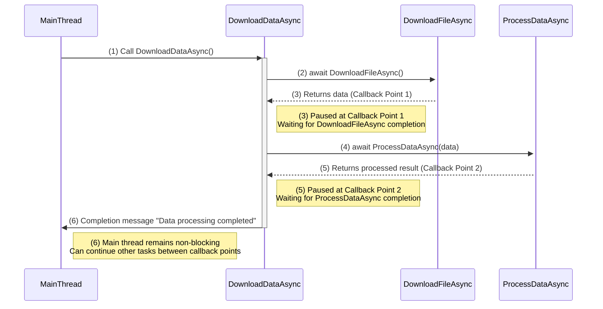

### Task-Based Asynchronous Programming

**Task-Based Asynchronous Programming (TAP)** is a programming model in C# that uses `Task` and `Task<TResult>` to represent asynchronous operations. TAP simplifies handling asynchronous programming by providing a structure for non-blocking operations using the `async` and `await` keywords.

#### TAP Key Concepts
1. **Task**: `Task` is the core object for asynchronous operations, representing the outcome. It contains the result if successful and an exception if it fails.
2. **async / await**: `async` marks a method as asynchronous, and `await` pauses execution to wait for the asynchronous operation to complete. These keywords make asynchronous code simpler and more readable.

#### Benefits of TAP
- **Readability**: The structure of asynchronous code is similar to synchronous code, making it more intuitive and easier to maintain.
- **Performance**: Tasks execute in a non-blocking way, reducing context switching and ideal for I/O-bound operations.
- **Error Handling**: TAP provides robust error handling; exceptions propagate back through the `Task`, allowing them to be caught by the calling code.

#### Example: Using Task-Based Asynchronous Programming
```csharp
using System;
using System.Net.Http;
using System.Threading.Tasks;

class Program
{
    static async Task Main()
    {
        Console.WriteLine("Fetching data...");
        string result = await FetchDataAsync("https://jsonplaceholder.typicode.com/posts/1");
        Console.WriteLine($"Fetched data: {result}");
    }

    static async Task<string> FetchDataAsync(string url)
    {
        using HttpClient client = new HttpClient();
        HttpResponseMessage response = await client.GetAsync(url);
        response.EnsureSuccessStatusCode();
        return await response.Content.ReadAsStringAsync();
    }
}
```

**Explanation**:
1. The `FetchDataAsync` method is asynchronous, making an asynchronous request using `HttpClient`.
2. `await client.GetAsync(url)` pauses execution, allowing other tasks to continue instead of blocking the main thread.
3. The final `result` is printed in the `Main` method once the data is fetched.

#### How TAP Works
- **Asynchronous Chaining**: Each `await` call creates a callback point, splitting the method into multiple execution stages without blocking the main thread.
- **Task Completion**: The program continues to the next step, forming an “asynchronous task chain” that efficiently handles I/O operations.

#### Use Cases for TAP
1. **I/O-Bound Operations**: Tasks like file I/O, network requests, etc., are ideal for asynchronous programming to improve performance.
2. **User Interface Applications**: In UI applications, it prevents the main thread from being blocked, maintaining responsiveness.
3. **Parallel Processing**: Multiple independent tasks can run in parallel, increasing efficiency.

#### Example of Parallel Task Execution
TAP supports parallel task execution using `Task.WhenAll` or `Task.WhenAny` to manage multiple asynchronous tasks.

```csharp
using System;
using System.Threading.Tasks;

class Program
{
    static async Task Main()
    {
        Task<int> task1 = DoWorkAsync(1, 1000);
        Task<int> task2 = DoWorkAsync(2, 2000);
        Task<int> task3 = DoWorkAsync(3, 3000);

        int[] results = await Task.WhenAll(task1, task2, task3);

        Console.WriteLine("All tasks completed:");
        foreach (var result in results)
        {
            Console.WriteLine($"Task result: {result}");
        }
    }

    static async Task<int> DoWorkAsync(int id, int delay)
    {
        Console.WriteLine($"Task {id} starting...");
        await Task.Delay(delay); // Simulating time-consuming operation
        Console.WriteLine($"Task {id} completed.");
        return id;
    }
}
```

**Explanation**:
- Using `Task.WhenAll`, tasks `task1`, `task2`, and `task3` run in parallel.
- `await Task.WhenAll(task1, task2, task3)` waits for all tasks to complete before returning results.

#### Summary
Task-Based Asynchronous Programming is a powerful and flexible asynchronous programming model in C#. The `async` and `await` keywords simplify asynchronous code, reducing nested callbacks and improving readability and maintainability.

---

**Deep Understanding**:

In asynchronous programming, `await` pauses the method execution to wait for the asynchronous operation to complete. Specifically, `await` creates a **callback point** to divide the method into multiple **execution stages**. The key advantage of this division is that it does not block the main thread, enabling efficient and smooth program flow.

### Detailed Explanation
1. **Creating Callback Points**:
   - When the program encounters an `await`, the asynchronous method doesn’t continue immediately but instead creates a "callback point" at the current position, acting as a "marker" where the program waits for the asynchronous operation to finish.
   - The callback point stores the current method state, variables, etc., allowing the program to resume from this point once the operation is complete.

2. **Dividing Into Multiple Execution Stages**:
   - When a method encounters `await`, it pauses, waiting for the asynchronous task to complete. Once the task completes, the program resumes from the callback point, executing the remaining code. This pause-and-resume mechanism divides the method into multiple “execution stages.”
   - Each `await` statement allows the program to pause execution without blocking other code, avoiding the complexity of thread management.

3. **Non-Blocking the Main Thread**:
   - Since `await` is non-blocking, when a method pauses at an `await` call, the main thread can continue executing other tasks without being stuck waiting.
   - This non-blocking wait time does not occupy the main thread’s resources, making it ideal for I/O-bound operations, such as network requests or file I/O.

### Example Understanding

Suppose we have an asynchronous method `DownloadDataAsync()`, which includes two `await` operations for downloading and processing data:

```csharp
async Task DownloadDataAsync()
{
    var data = await DownloadFileAsync(); // First await creates Callback Point 1
    var result = await ProcessDataAsync(data); // Second await creates Callback Point 2
    Console.WriteLine("Data processing completed.");
}
```

- **Callback Point 1**: At `await DownloadFileAsync()`, the first callback point is created. The method pauses, waiting for the file download to complete. The main thread remains free to continue other tasks.
- **Callback Point 2**: After the file download completes, `DownloadDataAsync` resumes from Callback Point 1 and proceeds to `await ProcessDataAsync(data)`, creating Callback Point 2. The method pauses again, awaiting data processing completion.
- **Resuming Execution**: After all asynchronous operations complete, the program resumes at the final callback point and prints "Data processing completed."

### Benefits of This Deep Understanding
This staged execution allows methods to be written and read as if they were synchronous, without complex nested callbacks. The callback mechanism of `await` keeps the code structure clear and enhances program responsiveness, making it an essential feature of asynchronous programming in C#.

### Summary
By creating callback points, `await` enables non-blocking asynchronous processing, dividing methods into multiple execution stages, ensuring the main thread can continue with other tasks, and improving program performance and readability.

---

A **sequence diagram** can visually illustrate how `await` creates callback points and how the method resumes execution in stages, allowing the main thread to process other tasks. 



### Process Explanation

1. **Step (1)**: The main thread calls `DownloadDataAsync`, starting the asynchronous method.
2. **Step (2)**: `DownloadDataAsync` pauses at `await DownloadFileAsync()`, waiting for file download to complete.
3. **Step (3)**: File download completes, triggering Callback Point 1, and `DownloadDataAsync` resumes execution.
4. **Step (4)**: The method continues and encounters `await ProcessDataAsync(data)`, creating Callback Point 2.
5. **Step (5)**: Data processing completes, triggering Callback Point 2, and `DownloadDataAsync` resumes.
6. **Step (6)**: Finally, "Data processing completed" is printed, marking the method completion.

### This numbered flow diagram clearly illustrates each execution step, making it easier to understand the callback point mechanism in `await`.
