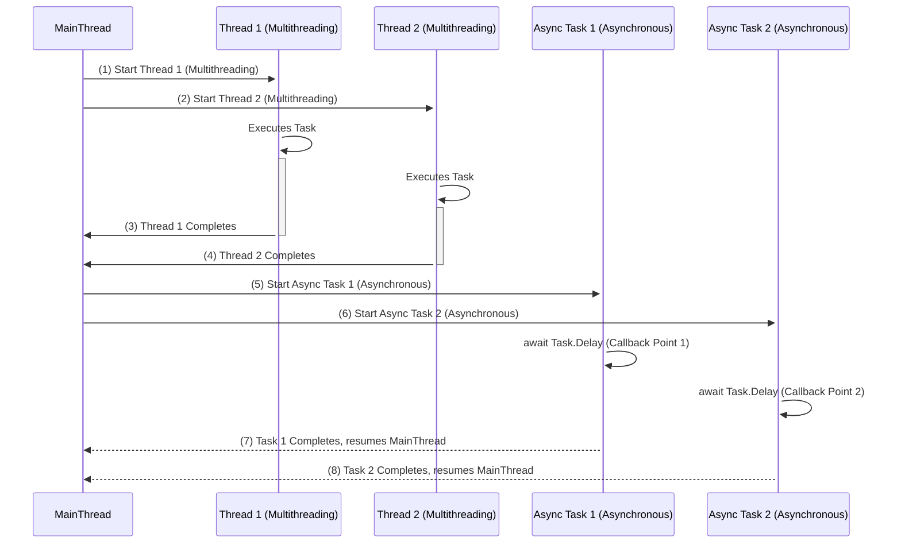

### Multithreading vs. Asynchronous Programming

**Multithreading** and **Asynchronous Programming** are two approaches for improving application performance and responsiveness in C#. While they can seem similar, they have distinct characteristics and are best suited for different scenarios.

#### Key Concepts of Multithreading and Asynchronous Programming

1. **Multithreading**:
   - Multithreading uses multiple threads to execute tasks concurrently, often improving responsiveness in applications.
   - Threads share memory, which can lead to complexity around thread safety and synchronization.
   
2. **Asynchronous Programming**:
   - Asynchronous programming relies on non-blocking operations, allowing other tasks to continue execution without waiting for a long-running task to complete.
   - It is achieved in C# using `async` and `await`, which divide the method into execution stages without creating new threads unless explicitly required.

#### Advantages of Each Approach

| Feature                | Multithreading                                     | Asynchronous Programming                                  |
|------------------------|----------------------------------------------------|-----------------------------------------------------------|
| **Parallel Execution** | Achieved by creating multiple threads              | Achieved by non-blocking calls rather than multiple threads |
| **Memory Management**  | Threads share memory, requiring synchronization    | Does not involve shared memory, reducing thread-safety issues |
| **Best Use Cases**     | CPU-bound tasks (e.g., calculations)               | I/O-bound tasks (e.g., file operations, network requests)  |
| **Context Switching**  | Involves thread switching overhead                 | Minimizes context switching for efficiency                 |
| **Complexity**         | Higher, due to synchronization requirements        | Lower, code is cleaner and easier to maintain              |

#### Example: Multithreading in C#
```csharp
using System;
using System.Threading;

class Program
{
    static void Main()
    {
        Thread thread1 = new Thread(PrintNumbers);
        Thread thread2 = new Thread(PrintLetters);

        thread1.Start();
        thread2.Start();

        thread1.Join();
        thread2.Join();

        Console.WriteLine("Main thread completed");
    }

    static void PrintNumbers()
    {
        for (int i = 1; i <= 5; i++)
        {
            Console.WriteLine($"Number: {i}");
            Thread.Sleep(500); // Simulate time-consuming operation
        }
    }

    static void PrintLetters()
    {
        for (char c = 'A'; c <= 'E'; c++)
        {
            Console.WriteLine($"Letter: {c}");
            Thread.Sleep(500); // Simulate time-consuming operation
        }
    }
}
```

**Explanation**:
1. Two threads, `thread1` and `thread2`, are created and execute `PrintNumbers` and `PrintLetters` concurrently.
2. Each thread simulates a time-consuming task with `Thread.Sleep(500)`.
3. `Main` waits for both threads to complete using `Join`.

#### Example: Asynchronous Programming in C#
```csharp
using System;
using System.Threading.Tasks;

class Program
{
    static async Task Main()
    {
        Task task1 = PrintNumbersAsync();
        Task task2 = PrintLettersAsync();

        await Task.WhenAll(task1, task2);

        Console.WriteLine("Main program completed");
    }

    static async Task PrintNumbersAsync()
    {
        for (int i = 1; i <= 5; i++)
        {
            Console.WriteLine($"Number: {i}");
            await Task.Delay(500); // Simulate asynchronous delay
        }
    }

    static async Task PrintLettersAsync()
    {
        for (char c = 'A'; c <= 'E'; c++)
        {
            Console.WriteLine($"Letter: {c}");
            await Task.Delay(500); // Simulate asynchronous delay
        }
    }
}
```

**Explanation**:
1. `PrintNumbersAsync` and `PrintLettersAsync` are asynchronous methods that print numbers and letters with a delay.
2. `Task.WhenAll` allows both tasks to run concurrently without blocking the main thread.
3. Each task resumes execution upon completion of the `await` delay.

#### How Multithreading and Asynchronous Programming Work

1. **Multithreading**:
   - Multiple threads run concurrently, each sharing memory and requiring synchronization to prevent data corruption.
   - Thread scheduling and context switching introduce overhead, but it allows for parallelism in CPU-bound tasks.

2. **Asynchronous Programming**:
   - Tasks execute in non-blocking stages, using `await` to create callback points.
   - It minimizes overhead and keeps the main thread available for other operations, ideal for I/O-bound tasks.

#### When to Use Each Approach

1. **Multithreading**:
   - Best suited for CPU-intensive tasks where parallel computation can enhance performance.
   - Examples include mathematical calculations, simulations, and other CPU-bound operations.

2. **Asynchronous Programming**:
   - Ideal for I/O-bound tasks like file I/O, database access, and network calls.
   - Asynchronous programming improves efficiency and responsiveness without involving multiple threads.

#### Example of Task Parallelism in Asynchronous Programming

In asynchronous programming, multiple tasks can run concurrently without involving multiple threads. For instance:

```csharp
using System;
using System.Threading.Tasks;

class Program
{
    static async Task Main()
    {
        Task<int> task1 = DoWorkAsync(1, 1000);
        Task<int> task2 = DoWorkAsync(2, 2000);
        Task<int> task3 = DoWorkAsync(3, 3000);

        int[] results = await Task.WhenAll(task1, task2, task3);

        Console.WriteLine("All tasks completed:");
        foreach (var result in results)
        {
            Console.WriteLine($"Task result: {result}");
        }
    }

    static async Task<int> DoWorkAsync(int id, int delay)
    {
        Console.WriteLine($"Task {id} starting...");
        await Task.Delay(delay); // Simulate time-consuming operation
        Console.WriteLine($"Task {id} completed.");
        return id;
    }
}
```

**Explanation**:
- `Task.WhenAll` runs `task1`, `task2`, and `task3` concurrently, allowing each task to progress without blocking the main thread.
- Each `await` creates a callback point, resuming the method upon task completion.

---

### Deep Understanding: How `await` and Threads Handle Execution Stages

1. **Threads in Multithreading**:
   - Each thread runs independently, potentially sharing resources, and requires synchronization to avoid conflicts.
   - Threads allow true parallel execution but come with context-switching costs.

2. **Callback Points in Asynchronous Programming**:
   - Each `await` creates a callback point, dividing the method into multiple stages without blocking the main thread.
   - This staged execution enhances program responsiveness and efficiency, especially for I/O operations.

---

### Sequence Diagram: Multithreading vs. Asynchronous Programming

Here's a **Mermaid sequence diagram** showing both approaches to illustrate the differences in execution flow.



### Process Explanation

1. **Multithreading Steps**:
   - **(1)** Main thread starts Thread 1, which executes its task independently.
   - **(2)** Main thread starts Thread 2 to execute another task concurrently.
   - **(3) and (4)** Both threads complete their tasks and return control to the main thread.

2. **Asynchronous Programming Steps**:
   - **(5)** Main thread starts Async Task 1 with an `await`, pausing at a callback point.
   - **(6)** Main thread starts Async Task 2 similarly, creating another callback point.
   - **(7) and (8)** Each asynchronous task completes, resuming the main thread without blocking.

### Summary

This sequence diagram demonstrates the different mechanisms in multithreading and asynchronous programming. In **multithreading**, separate threads handle tasks in parallel with shared memory, requiring synchronization. In **asynchronous programming**, `await` creates non-blocking callback points, allowing efficient task management without additional threads, making it ideal for I/O-bound tasks.
