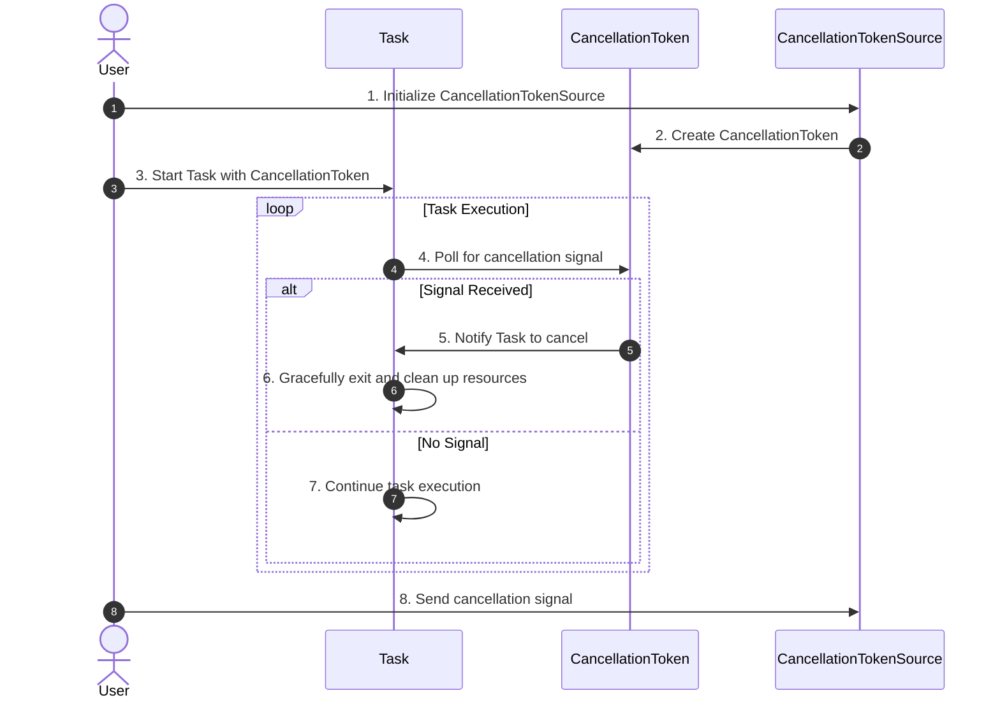

### **Task Cancellation in C#**

Task cancellation in C# allows you to terminate ongoing tasks gracefully when they are no longer needed. This is especially useful in long-running tasks, where early termination can save resources and improve responsiveness.

---

### **Key Concepts in Task Cancellation**

1. **CancellationToken**:
   - The core mechanism to signal cancellation requests.

2. **CancellationTokenSource**:
   - The controller that sends the cancellation signal.

3. **Polling for Cancellation**:
   - Tasks must periodically check for the cancellation signal and handle it appropriately.

4. **Graceful Termination**:
   - Tasks should clean up resources or save the current state before terminating.

---



---

### **Flow Description**
1. The **User** initializes a `CancellationTokenSource`, which controls the cancellation signal.
2. The `CancellationTokenSource` creates a `CancellationToken` associated with it, which is used to notify the task about cancellation.
3. The **User** starts the task and passes the `CancellationToken` to it.
4. During task execution, the task periodically polls the `CancellationToken` to check for a cancellation signal.
5. If a cancellation signal is detected, the `CancellationToken` notifies the task to cancel.
6. The task gracefully exits and cleans up resources upon receiving the cancellation signal.
7. If no cancellation signal is received, the task continues executing its logic.
8. The **User** sends a cancellation signal through the `CancellationTokenSource` to terminate the task.

This diagram and explanation provide a clear view of the task cancellation workflow in C#.

---

### **Basic Example: Task Cancellation**

```csharp
using System;
using System.Threading;
using System.Threading.Tasks;

class Program
{
    static async Task Main()
    {
        // Create a CancellationTokenSource
        CancellationTokenSource cts = new CancellationTokenSource();

        // Start a task and pass the cancellation token
        Task task = Task.Run(() =>
        {
            for (int i = 0; i < 10; i++)
            {
                if (cts.Token.IsCancellationRequested)
                {
                    Console.WriteLine("Task cancellation requested.");
                    return; // Exit the task gracefully
                }

                Console.WriteLine($"Task running: iteration {i}");
                Thread.Sleep(500); // Simulate work
            }
        }, cts.Token);

        // Simulate user cancellation after 2 seconds
        Thread.Sleep(2000);
        cts.Cancel();

        await task; // Wait for the task to complete
        Console.WriteLine("Task has been canceled.");
    }
}
```

---

#### **Output**:
```
Task running: iteration 0
Task running: iteration 1
Task running: iteration 2
Task cancellation requested.
Task has been canceled.
```

---

### **Using `ThrowIfCancellationRequested`**

Instead of manually checking the token, you can use `ThrowIfCancellationRequested` to automatically throw an exception when cancellation is requested.

#### **Example: Throwing a Cancellation Exception**

```csharp
using System;
using System.Threading;
using System.Threading.Tasks;

class Program
{
    static async Task Main()
    {
        CancellationTokenSource cts = new CancellationTokenSource();

        Task task = Task.Run(() =>
        {
            for (int i = 0; i < 10; i++)
            {
                cts.Token.ThrowIfCancellationRequested(); // Throws an exception if canceled

                Console.WriteLine($"Task running: iteration {i}");
                Thread.Sleep(500);
            }
        }, cts.Token);

        Thread.Sleep(2000);
        cts.Cancel();

        try
        {
            await task;
        }
        catch (OperationCanceledException)
        {
            Console.WriteLine("Task was canceled via exception.");
        }
    }
}
```

#### **Output**:
```
Task running: iteration 0
Task running: iteration 1
Task running: iteration 2
Task was canceled via exception.
```

---

### **Cancelling Multiple Tasks**

Cancellation tokens can be shared across multiple tasks, allowing for coordinated cancellation.

#### **Example: Coordinating Task Cancellation**

```csharp
using System;
using System.Threading;
using System.Threading.Tasks;

class Program
{
    static async Task Main()
    {
        CancellationTokenSource cts = new CancellationTokenSource();

        Task task1 = Task.Run(() =>
        {
            for (int i = 0; i < 5; i++)
            {
                cts.Token.ThrowIfCancellationRequested();
                Console.WriteLine($"Task 1: iteration {i}");
                Thread.Sleep(500);
            }
        }, cts.Token);

        Task task2 = Task.Run(() =>
        {
            for (int i = 0; i < 5; i++)
            {
                cts.Token.ThrowIfCancellationRequested();
                Console.WriteLine($"Task 2: iteration {i}");
                Thread.Sleep(500);
            }
        }, cts.Token);

        Thread.Sleep(2000);
        cts.Cancel();

        try
        {
            await Task.WhenAll(task1, task2);
        }
        catch (OperationCanceledException)
        {
            Console.WriteLine("Tasks were canceled.");
        }
    }
}
```

#### **Output**:
```
Task 1: iteration 0
Task 2: iteration 0
Task 1: iteration 1
Task 2: iteration 1
Tasks were canceled.
```

---

### **Timeout Cancellation**

A `CancellationTokenSource` can be configured to cancel after a specified timeout.

#### **Example: Timeout Cancellation**

```csharp
using System;
using System.Threading;
using System.Threading.Tasks;

class Program
{
    static async Task Main()
    {
        // Automatically cancel after 3 seconds
        CancellationTokenSource cts = new CancellationTokenSource(TimeSpan.FromSeconds(3));

        try
        {
            await Task.Run(() =>
            {
                for (int i = 0; i < 10; i++)
                {
                    cts.Token.ThrowIfCancellationRequested();
                    Console.WriteLine($"Task running: iteration {i}");
                    Thread.Sleep(500);
                }
            }, cts.Token);
        }
        catch (OperationCanceledException)
        {
            Console.WriteLine("Task was canceled due to timeout.");
        }
    }
}
```

#### **Output**:
```
Task running: iteration 0
Task running: iteration 1
Task running: iteration 2
Task running: iteration 3
Task running: iteration 4
Task was canceled due to timeout.
```

---

### **Best Practices for Task Cancellation**

1. **Check Cancellation Regularly**:
   - Use `IsCancellationRequested` or `ThrowIfCancellationRequested` in long-running loops or operations.

2. **Graceful Exit**:
   - Clean up resources (e.g., close files, save state) before exiting the task.

3. **Avoid Forceful Termination**:
   - Do not use methods like `Thread.Abort`; rely on cooperative cancellation instead.

4. **Use Timeouts**:
   - Combine `CancellationTokenSource` with a timeout to prevent tasks from running indefinitely.

5. **Share Cancellation Tokens**:
   - Use the same token across multiple tasks for coordinated cancellation.

---

### **Comparison of Cancellation Methods**

| **Method**                  | **Description**                                   | **Use Case**                                   |
|-----------------------------|---------------------------------------------------|-----------------------------------------------|
| `IsCancellationRequested`   | Manually checks if cancellation was requested.    | Fine-grained control in custom task logic.    |
| `ThrowIfCancellationRequested` | Automatically throws an `OperationCanceledException`. | When you want to halt execution immediately. |
| Timeout with `CancellationTokenSource` | Automatically cancels after a set duration.  | Avoiding long-running tasks.                  |
| Shared `CancellationToken`  | A single token shared across multiple tasks.      | Coordinated cancellation of multiple tasks.   |

---

### **Summary**

Task cancellation in C# enables efficient and controlled termination of tasks. By leveraging `CancellationToken` and `CancellationTokenSource`, you can implement graceful and cooperative cancellation mechanisms. Proper cancellation handling ensures better resource management and a responsive application.
