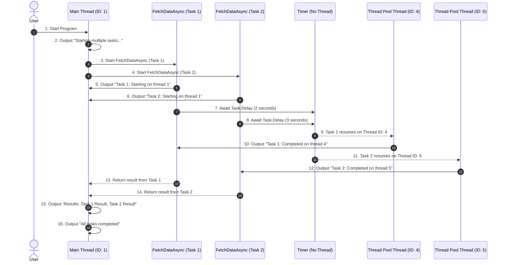

### **Thread and Thread Pool Work with `async` and `await`**

The **`async` and `await`** mechanism leverages threads and the .NET thread pool to efficiently manage asynchronous tasks. Let’s break down how threads and the thread pool operate in the **Advanced Example** provided earlier.

---

### **Code for Reference**

```csharp
using System;
using System.Threading.Tasks;

class Program
{
    static async Task Main(string[] args)
    {
        Console.WriteLine("1. Starting multiple tasks...");

        // Run two asynchronous tasks concurrently
        Task<string> task1 = FetchDataAsync("Task 1", 2000);
        Task<string> task2 = FetchDataAsync("Task 2", 3000);

        string[] results = await Task.WhenAll(task1, task2);

        Console.WriteLine($"2. Results: {string.Join(", ", results)}");
        Console.WriteLine("3. All tasks completed");
    }

    static async Task<string> FetchDataAsync(string name, int delay)
    {
        Console.WriteLine($"{name}: Starting on thread {Thread.CurrentThread.ManagedThreadId}");
        await Task.Delay(delay); // Simulate delay
        Console.WriteLine($"{name}: Completed on thread {Thread.CurrentThread.ManagedThreadId}");
        return $"{name} Result";
    }
}
```

---

### **How Threads and the Thread Pool Work**

1. **Main Thread**:
   - The program starts on the **main thread**.
   - Outputs `1. Starting multiple tasks...`.
   - Calls `FetchDataAsync` twice and starts two tasks. At this point:
     - The **main thread** remains free to handle other tasks.
     - Both tasks are handed over to the **thread pool** for execution.

2. **Thread Pool**:
   - The `Task.Delay` in `FetchDataAsync` uses the **timer mechanism** provided by the operating system, not an actual thread.
   - During the delay:
     - The tasks are paused, and the threads are released back to the thread pool to handle other tasks.
     - This is a key efficiency of `async` and `await`: **no thread is blocked during a delay**.

3. **Resuming Tasks**:
   - When `Task.Delay` completes:
     - The continuation of `FetchDataAsync` is scheduled to run on a thread from the thread pool.
     - It may or may not be the same thread that started the task.
     - Outputs like `Task 1: Starting on thread X` and `Task 1: Completed on thread Y` confirm this.

4. **`Task.WhenAll`**:
   - `Task.WhenAll` waits for both tasks (`task1` and `task2`) to complete.
   - The **main thread** is suspended at the `await` but not blocked. This allows the thread to be reused for other operations while waiting.

5. **Returning to Main Thread**:
   - After both tasks complete, execution resumes in the `Main` method.
   - Outputs the final results and `3. All tasks completed`.

---

### **Output Explanation with Threads**

```
1. Starting multiple tasks...
Task 1: Starting on thread 1
Task 2: Starting on thread 1
Task 1: Completed on thread 4
Task 2: Completed on thread 5
2. Results: Task 1 Result, Task 2 Result
3. All tasks completed
```

1. **Thread 1**:
   - Both `FetchDataAsync` tasks start on the main thread (ID: 1).
   - This demonstrates that the main thread initiates the asynchronous work.

2. **Thread 4 and Thread 5**:
   - After the `Task.Delay`, the tasks resume on different threads from the thread pool.
   - This shows how the thread pool dynamically assigns threads to tasks when they are ready to continue.

---



### **Explanation of the Sequence Diagram**

1. **Program Start**:
   - The program begins on the **main thread (ID: 1)**. The user initiates the program.

2. **Starting Tasks**:
   - Two `FetchDataAsync` tasks are started sequentially on the main thread. Both initially run on the **main thread** and output their start messages.

3. **Task Suspension**:
   - Both tasks hit `Task.Delay`, where they are suspended, and control is returned to the **main thread**.
   - The `Timer` mechanism handles the delay, and **no thread** is occupied during this time.

4. **Task Resumption**:
   - After their respective delays:
     - Task 1 resumes on **Thread Pool Thread (ID: 4)**.
     - Task 2 resumes on **Thread Pool Thread (ID: 5)**.
   - Each task outputs its completion message.

5. **Return to Main Thread**:
   - The results from both tasks are returned to the **main thread**.
   - The main thread processes the results and outputs the final messages.

6. **Program End**:
   - The program ends after all tasks are completed and results are displayed.

---

### **Flow Summary**

| **Step**            | **Thread/Component**        | **Action**                                                |
|---------------------|----------------------------|----------------------------------------------------------|
| 1–6                 | Main Thread (ID: 1)        | Program starts, tasks initiated, initial outputs logged. |
| 7–8                 | Timer                      | Tasks are suspended during `Task.Delay`. No thread is used.|
| 9–12                | Thread Pool (ID: 4, 5)     | Tasks resume on different thread pool threads.           |
| 13–16               | Main Thread (ID: 1)        | Results processed, final messages displayed.             |

This diagram and explanation effectively show how **threads** and the **thread pool** collaborate in the asynchronous execution process.

---

### **Key Takeaways on Threads and Thread Pool**

1. **Thread Pool Efficiency**:
   - Threads are expensive resources. The thread pool allows .NET to efficiently manage threads by reusing them for different tasks.

2. **No Blocking**:
   - During `Task.Delay`, no thread is occupied. Instead, a timer handles the delay.
   - This frees threads to perform other work, increasing scalability.

3. **Dynamic Thread Assignment**:
   - When a task resumes after `await`, it might not use the same thread it started on. Instead, it can use any available thread from the thread pool.

4. **Main Thread**:
   - The main thread is suspended during `await Task.WhenAll` but remains responsive to other operations if needed (e.g., in a UI application).

---

### **Thread Flow in the Example**

| **Step**                       | **Thread**                 | **Explanation**                                                                 |
|--------------------------------|----------------------------|---------------------------------------------------------------------------------|
| Main method starts             | Main thread (ID: 1)        | The main thread initiates the program.                                         |
| FetchDataAsync starts          | Main thread (ID: 1)        | Both tasks start on the main thread.                                           |
| Task.Delay                     | Timer (no thread used)     | The delay does not occupy a thread.                                            |
| FetchDataAsync resumes (Task 1)| Thread pool thread (ID: 4) | After the delay, Task 1 continues on a thread from the thread pool.            |
| FetchDataAsync resumes (Task 2)| Thread pool thread (ID: 5) | Similarly, Task 2 resumes on a different thread from the thread pool.          |
| Results processed              | Main thread (ID: 1)        | Once both tasks complete, the execution returns to the main thread.            |

---

### **Advantages of `async` and `await` with Thread Pool**

1. **Non-Blocking**:
   - Asynchronous calls like `Task.Delay` or I/O operations do not block threads.

2. **Thread Pool Optimization**:
   - Threads are reused and allocated dynamically for efficient resource usage.

3. **Scalability**:
   - By freeing threads during waits, the application can handle more tasks concurrently.

---

### **Conclusion**

The `async` and `await` mechanism in C# relies on efficient thread management via the .NET thread pool. It minimizes thread usage during idle times (e.g., delays or I/O waits) and dynamically assigns threads for task resumption. This approach leads to highly scalable and performant applications.
