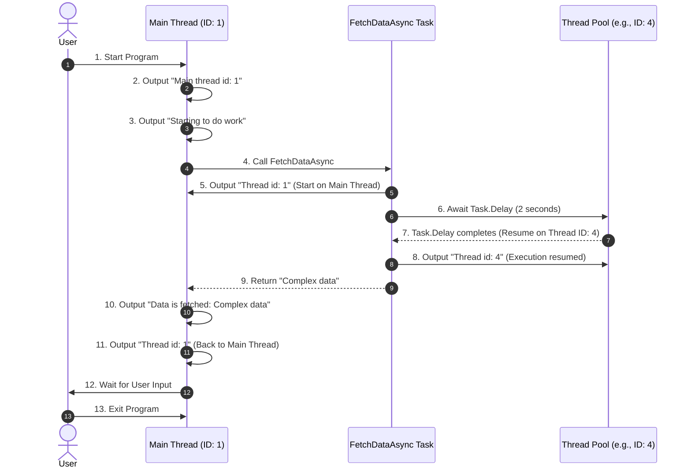

### Basic Syntax of Async and Await

The following code demonstrates an asynchronous workflow, and its output reflects how asynchronous tasks run and switch threads.

```csharp
using System;
using System.Threading;
using System.Threading.Tasks;

class Program
{
    // Entry point of the program
    static async Task Main(string[] args)
    {
        // Output the thread ID where the Main method is running
        Console.WriteLine($"1. Main thread id:{Thread.CurrentThread.ManagedThreadId}");

        // Indicate the start of some work
        Console.WriteLine("Starting to do work.");

        // Asynchronously call FetchDataAsync and wait for its result
        var data = await FetchDataAsync();

        // After FetchDataAsync completes, continue execution and output the fetched data
        Console.WriteLine($"Data is fetched: {data}");

        // Output the current thread ID again to observe any changes
        Console.WriteLine($"2. Thread id:{Thread.CurrentThread.ManagedThreadId}");

        // Prompt the user to press Enter to exit the program
        Console.WriteLine("Press enter to exit.");
        Console.ReadLine();
    }

    // An asynchronous method to simulate data fetching
    static async Task<string> FetchDataAsync()
    {
        // Output the thread ID where this method is running
        Console.WriteLine($"3. Thread id:{Thread.CurrentThread.ManagedThreadId}");

        // Asynchronously wait for 2 seconds to simulate a long-running operation
        await Task.Delay(2000);

        // Output the thread ID again to observe any thread switch after the delay
        Console.WriteLine($"4. Thread id:{Thread.CurrentThread.ManagedThreadId}");

        // Return a string representing the fetched data
        return "Complex data";
    }
}
```

---

### **Execution Result and Explanation**

#### **Example Output (Thread IDs may vary):**
```
1. Main thread id:1
Starting to do work.
3. Thread id:1
4. Thread id:4
Data is fetched: Complex data
2. Thread id:1
Press enter to exit.
```

---

### **Analysis**

1. **Execution of `Main` Method**:
   - The program starts, and the `Main` method runs on the main thread (ID: 1).
   - The output `1. Main thread id:1` and `Starting to do work.` confirms this.

2. **Calling `FetchDataAsync`**:
   - The `FetchDataAsync` method is called and starts executing on the main thread, outputting `3. Thread id:1`.
   - When `await Task.Delay(2000)` is encountered, the task is suspended, and the main thread is released to handle other tasks.

3. **Asynchronous Resumption**:
   - After a 2-second delay, the `Task.Delay` completes, and the continuation of the task may resume on a different thread (e.g., ID: 4).
   - The output `4. Thread id:4` shows the task resumed on a different thread.

4. **Returning to the Main Thread**:
   - After `FetchDataAsync` returns, the program resumes execution in the `Main` method's context, which is the original main thread (ID: 1).
   - The output `Data is fetched: Complex data` and `2. Thread id:1` indicate that the program has returned to the main thread.

5. **Program End**:
   - The program waits for user input before terminating.

---



---

### **Explanation of the Sequence Diagram**

1. **Initialization**:
   - The program starts on the main thread (Thread ID: 1), and outputs the thread ID and the start message.

2. **Asynchronous Call**:
   - The `Main` method calls `FetchDataAsync`, which starts on the main thread and outputs `Thread id: 1`.

3. **Task Suspension**:
   - The `await Task.Delay(2000)` suspends the task, releasing the main thread.
   - The delay is handled by the thread pool, and the main thread is free to handle other operations.

4. **Task Resumption**:
   - After the delay, the task resumes on a thread from the thread pool (Thread ID: 4).
   - It outputs the resumed thread ID before returning the result (`Complex data`).

5. **Return to Main Context**:
   - The program resumes execution in the `Main` method’s original context (Main Thread ID: 1).
   - It outputs the fetched data and the current thread ID.

6. **Program Exit**:
   - The program waits for user input before exiting.

This sequence highlights **how asynchronous tasks work, suspend, resume, and return to their original context** in C#.

---

### **Key Points**

1. **Asynchronous and Thread Switching**:
   - The `await` keyword suspends the task and frees the thread, allowing other tasks to use it.
   - When the task resumes, it may use a different thread from the thread pool.

2. **Original Thread Context**:
   - After an `await`, the program tries to return to the original synchronization context (e.g., the UI thread or main thread), as seen with `2. Thread id:1`.

3. **Thread Pool Optimization**:
   - The switch to `Thread id:4` shows how the .NET thread pool efficiently manages threads for asynchronous tasks.

---

### **Conclusion**

This code illustrates the core mechanism of asynchronous programming in C#:
- **Thread resources are released during `await`** to improve efficiency.
- **Asynchronous tasks can resume on different threads** to balance the load.
- **Execution returns to the original context** for consistency in program flow.

This approach is ideal for handling I/O-bound or long-running operations, improving responsiveness and overall performance.
