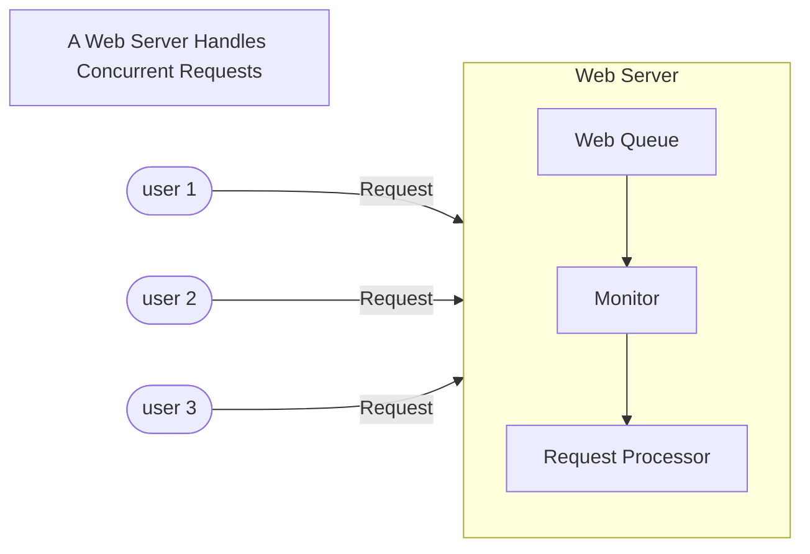

```mermaid
flowchart LR
    title["A Web Server Handles Concurrent Requests"]
    
    user1([user 1]) -->|Request| webServer
    user2([user 2]) -->|Request| webServer
    user3([user 3]) -->|Request| webServer

    subgraph webServer [Web Server]
        webQueue[Web Queue]
        monitor[Monitor]
        requestProcessor[Request Processor]
        
        webQueue --> monitor --> requestProcessor
    end
```
