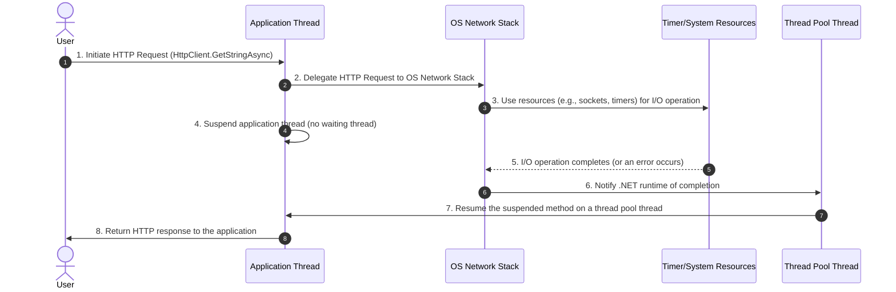

### the HTTP request and response handling process:

---

### **Flow Description**

1. **Step 1**:
   - The user initiates an HTTP request using an asynchronous method like `HttpClient.GetStringAsync`.
   - The application thread begins handling the operation.

2. **Step 2**:
   - The application thread delegates the HTTP request to the **OS Network Stack**.
   - The network stack manages sending the request and waiting for the response.

3. **Step 3**:
   - The **OS Network Stack** uses system resources (e.g., sockets, timers) to handle the I/O operation asynchronously.

4. **Step 4**:
   - The application thread is **suspended** at the `await` point and no longer occupies a thread.
   - This significantly reduces resource usage, allowing the thread to be freed for other tasks.

5. **Step 5**:
   - The **Timer/System Resources** complete the I/O operation and notify the OS Network Stack that the response is ready or an error has occurred.

6. **Step 6**:
   - The OS Network Stack notifies the .NET runtime that the asynchronous operation has completed.

7. **Step 7**:
   - The suspended asynchronous method is resumed on a **thread pool thread**.

8. **Step 8**:
   - The application thread processes the response and returns the result to the user.

---

### **Key Points**

- **OS Responsibility**:
  - HTTP requests are handled by the **OS Network Stack**, not the .NET application thread.

- **Resource Efficiency**:
  - During the waiting period, no .NET thread is blocked.

- **Thread Pool Resumption**:
  - Upon completion of the request, the suspended asynchronous method resumes execution on a thread pool thread.

---

This sequence diagram demonstrates the efficient mechanism of handling HTTP requests in C# using **`async/await`**, highlighting how the OS and thread pool collaborate to minimize resource consumption and improve application performance.
