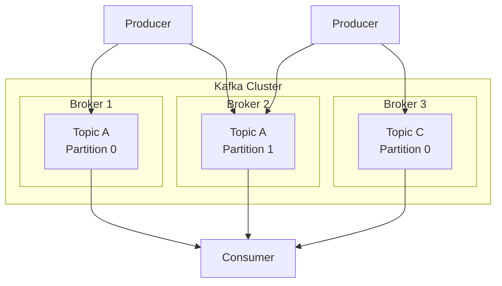

### Kafka architecture diagram

Here is the Mermaid syntax that replicates the Kafka architecture diagram you provided:

### Explanation:
- **Producer1** and **Producer2** represent the producer entities, each connecting to different brokers and partitions within the Kafka cluster.
- The **Kafka Cluster** is a container for **Broker 1**, **Broker 2**, and **Broker 3**, each holding different topics and partitions.
- The **Consumer** connects to multiple brokers and partitions to consume the messages. 

You can paste this code into any tool or platform that supports Mermaid diagrams to visualize the architecture.
