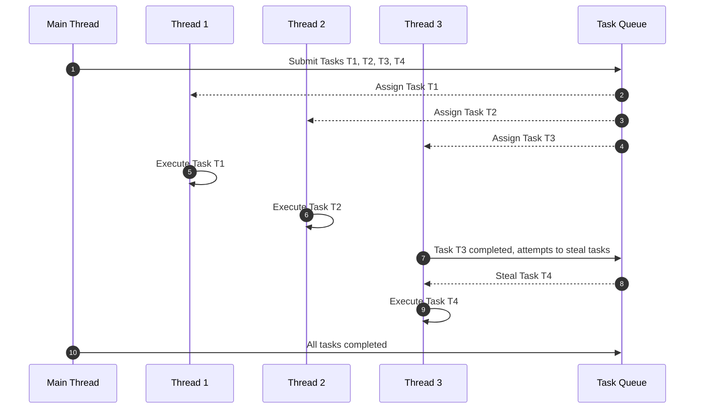

### **Why and How TPL Uses ThreadPool and Work-Stealing Algorithm**

---

### **Why TPL Uses ThreadPool and Work-Stealing Algorithm**

#### **1. Advantages of ThreadPool**

- **Thread Reuse**:
  - Creating and destroying threads is resource-intensive. ThreadPool reuses threads to avoid frequent thread creation and destruction, improving performance.
  
- **Automatic Management**:
  - The ThreadPool dynamically adjusts the number of threads based on system resources, such as CPU cores, and the workload, ensuring efficient resource usage.
  
- **Task Scheduling**:
  - ThreadPool uses task queues and schedulers to optimize thread allocation and manage tasks efficiently.

#### **2. Advantages of the Work-Stealing Algorithm**

- **Load Balancing**:
  - If some threads finish their tasks earlier than others, the work-stealing algorithm allows idle threads to "steal" tasks from busy threads, avoiding resource underutilization.
  
- **Increased Parallel Efficiency**:
  - By dynamically redistributing tasks among threads, the algorithm reduces idle time and maximizes the overall parallel performance.

---

### **How ThreadPool and Work-Stealing Algorithm Work**

#### **1. How ThreadPool Works**

1. **Task Queue**:
   - All tasks submitted to TPL are added to a centralized task queue.
   - Threads from the ThreadPool fetch tasks from this queue for execution.

2. **Dynamic Thread Management**:
   - The ThreadPool dynamically increases or decreases the number of threads based on the workload and available system resources.

3. **Thread Reuse**:
   - After completing a task, a thread does not terminate. Instead, it waits for the next task, minimizing overhead.

#### **2. How Work-Stealing Algorithm Works**

1. **Individual Task Queues for Threads**:
   - Each thread maintains its own task queue and processes tasks from it.

2. **Stealing Tasks**:
   - If a thread finishes all tasks in its queue, it attempts to "steal" tasks from other threads' queues to stay busy.

3. **Dynamic Task Redistribution**:
   - The stolen tasks are usually smaller tasks to maintain load balancing and efficiency.

---

### **When to Use ThreadPool and Work-Stealing Algorithm**

- **CPU-Bound Tasks**:
  - Tasks that involve computations, such as mathematical calculations or data processing, can benefit from parallel processing across multiple cores.

- **I/O-Bound Tasks**:
  - Tasks like file reading/writing or network requests leverage the ThreadPool to minimize thread blocking and improve throughput.

- **High-Concurrency Tasks**:
  - Scenarios involving a large number of independent tasks, such as processing multiple web requests or batch jobs.

---

### **Mermaid Sequence Diagram: ThreadPool and Work-Stealing Algorithm**

The following sequence diagram illustrates how the ThreadPool processes tasks and uses the work-stealing algorithm to balance the workload.



---

### **Code Example: Demonstrating ThreadPool and Work-Stealing**

```csharp
using System;
using System.Threading;
using System.Threading.Tasks;

class Program
{
    static void Main()
    {
        Parallel.For(0, 10, i =>
        {
            Console.WriteLine($"Task {i} is executed by Thread {Thread.CurrentThread.ManagedThreadId}");
            Thread.Sleep(500); // Simulate work
        });

        Console.WriteLine("All tasks completed.");
    }
}
```

**Sample Output** (Thread IDs may vary):
```
Task 0 is executed by Thread 4
Task 1 is executed by Thread 5
Task 2 is executed by Thread 6
Task 3 is executed by Thread 7
Task 4 is executed by Thread 4
...
All tasks completed.
```

**Explanation**:
1. Tasks are distributed across threads in the ThreadPool.
2. Threads are reused: once a thread completes a task, it fetches a new task from the queue.
3. Work-stealing occurs if a thread finishes early and other threads are still busy.

---

### **Key Benefits of the Approach**

| **Feature**            | **ThreadPool**                      | **Work-Stealing Algorithm**             |
|------------------------|-------------------------------------|-----------------------------------------|
| **Efficient Resource Use** | Reuses threads to avoid creation overhead. | Balances workload dynamically.          |
| **Reduced Overhead**   | Minimizes thread creation/destruction. | Reduces idle time among threads.        |
| **Scalable**           | Adjusts threads based on workload.  | Dynamically redistributes tasks.         |

---

### **Best Practices**

1. **Optimize Task Granularity**:
   - Avoid tasks that are too small (causing excessive task overhead) or too large (causing load imbalance).

2. **Minimize Shared Resource Contention**:
   - Use thread-safe mechanisms like `lock` or `Interlocked` to manage shared resources.

3. **Avoid Thread Affinity**:
   - Parallel loops do not guarantee which thread will handle specific iterations. Avoid relying on thread-local storage.

4. **Use PLINQ for Data Parallelism**:
   - For data transformation scenarios, **Parallel LINQ (PLINQ)** offers an easier way to achieve parallelism.

---

### **Summary**

1. **ThreadPool**:
   - Efficiently manages and reuses threads, reducing overhead and improving performance.
   
2. **Work-Stealing Algorithm**:
   - Dynamically balances workload among threads, ensuring optimal resource utilization.

3. **Advantages**:
   - Automated management minimizes the complexity of writing multithreaded programs.
   - Scales well with multi-core CPUs, improving overall performance.

By understanding how ThreadPool and work-stealing algorithms operate, developers can make the most of the Task Parallel Library to write efficient and scalable parallel applications.
