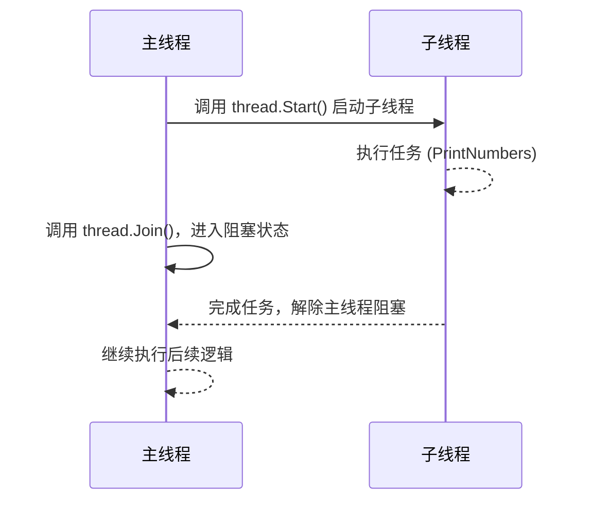

### **`Thread.Start()` 和 `Thread.Join()` 的详细解释**

在 C# 中，`Thread` 类用于创建和管理线程。`Start()` 和 `Join()` 是线程操作的两个关键方法：

---

### **1. `Thread.Start()`**

#### **功能**：
- **启动线程**：将线程标记为可运行状态，允许线程调度器选择并运行该线程。
- **只调用一次**：一个线程只能启动一次，重复调用会抛出 `ThreadStateException`。

#### **用法**：
```csharp
Thread thread = new Thread(SomeMethod);
thread.Start();
```

#### **执行流程**：
1. 创建一个线程对象并绑定执行的方法。
2. 调用 `Start()`，线程进入就绪状态，等待线程调度器分配 CPU。
3. 线程开始执行指定的方法。

---

#### **代码示例**：
```csharp
using System;
using System.Threading;

class Program
{
    static void Main()
    {
        Thread thread = new Thread(PrintNumbers);
        thread.Start();
        Console.WriteLine("主线程继续执行...");
    }

    static void PrintNumbers()
    {
        for (int i = 1; i <= 5; i++)
        {
            Console.WriteLine($"子线程: {i}");
            Thread.Sleep(100); // 模拟工作负载
        }
    }
}
```

**输出示例**:
```plaintext
主线程继续执行...
子线程: 1
子线程: 2
子线程: 3
...
```

---

### **2. `Thread.Join()`**

#### **功能**：
- **阻塞当前线程**：使调用线程（通常是主线程）等待目标线程完成后再继续执行。
- **线程同步**：确保主线程不会在目标线程完成之前继续执行后续逻辑。

#### **用法**：
```csharp
Thread thread = new Thread(SomeMethod);
thread.Start();
thread.Join(); // 等待线程结束
```

#### **执行流程**：
1. 主线程调用 `Join()`，进入阻塞状态。
2. 目标线程运行完成后，`Join()` 解除阻塞，主线程继续执行。

---

#### **代码示例**：
```csharp
using System;
using System.Threading;

class Program
{
    static void Main()
    {
        Thread thread = new Thread(PrintNumbers);
        thread.Start();

        Console.WriteLine("等待子线程完成...");
        thread.Join(); // 等待子线程完成
        Console.WriteLine("子线程已完成，主线程继续执行。");
    }

    static void PrintNumbers()
    {
        for (int i = 1; i <= 5; i++)
        {
            Console.WriteLine($"子线程: {i}");
            Thread.Sleep(100); // 模拟工作负载
        }
    }
}
```

**输出示例**:
```plaintext
等待子线程完成...
子线程: 1
子线程: 2
子线程: 3
子线程: 4
子线程: 5
子线程已完成，主线程继续执行。
```

---

### **`Thread.Start()` 与 `Thread.Join()` 的比较**

| **方法**         | **功能**                                   | **用法**                              |
|------------------|-------------------------------------------|---------------------------------------|
| **`Start()`**    | 启动线程，让线程进入就绪状态，等待调度执行。   | `thread.Start();`                     |
| **`Join()`**     | 阻塞调用线程，直到目标线程完成执行。           | `thread.Join();`                      |

---

### **注意事项**

#### **`Thread.Start()` 的注意事项**
1. **一个线程只能启动一次**：
   - 试图对已经运行或完成的线程再次调用 `Start()` 会抛出 `ThreadStateException`。

   **示例**：
   ```csharp
   Thread thread = new Thread(SomeMethod);
   thread.Start();
   thread.Start(); // 会抛出异常
   ```

2. **线程执行顺序不固定**：
   - 调用 `Start()` 后，线程的运行时间由线程调度器决定，可能与主线程并行或交替执行。

---

#### **`Thread.Join()` 的注意事项**
1. **阻塞调用线程**：
   - 使用 `Join()` 会阻塞当前线程，直到目标线程完成执行。避免在主线程中使用 `Join()` 等待时间过长。

2. **防止死锁**：
   - 避免在 `Join()` 中等待的线程反过来依赖当前线程，导致死锁。

---

### **`Thread.Join()` 的超时机制**

可以为 `Join()` 方法指定一个超时时间，以防止无限等待：

#### **示例：指定超时时间**
```csharp
Thread thread = new Thread(() =>
{
    Thread.Sleep(2000); // 模拟长时间任务
    Console.WriteLine("子线程完成工作");
});

thread.Start();

if (thread.Join(1000)) // 等待最多 1000 毫秒
{
    Console.WriteLine("子线程已完成");
}
else
{
    Console.WriteLine("等待超时，主线程继续执行");
}
```

**输出示例**:
```plaintext
等待超时，主线程继续执行
子线程完成工作
```

---

### **阻塞调用线程的序列图**

以下是使用 **`Thread.Join()`** 阻塞调用线程的详细执行流程，用序列图来帮助理解。

---

#### **线程阻塞的序列图**



#### **序列图说明**

1. **启动子线程**：
   - 主线程调用 `thread.Start()`，子线程进入就绪状态，并开始执行任务。

2. **阻塞主线程**：
   - 主线程调用 `thread.Join()`，等待子线程完成。
   - 在子线程完成之前，主线程不会执行后续逻辑。

3. **子线程完成任务**：
   - 子线程完成其任务，通知主线程解除阻塞。

4. **主线程继续执行**：
   - 主线程解除阻塞后，恢复执行后续逻辑。

---

#### **完整代码示例**

以下代码展示了主线程如何通过 `Join()` 等待子线程完成，结合序列图有助于理解阻塞的逻辑。

```csharp
using System;
using System.Threading;

class Program
{
    static void Main()
    {
        // 创建子线程
        Thread thread = new Thread(PrintNumbers);
        thread.Start(); // 启动子线程

        Console.WriteLine("主线程: 等待子线程完成...");
        thread.Join(); // 阻塞主线程，直到子线程完成
        Console.WriteLine("主线程: 子线程已完成，继续执行后续逻辑。");
    }

    static void PrintNumbers()
    {
        for (int i = 1; i <= 5; i++)
        {
            Console.WriteLine($"子线程: {i}");
            Thread.Sleep(100); // 模拟任务处理
        }
    }
}
```

#### **运行结果**

```plaintext
主线程: 等待子线程完成...
子线程: 1
子线程: 2
子线程: 3
子线程: 4
子线程: 5
主线程: 子线程已完成，继续执行后续逻辑。
```

#### **使用场景：同步任务**

`Thread.Join()` 的主要作用是同步任务，确保线程执行的顺序符合业务逻辑。以下是典型使用场景：

1. **依赖关系**：
   - 主线程的后续任务需要依赖子线程的执行结果。

2. **防止数据竞争**：
   - 等待子线程完成，避免多个线程对同一资源的竞争访问。

3. **任务链执行**：
   - 多个线程顺序执行时，使用 `Join()` 确保上一个线程完成后再启动下一个线程。

#### **阻塞的潜在问题**

1. **效率问题**：
   - `Join()` 会阻塞调用线程，如果子线程耗时较长，可能导致系统资源浪费。

2. **死锁风险**：
   - 如果两个线程互相等待对方完成，会导致死锁。

   **示例：死锁代码**
   ```csharp
   Thread thread1 = new Thread(() => { Thread.Sleep(1000); thread2.Join(); });
   Thread thread2 = new Thread(() => { Thread.Sleep(1000); thread1.Join(); });

   thread1.Start();
   thread2.Start();

   thread1.Join(); // 死锁：两个线程相互等待
   thread2.Join();
   ```

#### **优化建议**

1. **减少阻塞**：
   - 使用异步编程模型（如 `Task` 或 `async/await`），避免线程直接阻塞。

2. **设置超时**：
   - 使用 `thread.Join(timeout)` 设置等待的最长时间，防止无限阻塞。

   **示例：设置超时**
   ```csharp
   if (thread.Join(1000)) // 最多等待 1000 毫秒
   {
       Console.WriteLine("子线程完成");
   }
   else
   {
       Console.WriteLine("等待超时，继续执行主线程");
   }
   ```

3. **线程池**：
   - 使用 `ThreadPool` 动态管理线程，减少线程切换和阻塞的开销。

### **总结**

- **`Thread.Join()`** 是一种简单的线程同步方法，适合用于短时间的任务依赖。
- 结合序列图可以直观理解线程的阻塞过程，主线程在调用 `Join()` 后暂停执行，直到子线程完成。
- 在实际开发中，应合理使用 `Join()`，并通过超时或异步编程优化阻塞的性能问题。

---

### **总结**

1. **`Thread.Start()`**：
   - 用于启动线程，使其进入就绪状态。
   - 启动后线程的执行顺序不受开发者控制，由操作系统线程调度器决定。

2. **`Thread.Join()`**：
   - 用于同步线程，阻塞当前线程直到目标线程完成。
   - 可以指定超时时间，防止无限等待。

合理使用 `Start()` 和 `Join()`，可以实现线程的并发和同步，在开发多线程应用程序时显得尤为重要。
