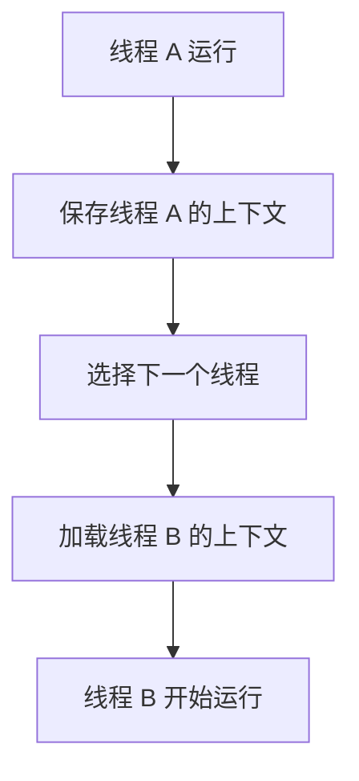

### **上下文 (Context)**

#### **什么是上下文?**
- **上下文**是操作系统在执行线程或进程时需要维护的状态信息。  
  它包括线程的寄存器、程序计数器、栈指针、内存地址等信息，用于确保线程或进程在被暂停后能够正确恢复执行。

---

#### **上下文的组成**

| **组成部分**          | **描述**                                                                 |
|-----------------------|-------------------------------------------------------------------------|
| **寄存器状态**        | 包含线程当前的 CPU 寄存器值（如通用寄存器、程序计数器等）。                |
| **程序计数器 (PC)**    | 指向线程或进程当前正在执行的指令地址。                                   |
| **栈指针 (SP)**        | 指向线程的调用栈，用于函数调用和返回时存储局部变量。                      |
| **线程的私有数据**     | 包括线程的内存地址空间、全局变量等线程独有的数据。                        |
| **操作系统信息**       | 包括线程的调度优先级、运行时间片等由调度器管理的信息。                    |

上下文是线程或进程的核心状态，当系统切换任务时，需要保存当前线程的上下文，并加载下一个线程的上下文，以实现无缝的任务切换。

---

### **线程调度中的上下文切换 (Context Switching)**

#### **什么是上下文切换?**
- **上下文切换**是指操作系统在多线程或多进程环境中，从一个线程（或进程）切换到另一个线程（或进程）的过程。
- 它涉及保存当前线程的上下文，并加载目标线程的上下文，使其能够从被中断的位置继续执行。

---

#### **上下文切换的步骤**

1. **保存当前线程的上下文**：
   - 系统保存当前线程的 CPU 寄存器、程序计数器、栈指针等状态到内存中。
   
2. **选择下一个线程**：
   - 调度器根据调度策略（如优先级、时间片）决定下一个执行的线程。

3. **加载目标线程的上下文**：
   - 系统将下一个线程的上下文信息加载到 CPU，恢复线程的执行状态。

4. **开始执行目标线程**：
   - 系统将控制权交给目标线程，继续执行其未完成的任务。

---

#### **上下文切换的流程图**

以下是上下文切换的简单流程：



---

#### **上下文切换的优缺点**

| **优点**                     | **缺点**                                                             |
|------------------------------|---------------------------------------------------------------------|
| 支持多任务并发，提高资源利用率 | 上下文切换需要保存和加载状态，增加开销。                                |
| 提高系统响应性                | 频繁的上下文切换会降低 CPU 效率。                                     |
| 避免任务长期占用 CPU          | 上下文切换时可能导致缓存命中率降低，增加性能损耗。                      |

---

#### **上下文切换的影响**

| **方面**         | **影响**                                                                 |
|------------------|-------------------------------------------------------------------------|
| **性能**         | 每次切换都需要时间，频繁切换可能显著降低系统效率。                          |
| **资源消耗**     | 上下文切换需要 CPU 和内存资源用于保存和加载线程状态。                        |
| **实时性**       | 对于实时系统，过多的上下文切换可能影响关键任务的按时完成。                   |
| **多核处理**     | 在多核系统中，上下文切换可能涉及线程从一个核转移到另一个核。                 |

---

### **C# 代码示例：上下文切换**

以下代码展示了多个线程的执行过程，并通过 `Thread.Sleep` 模拟上下文切换的延迟。

#### **代码示例**

```csharp
using System;
using System.Threading;

class Program
{
    static void Main()
    {
        Thread threadA = new Thread(() => Print("线程 A"));
        Thread threadB = new Thread(() => Print("线程 B"));

        threadA.Start();
        threadB.Start();

        threadA.Join();
        threadB.Join();

        Console.WriteLine("所有线程完成执行");
    }

    static void Print(string threadName)
    {
        for (int i = 0; i < 5; i++)
        {
            Console.WriteLine($"{threadName} 正在运行: {i}");
            Thread.Sleep(100); // 模拟上下文切换
        }
    }
}
```

**输出示例**:
```plaintext
线程 A 正在运行: 0
线程 B 正在运行: 0
线程 A 正在运行: 1
线程 B 正在运行: 1
...
```

---

### **上下文切换的优化建议**

1. **减少不必要的线程**：
   - 使用线程池 (`ThreadPool`) 动态管理线程，避免频繁创建和销毁线程。

2. **批量处理任务**：
   - 将小任务合并成一个大任务，减少线程切换的频率。

3. **使用异步编程模型**：
   - 在 C# 中使用 `async/await`，避免阻塞线程。

4. **设置线程优先级**：
   - 对关键任务设置较高的优先级，减少低优先级线程的上下文切换。

---

### **总结**

- **上下文**是线程或进程的执行状态信息，包括寄存器、程序计数器和栈指针等。
- **上下文切换**是操作系统在多线程环境中，通过保存和加载线程状态来实现任务切换的过程。
- 上下文切换虽然支持多任务并发，但过于频繁可能导致性能损耗。在开发中应合理控制线程数量和调度频率，以优化系统性能。
