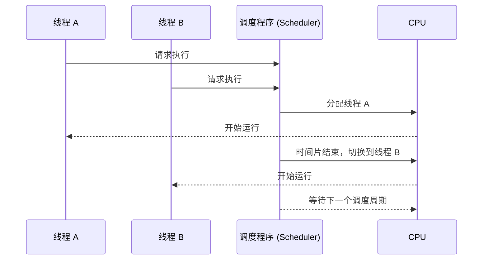

### **线程调度 (Thread Scheduling)**

**线程调度**是操作系统中的一项关键功能，用于决定多个线程如何分配 CPU 时间，以便更高效地完成任务。线程调度机制保证了多线程程序在单核或多核处理器上的平稳运行。

---

### **线程调度的关键概念**

| **概念**                   | **描述**                                                                 |
|----------------------------|-------------------------------------------------------------------------|
| **线程优先级**              | 每个线程都有一个优先级，优先级高的线程通常会获得更多的 CPU 时间。          |
| **时间片 (Time Slice)**     | 每个线程分配的 CPU 执行时间。线程调度程序在时间片到期后切换线程。          |
| **抢占式调度 (Preemptive)** | 操作系统可中断当前正在运行的线程，转而运行更高优先级的线程。               |
| **非抢占式调度 (Non-Preemptive)** | 当前线程运行到结束或主动让出 CPU 资源，系统才切换线程。                  |
| **上下文切换 (Context Switch)** | 操作系统保存当前线程的状态并切换到另一个线程。切换过程消耗资源和时间。      |

---

### **线程调度策略**

| **调度策略**             | **描述**                                                                 |
|--------------------------|-------------------------------------------------------------------------|
| **先到先服务 (FCFS)**     | 线程按照到达时间依次调度，先到的先执行。                                   |
| **最短任务优先 (SJF)**    | 优先调度执行时间最短的线程，可能导致长任务线程饥饿。                       |
| **优先级调度**            | 根据线程的优先级决定调度顺序。                                             |
| **循环调度 (Round Robin)**| 每个线程分配固定时间片，时间片用完后切换到下一个线程。                     |
| **多级队列调度**          | 根据优先级将线程分为多个队列，不同队列有不同的调度策略。                   |

---

### **线程调度的工作流程**



---

### **线程调度中的上下文切换**

**上下文切换**是指当一个线程暂停执行，另一个线程开始执行时，操作系统需要保存和恢复线程状态的过程。

#### **上下文切换的步骤**
1. **保存当前线程状态**:
   - 保存线程寄存器、程序计数器和堆栈指针等状态。
2. **加载目标线程状态**:
   - 恢复被调度线程的寄存器、程序计数器等信息。
3. **开始执行目标线程**:
   - 将 CPU 控制权交给目标线程。

#### **上下文切换的开销**
- 上下文切换涉及保存和恢复线程状态，以及缓存切换，可能导致性能损耗。
- 高频率的上下文切换会增加系统开销。

---

### **多线程调度的实际应用**

| **场景**                   | **调度策略**                                                             |
|----------------------------|-------------------------------------------------------------------------|
| **实时系统**                | 使用优先级调度，高优先级线程获得 CPU。                                     |
| **服务器应用**              | 采用循环调度或多级队列调度，保证公平性和响应时间。                          |
| **高性能计算**              | 使用最短任务优先，尽量减少任务的总完成时间。                                 |
| **桌面应用**                | 抢占式调度，优先保证前台线程的流畅运行。                                    |

---

### **C# 中的线程调度示例**

C# 中的 `Thread` 类和 `Task` 类可以模拟线程调度，以下代码展示了简单的线程优先级设置。

#### **代码示例**
```csharp
using System;
using System.Threading;

class Program
{
    static void Main()
    {
        Thread highPriorityThread = new Thread(PrintNumbers);
        Thread lowPriorityThread = new Thread(PrintNumbers);

        // 设置线程优先级
        highPriorityThread.Priority = ThreadPriority.Highest;
        lowPriorityThread.Priority = ThreadPriority.Lowest;

        // 启动线程
        highPriorityThread.Start("高优先级线程");
        lowPriorityThread.Start("低优先级线程");

        highPriorityThread.Join();
        lowPriorityThread.Join();

        Console.WriteLine("所有线程执行完毕");
    }

    static void PrintNumbers(object threadName)
    {
        for (int i = 0; i < 10; i++)
        {
            Console.WriteLine($"{threadName}: {i}");
            Thread.Sleep(100); // 模拟工作负载
        }
    }
}
```

**输出示例**:
```plaintext
高优先级线程: 0
高优先级线程: 1
高优先级线程: 2
低优先级线程: 0
高优先级线程: 3
低优先级线程: 1
...
```

---

### **线程调度的优缺点**

| **优点**                     | **缺点**                                                              |
|------------------------------|----------------------------------------------------------------------|
| 提高系统资源利用率             | 上下文切换开销可能导致性能下降。                                        |
| 提高响应速度和任务公平性       | 不合理的调度策略可能导致线程饥饿或优先级反转问题。                      |
| 支持并发处理，缩短任务完成时间 | 多线程调度可能导致复杂的竞争条件和死锁。                                |

---

### **总结**

线程调度是操作系统的重要功能，直接影响多线程程序的性能和效率。合理选择调度策略（如优先级调度、循环调度等）可以根据场景优化应用程序性能。在 C# 中，开发者可以通过 `Thread` 或 `Task` 控制线程行为，实现高效的多线程应用程序。
