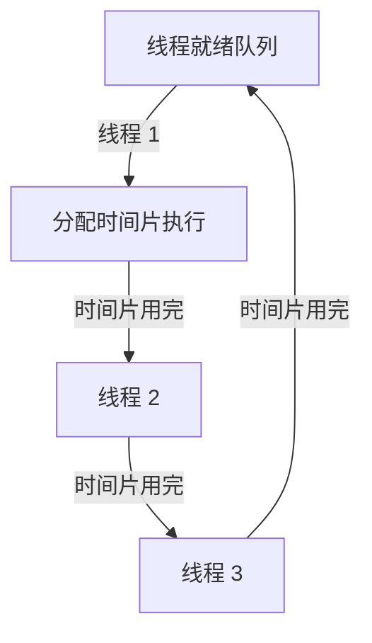

### **线程调度策略**

线程调度策略是操作系统根据线程优先级、运行状态和资源分配需求，决定线程执行顺序的规则。这些策略确保多线程程序能够高效、公平地使用 CPU 和其他资源。

---

### **常见线程调度策略**

| **策略名称**             | **描述**                                                                 |
|--------------------------|-------------------------------------------------------------------------|
| **先到先服务 (FCFS)**     | 按照线程到达的时间顺序依次调度，先到的先执行，适合简单场景。               |
| **最短任务优先 (SJF)**    | 优先调度执行时间最短的线程，减少任务的总完成时间，但可能导致长任务饥饿。     |
| **优先级调度 (Priority)** | 按线程的优先级决定调度顺序，优先级高的线程先执行，适合实时系统。            |
| **循环调度 (Round Robin)**| 每个线程分配固定的时间片，时间片用完后切换到下一个线程，保证公平性。         |
| **多级队列调度**          | 按优先级或类型将线程分为多个队列，每个队列使用不同的调度策略。               |
| **多级反馈队列调度**      | 动态调整线程的优先级，让长期等待的线程获得更多机会，适合多任务处理场景。       |

---

### **各策略的优点和缺点**

| **调度策略**             | **优点**                                     | **缺点**                                   |
|--------------------------|----------------------------------------------|-------------------------------------------|
| **先到先服务 (FCFS)**     | 实现简单，公平性好。                          | 长任务会阻塞短任务，等待时间不可预测。       |
| **最短任务优先 (SJF)**    | 总完成时间最短，系统效率高。                   | 可能导致长任务饥饿。                        |
| **优先级调度 (Priority)** | 确保关键任务优先完成。                        | 可能导致低优先级线程饥饿（优先级反转问题）。 |
| **循环调度 (Round Robin)**| 简单且公平，适合交互式任务。                  | 频繁的上下文切换增加开销。                  |
| **多级队列调度**          | 区分任务类型，提高资源利用率。                 | 实现复杂，不适合动态场景。                  |
| **多级反馈队列调度**      | 动态调整优先级，平衡公平性和效率。              | 实现复杂，参数调优困难。                    |

---

### **常见调度策略的流程图**

以下是 **循环调度 (Round Robin)** 策略的流程图，展示线程如何分配时间片并循环执行。



**说明**：
1. 所有线程按照顺序排队。
2. 每个线程获得一个固定的时间片执行。
3. 时间片用完后，调度程序切换到下一个线程。

---

### **C# 代码示例：优先级调度**

在 C# 中，可以使用 `Thread.Priority` 设置线程优先级，模拟优先级调度。

#### **代码示例**
```csharp
using System;
using System.Threading;

class Program
{
    static void Main()
    {
        Thread lowPriorityThread = new Thread(PrintNumbers);
        Thread highPriorityThread = new Thread(PrintNumbers);

        // 设置线程优先级
        lowPriorityThread.Priority = ThreadPriority.Lowest;
        highPriorityThread.Priority = ThreadPriority.Highest;

        // 启动线程
        lowPriorityThread.Start("低优先级线程");
        highPriorityThread.Start("高优先级线程");

        lowPriorityThread.Join();
        highPriorityThread.Join();

        Console.WriteLine("所有线程执行完毕");
    }

    static void PrintNumbers(object threadName)
    {
        for (int i = 1; i <= 5; i++)
        {
            Console.WriteLine($"{threadName}: {i}");
            Thread.Sleep(100);
        }
    }
}
```

**输出示例**:
```plaintext
高优先级线程: 1
高优先级线程: 2
高优先级线程: 3
低优先级线程: 1
高优先级线程: 4
...
```

---

### **线程调度策略的适用场景**

| **场景**               | **适用策略**                                                       |
|------------------------|-------------------------------------------------------------------|
| **实时系统**            | 优先级调度：确保关键任务按时完成。                                  |
| **交互式应用**          | 循环调度：保证界面响应速度，防止单个任务长时间占用 CPU。              |
| **高性能计算**          | 最短任务优先：减少任务总完成时间，提高整体效率。                     |
| **服务器环境**          | 多级反馈队列：平衡高优先级请求与低优先级任务的公平性。                |

---

### **总结**

线程调度策略的选择直接影响系统的性能和响应性。在实际应用中，应根据具体需求选择合适的调度策略，例如：
- 实时系统需要优先级调度以保障关键任务的运行；
- 交互式应用更适合循环调度以提高用户体验；
- 多任务处理场景中可以选择多级反馈队列调度以平衡效率和公平性。

合理利用线程调度策略可以有效提升多线程程序的性能和资源利用率。
