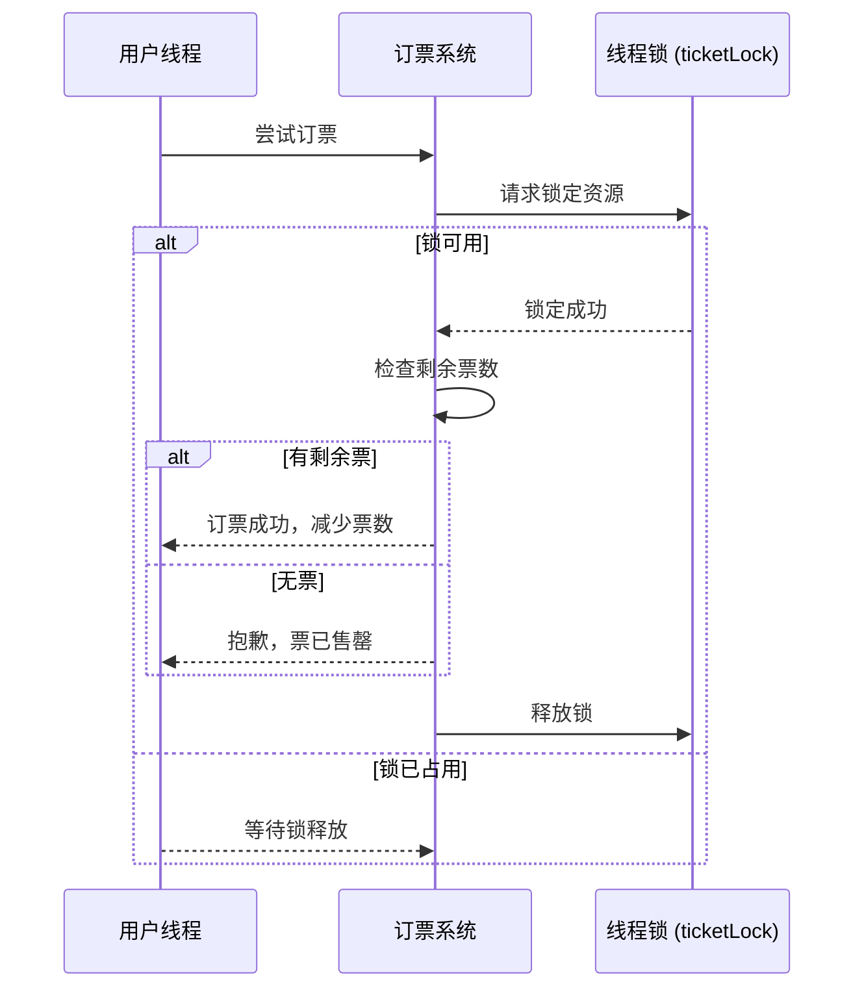

### **飞机票订票系统：使用 C# 线程锁的示例**

在多线程场景中，多个线程同时操作共享资源（例如剩余机票数）可能导致数据不一致问题。通过 **线程锁（`lock` 关键字）**，可以确保只有一个线程在某个时间点访问共享资源，从而避免竞争条件。

---

### **场景描述**

一个飞机票订票系统，多个用户（线程）尝试同时购买剩余机票。系统需要确保：
1. **数据一致性**：不能超卖机票。
2. **线程安全**：确保多个线程同时操作时数据完整性。

---

#### **完整代码示例**

```csharp
using System;
using System.Threading;

class AirplaneTicketBooking
{
    private static int availableTickets = 5; // 剩余机票数量
    private static readonly object ticketLock = new object(); // 锁对象

    static void Main()
    {
        // 模拟多个用户同时订票
        for (int i = 1; i <= 10; i++)
        {
            Thread thread = new Thread(BookTicket);
            thread.Name = $"用户{i}";
            thread.Start();
        }
    }

    static void BookTicket()
    {
        Console.WriteLine($"{Thread.CurrentThread.Name} 尝试订票...");

        // 使用锁确保线程安全
        lock (ticketLock)
        {
            if (availableTickets > 0)
            {
                Console.WriteLine($"{Thread.CurrentThread.Name} 成功订到票！剩余票数: {--availableTickets}");
            }
            else
            {
                Console.WriteLine($"{Thread.CurrentThread.Name} 抱歉，票已售罄！");
            }
        }
    }
}
```

---

#### **运行结果示例**

```plaintext
用户1 尝试订票...
用户1 成功订到票！剩余票数: 4
用户2 尝试订票...
用户2 成功订到票！剩余票数: 3
用户3 尝试订票...
用户3 成功订到票！剩余票数: 2
用户4 尝试订票...
用户4 成功订到票！剩余票数: 1
用户5 尝试订票...
用户5 成功订到票！剩余票数: 0
用户6 尝试订票...
用户6 抱歉，票已售罄！
用户7 尝试订票...
用户7 抱歉，票已售罄！
...
```

---

### **线程锁的关键点**

1. **共享资源**：
   - `availableTickets` 是共享资源，多个线程会同时访问和修改它。

2. **锁对象**：
   - `ticketLock` 是一个全局锁，`lock(ticketLock)` 确保只有一个线程可以进入关键区域。

3. **锁的作用**：
   - `lock` 块内的代码是线程安全的，其他线程必须等待当前线程完成后才能进入。

4. **防止超卖**：
   - 锁定后检查票数并减一，保证票数不会被多个线程同时减少。

---

### **序列图解释**

以下序列图展示了多个线程尝试订票的过程，以及如何通过锁确保线程安全。



---

### **锁的优势和注意事项**

#### **优点**
1. **数据一致性**：
   - 确保共享资源不会因多个线程的同时修改而破坏。

2. **易于实现**：
   - 使用 `lock` 关键字实现线程同步，简单且高效。

#### **注意事项**
1. **死锁**：
   - 如果多个锁嵌套使用，可能导致死锁。尽量避免多个锁的交叉依赖。

2. **性能损耗**：
   - 锁会增加线程等待时间，降低系统吞吐量。在可能的情况下，优先使用无锁结构。

3. **锁的范围**：
   - 锁的范围应尽量小，仅包含需要同步的关键代码，避免长时间占用锁资源。

---

### **改进建议：使用 Monitor 或 Mutex**

`lock` 是 `Monitor` 的语法糖。对于更复杂的场景，可以使用 `Monitor` 或 `Mutex` 提供更灵活的控制。

#### **使用 Monitor**
```csharp
Monitor.Enter(ticketLock);
try
{
    if (availableTickets > 0)
    {
        Console.WriteLine($"{Thread.CurrentThread.Name} 成功订到票！剩余票数: {--availableTickets}");
    }
    else
    {
        Console.WriteLine($"{Thread.CurrentThread.Name} 抱歉，票已售罄！");
    }
}
finally
{
    Monitor.Exit(ticketLock);
}
```

---

### **总结**

- 使用 **线程锁（`lock`）** 可以有效解决多线程访问共享资源的竞争问题。
- 在订票系统中，通过锁确保了票数的线程安全，防止多个线程同时修改数据导致超卖。
- 在多线程开发中，锁是最常用的同步工具，但需注意死锁和性能开销问题。通过合理设计代码逻辑，可以在确保线程安全的同时优化性能。
