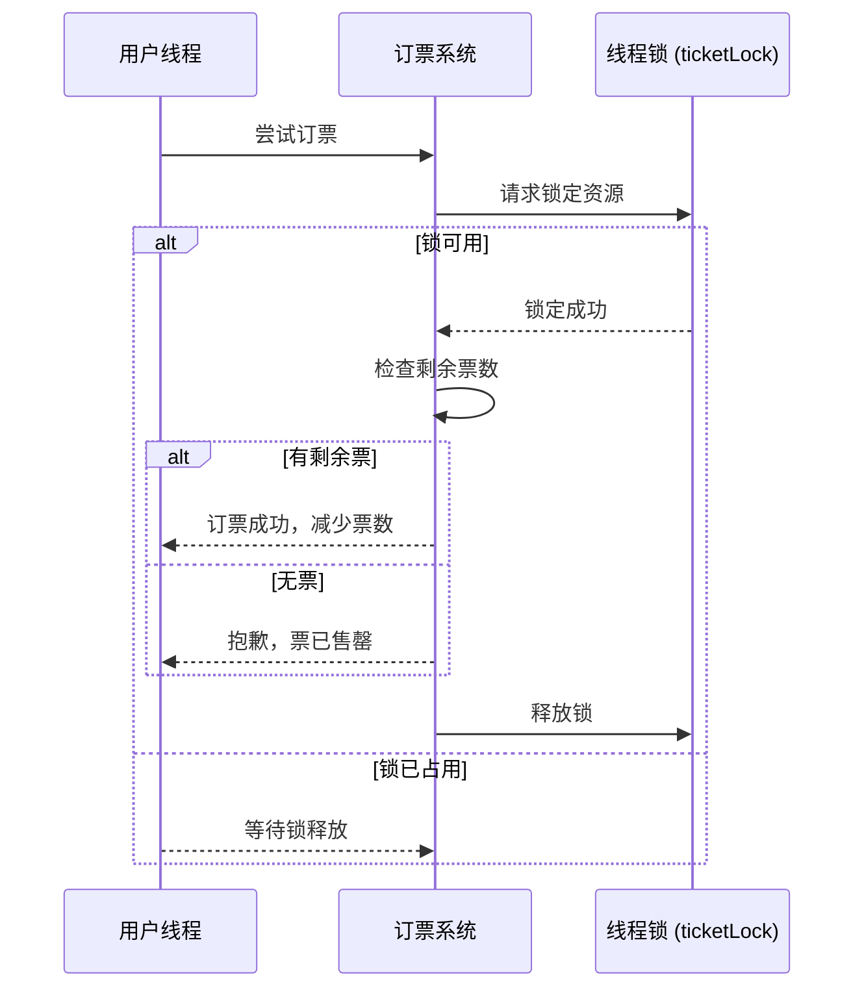

### **飞机票订票系统：使用 C# 线程锁的示例**

在多线程场景中，多个线程同时操作共享资源（例如剩余机票数）可能导致数据不一致问题。通过 **线程锁（`lock` 关键字）**，可以确保只有一个线程在某个时间点访问共享资源，从而避免竞争条件。

---

### **场景描述**

一个飞机票订票系统，多个用户（线程）尝试同时购买剩余机票。系统需要确保：
1. **数据一致性**：不能超卖机票。
2. **线程安全**：确保多个线程同时操作时数据完整性。

---

#### **完整代码示例**

```csharp
using System;
using System.Threading;

class AirplaneTicketBooking
{
    private static int availableTickets = 5; // 剩余机票数量
    private static readonly object ticketLock = new object(); // 锁对象

    static void Main()
    {
        // 模拟多个用户同时订票
        for (int i = 1; i <= 10; i++)
        {
            Thread thread = new Thread(BookTicket);
            thread.Name = $"用户{i}";
            thread.Start();
        }
    }

    static void BookTicket()
    {
        Console.WriteLine($"{Thread.CurrentThread.Name} 尝试订票...");

        // 使用锁确保线程安全
        lock (ticketLock)
        {
            if (availableTickets > 0)
            {
                Console.WriteLine($"{Thread.CurrentThread.Name} 成功订到票！剩余票数: {--availableTickets}");
            }
            else
            {
                Console.WriteLine($"{Thread.CurrentThread.Name} 抱歉，票已售罄！");
            }
        }
    }
}
```

---

#### **运行结果示例**

```plaintext
用户1 尝试订票...
用户1 成功订到票！剩余票数: 4
用户2 尝试订票...
用户2 成功订到票！剩余票数: 3
用户3 尝试订票...
用户3 成功订到票！剩余票数: 2
用户4 尝试订票...
用户4 成功订到票！剩余票数: 1
用户5 尝试订票...
用户5 成功订到票！剩余票数: 0
用户6 尝试订票...
用户6 抱歉，票已售罄！
用户7 尝试订票...
用户7 抱歉，票已售罄！
...
```

---

### **线程锁的关键点**

1. **共享资源**：
   - `availableTickets` 是共享资源，多个线程会同时访问和修改它。

2. **锁对象**：
   - `ticketLock` 是一个全局锁，`lock(ticketLock)` 确保只有一个线程可以进入关键区域。

3. **锁的作用**：
   - `lock` 块内的代码是线程安全的，其他线程必须等待当前线程完成后才能进入。

4. **防止超卖**：
   - 锁定后检查票数并减一，保证票数不会被多个线程同时减少。

---

### **序列图解释**

以下序列图展示了多个线程尝试订票的过程，以及如何通过锁确保线程安全。



---

### **锁的优势和注意事项**

#### **优点**
1. **数据一致性**：
   - 确保共享资源不会因多个线程的同时修改而破坏。

2. **易于实现**：
   - 使用 `lock` 关键字实现线程同步，简单且高效。

#### **注意事项**
1. **死锁**：
   - 如果多个锁嵌套使用，可能导致死锁。尽量避免多个锁的交叉依赖。

2. **性能损耗**：
   - 锁会增加线程等待时间，降低系统吞吐量。在可能的情况下，优先使用无锁结构。

3. **锁的范围**：
   - 锁的范围应尽量小，仅包含需要同步的关键代码，避免长时间占用锁资源。

---

### **改进建议：使用 Monitor 或 Mutex**

`lock` 是 `Monitor` 的语法糖。对于更复杂的场景，可以使用 `Monitor` 或 `Mutex` 提供更灵活的控制。

#### **使用 Monitor**
```csharp
Monitor.Enter(ticketLock);
try
{
    if (availableTickets > 0)
    {
        Console.WriteLine($"{Thread.CurrentThread.Name} 成功订到票！剩余票数: {--availableTickets}");
    }
    else
    {
        Console.WriteLine($"{Thread.CurrentThread.Name} 抱歉，票已售罄！");
    }
}
finally
{
    Monitor.Exit(ticketLock);
}
```

---

### **总结**

- 使用 **线程锁（`lock`）** 可以有效解决多线程访问共享资源的竞争问题。
- 在订票系统中，通过锁确保了票数的线程安全，防止多个线程同时修改数据导致超卖。
- 在多线程开发中，锁是最常用的同步工具，但需注意死锁和性能开销问题。通过合理设计代码逻辑，可以在确保线程安全的同时优化性能。

---

### **为什么使用 `private static readonly object ticketLock = new object();` 而不是 `object ticketLock = new object();`**

在多线程场景中，线程锁的正确使用直接关系到程序的线程安全性。选择 **`private static readonly`** 是基于以下几个关键因素：**作用域**、**生命周期** 和 **线程安全**。

---

### **1. 作用域和共享访问**

#### **使用 `static` 的场景**
- **`static`** 确保 `ticketLock` 是一个类级别的共享资源，所有实例都共享同一个锁对象。
- 在多线程场景中，多个线程通常会访问同一个共享资源（例如剩余机票数量 `availableTickets`）。如果锁对象不是共享的，就会导致锁的机制失效，从而引发数据竞争问题。

#### **不使用 `static` 的问题**
- 如果锁对象是非静态的，那么每个类实例都会有自己独立的 `ticketLock`，线程访问不同实例时将无法互相阻塞。
- 结果是多个线程可以同时修改共享资源，导致**数据不一致**。

---

#### **示例对比**

##### **没有使用 `static` 的情况**
```csharp
private object ticketLock = new object(); // 非静态锁对象

static void Main()
{
    var booking1 = new AirplaneTicketBooking();
    var booking2 = new AirplaneTicketBooking();

    Thread t1 = new Thread(booking1.BookTicket);
    Thread t2 = new Thread(booking2.BookTicket); // 使用了不同的锁对象

    t1.Start();
    t2.Start();
}
```

- **问题**：  
  - `booking1` 和 `booking2` 分别有自己的 `ticketLock`。
  - 线程 `t1` 和 `t2` 会同时进入关键区，因为锁对象不同。
  - 结果：共享的 `availableTickets` 数据发生竞争，可能导致超卖等问题。

---

##### **使用 `static` 的情况**
```csharp
private static readonly object ticketLock = new object(); // 静态锁对象

static void Main()
{
    var booking1 = new AirplaneTicketBooking();
    var booking2 = new AirplaneTicketBooking();

    Thread t1 = new Thread(booking1.BookTicket);
    Thread t2 = new Thread(booking2.BookTicket);

    t1.Start();
    t2.Start();
}
```

- **解决方案**：  
  - `booking1` 和 `booking2` 共享同一个 `ticketLock` 对象。
  - `lock(ticketLock)` 保证同一时间只有一个线程可以进入关键区。
  - 结果：**线程安全性得到保障**。

---

### **2. 锁对象的生命周期**

#### **使用 `static` 的好处**
- `static` 锁对象的生命周期是整个应用程序运行的时间。只要程序还在运行，`ticketLock` 就会一直存在。
- 这非常适合保护共享资源（如剩余机票），因为它的生命周期需要跨越所有实例。

#### **不使用 `static` 的问题**
- 非静态锁对象的生命周期是实例级别的。  
  如果多个类实例对应不同的锁对象，锁的机制就无法保护全局共享资源。

---

### **3. 为什么需要 `readonly`**

#### **`readonly` 的作用**
- **`readonly`** 确保 `ticketLock` 一旦初始化后，其引用就不能被修改。
- 锁对象的稳定性非常重要。如果锁对象被重新分配引用，不同线程可能会锁定不同的对象，导致锁失效。

#### **不使用 `readonly` 的风险**
```csharp
private static object ticketLock = new object();

static void Main()
{
    ticketLock = new object(); // 重新分配锁对象
}
```
- 如果锁对象可以被重新分配，不同线程可能锁定的是不同的对象，导致共享资源无法正确同步。

---

### **4. 代码对比**

#### **`private static readonly object ticketLock = new object();`**
- **作用域**：所有类实例共享同一个锁对象。
- **生命周期**：存在于整个程序的生命周期内。
- **线程安全**：确保同一时刻只有一个线程可以访问共享资源。

#### **`private object ticketLock = new object();`**
- **作用域**：每个类实例都有自己的锁对象。
- **生命周期**：仅存在于实例生命周期内。
- **线程安全**：无法保证多个实例对共享资源的同步访问。

---

### **总结对比表**

| **特性**               | **`static readonly` 锁对象**                  | **非静态锁对象**                       |
|------------------------|----------------------------------------------|----------------------------------------|
| **作用域**             | 类级别，所有实例共享。                         | 实例级别，每个实例有独立锁对象。          |
| **生命周期**           | 程序运行期间一直存在。                          | 实例销毁时锁对象也随之销毁。              |
| **线程安全**           | 全局保护共享资源，防止数据竞争。                 | 不同实例之间无法互相同步，可能导致竞态条件。 |
| **重新分配锁的风险**   | 使用 `readonly` 避免锁对象被重新分配，确保稳定性。 | 锁对象可能被修改，导致锁定机制失效。       |

---

### **选择 `private static readonly object ticketLock` 的理由**

1. **保证线程安全**：  
   - 共享的锁对象避免了不同线程对共享资源的同时访问，确保了数据一致性。

2. **生命周期与共享资源一致**：  
   - 锁对象的生命周期与共享资源相同，保证程序运行期间始终有效。

3. **防止锁对象被修改**：  
   - 使用 `readonly` 避免锁对象被重新分配，从而保证锁机制的稳定性。

如果锁对象是非静态的，每个实例会有自己的锁，线程同步的机制就会失效，导致数据竞争和不一致的风险。因此，在这种多线程共享资源的场景下，**`private static readonly object` 是最佳选择**。
