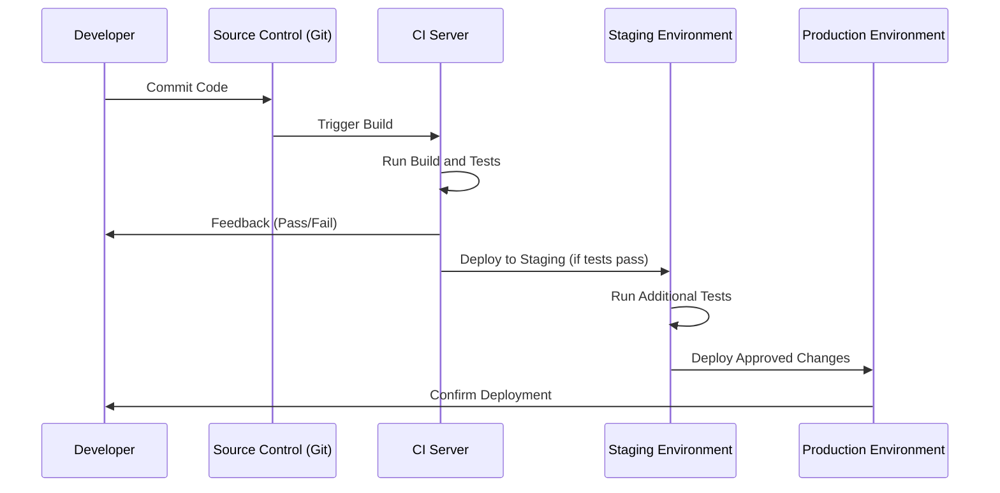

### **Understanding SDLC with CI/CD: A Complete Guide**

Modern software development relies heavily on automation and iterative processes to deliver high-quality, reliable products quickly. This is where **SDLC** (Software Development Life Cycle) and **CI/CD** (Continuous Integration/Continuous Delivery or Deployment) come into play. In this article, we’ll explore the SDLC stages, the differences between CI and CD, and the workings of a typical CI/CD pipeline.

---

### **Section 1: SDLC with CI/CD**

The **Software Development Life Cycle (SDLC)** includes the following key stages:
1. **Development**: Writing and refining code.
2. **Testing**: Validating code functionality and performance.
3. **Deployment**: Releasing the code to staging or production environments.
4. **Maintenance**: Updating and monitoring the software in production.

**CI/CD** enhances and automates SDLC stages, enabling **faster and more reliable software releases**. Here's how it works:
- **Code Push**: When a developer pushes code to a version control system like Git, it triggers the CI/CD process.
- **Automated Build and Test**: The system automatically compiles the code and runs tests, including **end-to-end (e2e)** test cases, to validate its functionality.
- **Deployment or Feedback**: 
  - If tests pass, the code is automatically deployed to a staging or production environment.
  - If tests fail, the code is returned to the development team for bug fixing.

**Benefits**:
- **Fast Feedback**: Developers receive immediate alerts about issues, enabling quicker fixes.
- **Reduced Production Risks**: Automated tests catch bugs early, minimizing errors in live environments.

---

### **Section 2: Difference Between CI and CD**

**Continuous Integration (CI)** and **Continuous Delivery (CD)** are complementary but distinct components of CI/CD. 

| **Aspect**                | **Continuous Integration (CI)**                                  | **Continuous Delivery (CD)**                                  |
|---------------------------|------------------------------------------------------------------|--------------------------------------------------------------|
| **Focus**                 | Automating build, test, and integration processes               | Automating deployment and release processes                  |
| **Key Actions**           | - Runs tests on every code commit                               | - Deploys code to staging or production environments         |
|                           | - Detects integration issues early                              | - Automates infrastructure changes and release approvals     |
| **Goal**                  | Ensure the codebase is always in a working state                | Ensure software is always deployable                         |
| **Manual Steps**          | None; fully automated                                           | May involve manual testing or approval before deployment     |
| **Encourages**            | Frequent code commits and rapid feedback                        | Reliable and repeatable releases                             |

**CI Example**:
- Developer commits code to a repository.
- CI server runs automated unit and integration tests.
- Results are immediately reported to the developer.

**CD Example**:
- After CI tests pass, the CD pipeline deploys the code to a staging environment.
- Optional manual or automated checks are performed before releasing to production.

---

### **Section 3: CI/CD Pipeline**

A **CI/CD pipeline** is a sequence of automated steps that take code from development to production. It ensures efficient, consistent, and error-free software delivery.

#### **Stages in a Typical CI/CD Pipeline**:
1. **Code Commit**:  
   - Developer commits changes to a version control system (e.g., Git).
2. **Trigger Build**:  
   - CI server detects the commit and triggers the pipeline.
3. **Build and Test**:  
   - Code is compiled.
   - Automated tests are run, including unit tests and integration tests.
4. **Feedback**:  
   - Test results are reported to the developer.
   - If tests fail, the pipeline stops, and the developer fixes the code.
5. **Artifact Deployment**:  
   - On success, build artifacts are deployed to a staging environment.
6. **Staging Environment Testing**:  
   - Further testing (e.g., performance or end-to-end tests) is conducted in staging.
7. **Production Deployment**:  
   - After approval, the CD system deploys the code to production.

#### **Benefits of a CI/CD Pipeline**:
- **Automation**: Reduces manual errors and speeds up development.
- **Early Bug Detection**: Problems are identified and resolved early.
- **Consistency**: Provides a repeatable and reliable release process.

---

### **CI/CD Pipeline Sequence Diagram**

---

### **Conclusion**

By combining **SDLC** with **CI/CD**, modern development teams achieve:
- **Faster Feedback Cycles**: Automating tests and builds ensures immediate error detection.
- **Higher Reliability**: Issues are resolved early, reducing bugs in production.
- **Streamlined Processes**: Automated pipelines make releases predictable and repeatable.

Understanding the differences between **CI** and **CD** and how they work together in a CI/CD pipeline helps organizations deliver high-quality software efficiently while minimizing risks.
