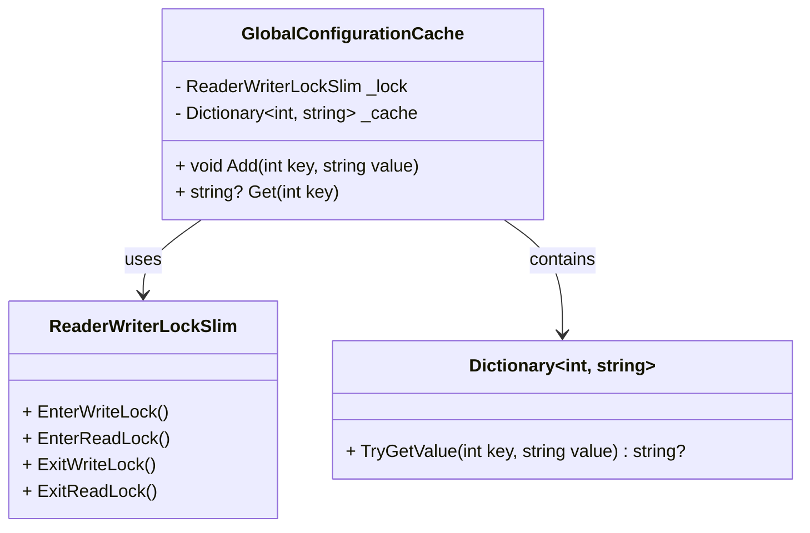

### 
The **C4 Model** provides a standardized way to document the architecture of software systems with four hierarchical diagram levels:

1. **Context Diagram**: High-level view showing the system, external users, and systems it interacts with.
2. **Container Diagram**: Details the containers (e.g., applications, databases) that make up the system.
3. **Component Diagram**: Shows components within a specific container.
4. **Code/Classes**: Detailed internal structure of individual components (not usually represented with C4 but can be shown with class diagrams).

Using **Mermaid** to create these C4 diagrams, I’ll guide you through building each level with an example based on a `GlobalConfigurationCache` system.

---

### 1. **Context Diagram** 

The **Context Diagram** shows the main system (`Configuration System`) and its interactions with external systems (e.g., `Admin User`, `External Cache System`).

```mermaid
%% C4 Context Diagram %%
flowchart TB
    subgraph SystemBoundary[Configuration System]
        system[Configuration Service]
    end

    user[Admin User]
    cache[External Cache System]

    user --> system : Manages
    system --> cache : Retrieves and Updates Configuration
```

### Explanation
- **`Configuration System`**: The main system boundary containing the `Configuration Service`.
- **`Admin User`**: Represents a user who interacts with the system to manage configurations.
- **`External Cache System`**: An external system where configuration data might be stored or retrieved.

### 2. **Container Diagram**

The **Container Diagram** dives into the containers within the `Configuration System`, showing applications, databases, or microservices involved.

```mermaid
%% C4 Container Diagram %%
flowchart TB
    subgraph SystemBoundary[Configuration System]
        app[Configuration API]
        cacheService[Cache Service]
        db[(Configuration Database)]
    end

    user[Admin User]
    extCache[External Cache System]

    user --> app : Uses
    app --> cacheService : Calls
    app --> db : Reads/Writes Configuration
    cacheService --> extCache : Retrieves/Updates Cached Configurations
```

### Explanation
- **`Configuration API`**: Exposes configuration management capabilities to users.
- **`Cache Service`**: Interacts with external cache systems.
- **`Configuration Database`**: Stores configuration data persistently.
- **`External Cache System`**: Used for caching configuration data.

### 3. **Component Diagram**

The **Component Diagram** breaks down the `Cache Service` container to show its internal components.

```mermaid
%% C4 Component Diagram %%
flowchart TB
    subgraph CacheServiceBoundary[Cache Service]
        GlobalConfigurationCache[GlobalConfigurationCache]
        CacheManager[CacheManager]
        CacheAdapter[CacheAdapter]
    end

    app[Configuration API]
    extCache[External Cache System]

    app --> GlobalConfigurationCache : Reads/Writes Configuration
    GlobalConfigurationCache --> CacheManager : Manages Cache
    CacheManager --> CacheAdapter : Uses Adapter Pattern
    CacheAdapter --> extCache : Interacts with External Cache
```

### Explanation
- **`GlobalConfigurationCache`**: Main component managing configuration caching.
- **`CacheManager`**: Handles cache-related operations.
- **`CacheAdapter`**: Provides an interface to interact with the `External Cache System`.

### 4. **Class Diagram for Code-Level Detail**

A class diagram (like the one provided earlier) can represent code-level details within the `GlobalConfigurationCache` component.



### Explanation
- **`GlobalConfigurationCache`**: Manages configuration data, with methods for adding and retrieving cache items.
- **`ReaderWriterLockSlim` and `Dictionary`**: Supporting classes that ensure thread safety and data storage.

---

### How to Document C4 Model in Visual Studio Code

1. **Install VS Code and Extensions**:
   - Use the **Mermaid** extension for syntax highlighting and preview.
   - For richer previews, **Markdown Preview Enhanced** is recommended.

2. **Create a Markdown File**:
   - Start a `.md` file (e.g., `C4Model.md`) and add code blocks for each diagram using the `mermaid` language.

3. **Add Mermaid Code**:
   - Use the Mermaid syntax for each level of the C4 Model as shown above, starting with the Context Diagram and moving through to the Class Diagram if needed.

4. **Preview and Export**:
   - Preview each diagram in VS Code by selecting **Preview Mermaid** or **Markdown Preview Enhanced**.
   - Export the diagrams to PNG/SVG if needed for use in external documentation.

This guide helps you use VS Code and Mermaid to create and document C4 Model diagrams, visually illustrating each level of your system architecture.
