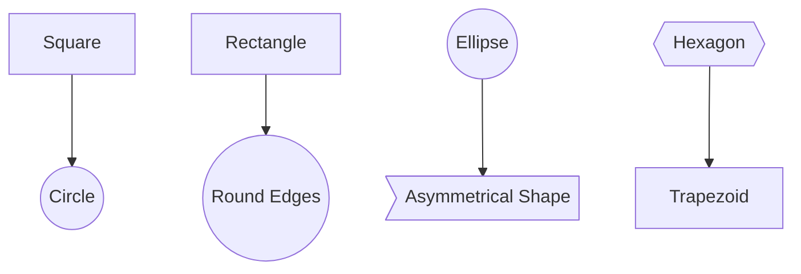
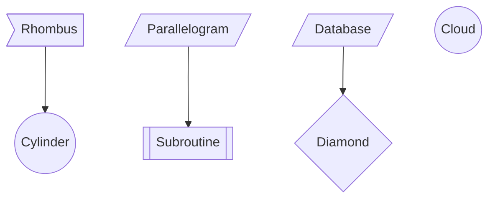
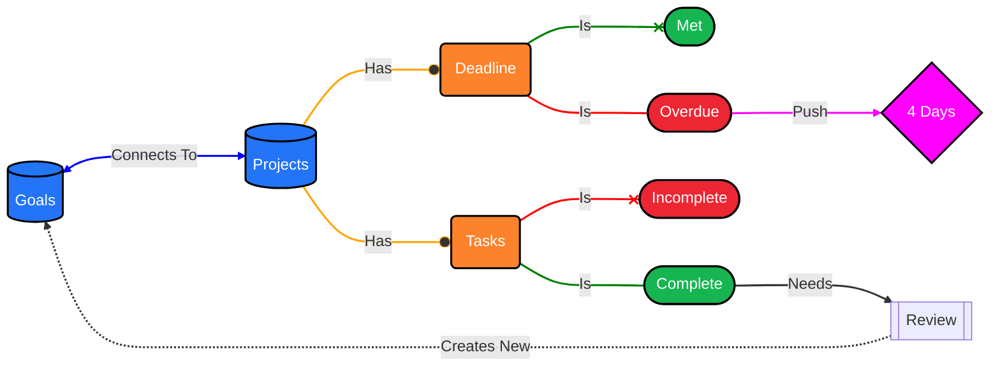
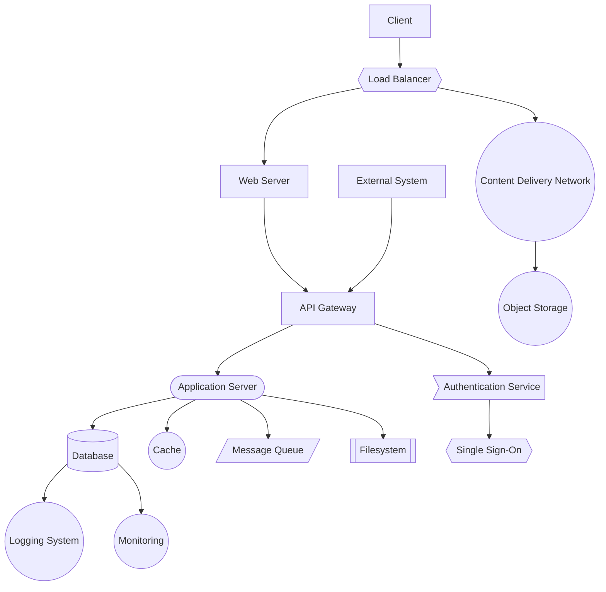
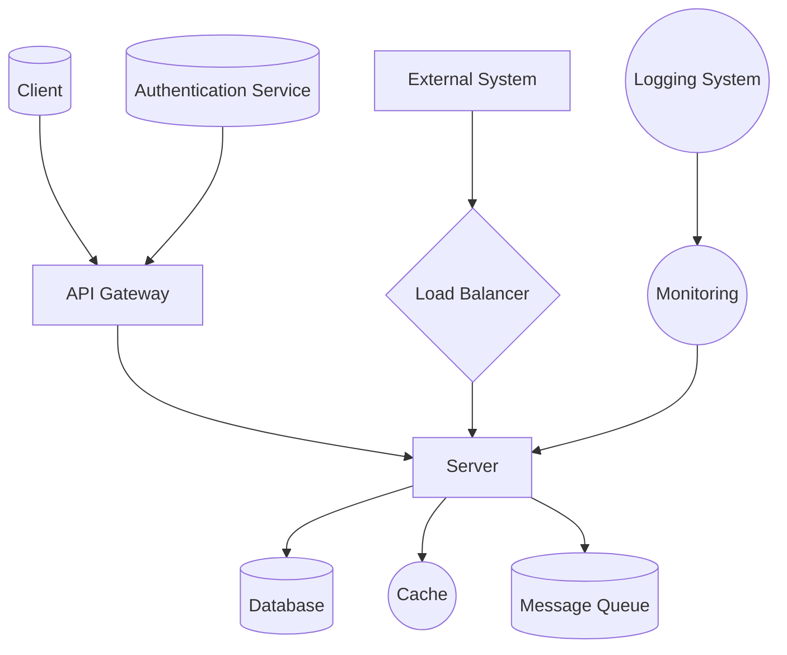
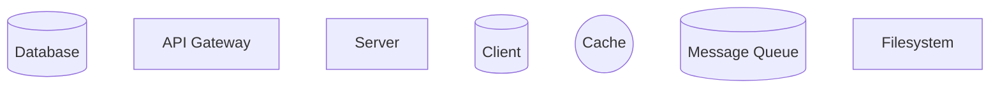
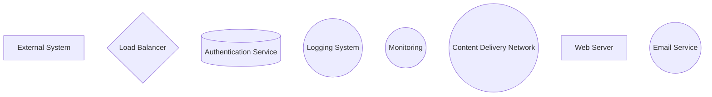
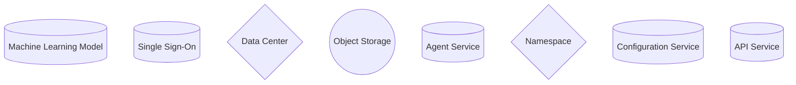

### Mermaid Diagram Examples

In Mermaid, you can use various shapes to represent different components or nodes. Here’s a list of the basic shapes available in Mermaid and how to create them:

### Explanation of Each Shape

1. **Square**: Defined with `[Label]`. 
    - Example: `A[Square]`

2. **Circle**: Defined with `((Label))`.
    - Example: `B((Circle))`

3. **Rectangle**: Similar to square but often used interchangeably.
    - Example: `C[Rectangle]`

4. **Round Edges (Rounded Rectangle)**: Defined with `([Label])`.
    - Example: `D([Round Edges])`

5. **Ellipse**: Also uses rounded parentheses, creating an elliptical shape.
    - Example: `E((Ellipse))`

6. **Asymmetrical Shape**: Defined with `>Label]` (triangle on one side).
    - Example: `F>Asymmetrical Shape]`

7. **Hexagon**: Defined with `{{Label}}`.
    - Example: `G{{Hexagon}}`

8. **Trapezoid**: Mermaid doesn’t have a direct trapezoid shape, but customizations can be added by creating subgraphs or groups.

9. **Rhombus (Decision)**: Defined with `{Label}` for a diamond shape, often used for decisions.
    - Example: `N{Diamond}`

10. **Cylinder**: Often used for databases or storage.
    - Example: `J((Cylinder))`

11. **Parallelogram**: Created using `[/Label/]` or `[\Label\]`.
    - Example: `K[/Parallelogram/]`

12. **Subroutine**: Represented by double square brackets `[[Label]]`.
    - Example: `L[[Subroutine]]`

13. **Database**: Displayed as a barrel shape.
    - Example: `M[/Database/]`

14. **Cloud**: Simulated by using rounded brackets for a cloud-like shape.
    - Example: `O((Cloud))`

### Usage in Diagrams

Each shape has specific uses and can be used to represent different types of nodes or components in your diagram, enhancing readability and clarity. Use them according to your needs for representing various components in architectural, workflow, or process diagrams.

---

---
Here’s a sample web system architecture diagram using various Mermaid shapes to represent typical components and their relationships in a web system:

### Explanation of Each Component

- **Client** (`CLT`): Represented as a basic **Rectangle** to show the client interacting with the system.
- **Load Balancer** (`LB`): A **Hexagon**, as a central distribution point for incoming traffic.
- **Web Server** (`WEB`): Shown as a **Rectangle** to represent the server handling HTTP requests.
- **CDN** (`CDN`): A **Circle** for caching static content close to users.
- **API Gateway** (`API`): A **Rectangle** for routing requests to services.
- **Authentication Service** (`AUTH`): Represented with an **Asymmetrical Shape** to highlight its distinct role in security.
- **Application Server** (`SRV`): A **Rectangle** to represent core application logic.
- **Database** (`DB`): A **Cylinder** as a common symbol for data storage.
- **Cache** (`CACHE`): An **Ellipse** for in-memory caching.
- **Message Queue** (`MQ`): A **Parallelogram**, often used to handle asynchronous tasks.
- **Filesystem** (`FILE`): A **Subroutine** shape, useful for additional storage.
- **Logging System** (`LOGS`): A **Circle** for handling logs.
- **Monitoring System** (`MON`): A **Circle** for tracking system health.
- **Object Storage** (`STORAGE`): Used for large files, depicted as a **Cloud**.
- **External System** (`EXT`): A **Rectangle** to represent integrations with external systems.
- **Single Sign-On (SSO)**: A **Diamond** showing it as an authentication feature connecting to `AUTH`.

### Flow and Connections

- **Client** initiates a connection to the **Load Balancer**.
- The **Load Balancer** distributes traffic to the **Web Server** or **CDN**.
- **Web Server** communicates with the **API Gateway** for routing.
- **API Gateway** routes requests to **Application Server** or **Authentication Service**.
- **Application Server** interacts with the **Database**, **Cache**, **Message Queue**, and **Filesystem**.
- **Database** connects to **Logging** and **Monitoring** systems for tracking and storage management.
- **Object Storage** is linked to **CDN** for efficient content delivery.
- **External System** may interact with the **API Gateway** for integrations.

This layout represents a standard architecture for a web application, covering key components and relationships for scalability, caching, and storage.

---

---

