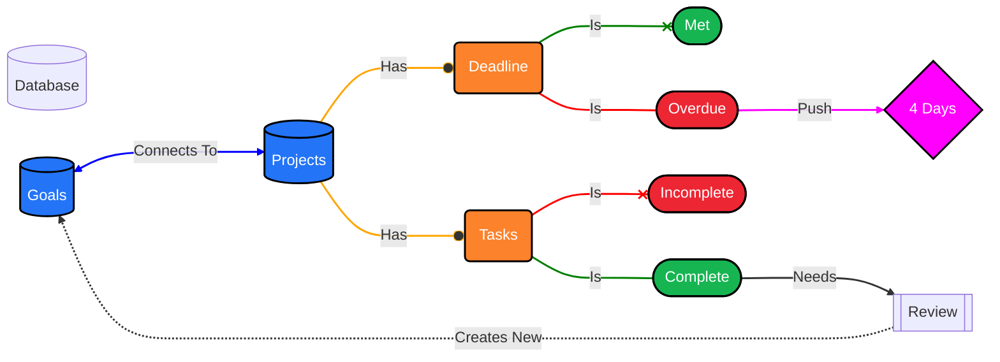

### Mermaid Diagram Examples

```mermaid
flowchart LR

%% Components %%
DB[(Database)]

%% Colors %%
linkStyle default stroke-width:2px
classDef blue fill:#2374f7,stroke:#000,stroke-width:2px,color:#fff
classDef orange fill:#fc822b,stroke:#000,stroke-width:2px,color:#fff
classDef green fill:#16b552,stroke:#000,stroke-width:2px,color:#fff
classDef red fill:#ed2633,stroke:#000,stroke-width:2px,color:#fff
classDef magenta fill:magenta,stroke:#000,stroke-width:2px,color:#fff

%% Goals Database%
%% 0 %%
G[(Goals)]:::blue <===> |Connects To| P[(Projects)]:::blue

%% Projects Database %%
%% Deadline %%
%% 1,2,3,4 %%
P ---o |Has| PD(Deadline):::orange
PD ---x |Is| MT([Met]):::green
PD ---- |Is| OV([Overdue]):::red ---> |Push| FOV{4 Days}:::magenta

%% Tasks %%
%% 5,6,7,8 %%
P ---o |Has| PT(Tasks):::orange
PT ---x |Is| IC([Incomplete]):::red
PT ---- |Is| C([Complete]):::green
C ---> |Needs| R[[Review]]

%% Review %%
%% 9 %%
R -..-> |Creates New| G

%% Link Colors %%
linkStyle 0 stroke:blue
linkStyle 1,5 stroke:orange
linkStyle 2,7 stroke:green
linkStyle 3,6 stroke:red
linkStyle 4 stroke:magenta

%% Clickable Links %%
click P "https://www.notion.so/redgregory/db9274f912e1400a895d51030bc7e680?v=2764569801174438898a704b66599c22"
```
