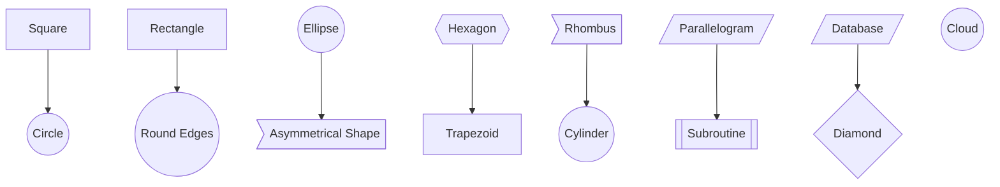
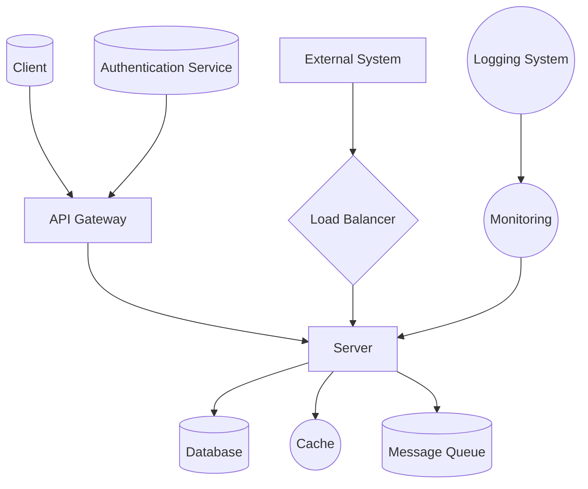
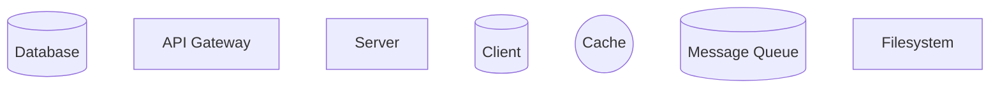
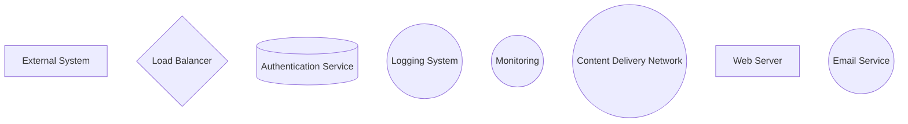
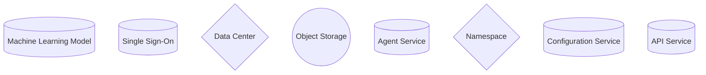

### Mermaid Diagram Examples

```mermaid
graph TD
    A[Square] --> B((Circle))
    C[Rectangle] --> D((Round Edges))
    E((Ellipse)) --> F>Asymmetrical Shape]
    G{{Hexagon}} --> H[Trapezoid]
    I>Rhombus] --> J((Cylinder))
    K[/Parallelogram/] --> L[[Subroutine]]
    M[/Database/] --> N{Diamond}
    O((Cloud))
```
---

```mermaid
flowchart LR

%% Colors %%
linkStyle default stroke-width:2px
classDef blue fill:#2374f7,stroke:#000,stroke-width:2px,color:#fff
classDef orange fill:#fc822b,stroke:#000,stroke-width:2px,color:#fff
classDef green fill:#16b552,stroke:#000,stroke-width:2px,color:#fff
classDef red fill:#ed2633,stroke:#000,stroke-width:2px,color:#fff
classDef magenta fill:magenta,stroke:#000,stroke-width:2px,color:#fff

%% Goals Database%
%% 0 %%
G[(Goals)]:::blue <===> |Connects To| P[(Projects)]:::blue

%% Projects Database %%
%% Deadline %%
%% 1,2,3,4 %%
P ---o |Has| PD(Deadline):::orange
PD ---x |Is| MT([Met]):::green
PD ---- |Is| OV([Overdue]):::red ---> |Push| FOV{4 Days}:::magenta

%% Tasks %%
%% 5,6,7,8 %%
P ---o |Has| PT(Tasks):::orange
PT ---x |Is| IC([Incomplete]):::red
PT ---- |Is| C([Complete]):::green
C ---> |Needs| R[[Review]]

%% Review %%
%% 9 %%
R -..-> |Creates New| G

%% Link Colors %%
linkStyle 0 stroke:blue
linkStyle 1,5 stroke:orange
linkStyle 2,7 stroke:green
linkStyle 3,6 stroke:red
linkStyle 4 stroke:magenta

%% Clickable Links %%
click P "https://www.notion.so/redgregory/db9274f912e1400a895d51030bc7e680?v=2764569801174438898a704b66599c22"
```

---

```mermaid
graph TD
    CLT[(Client)] --> AP[API Gateway]
    AP --> SRV[Server]
    SRV --> DB[(Database)]
    SRV --> CACHE((Cache))
    SRV --> MQ[(Message Queue)]
    EXT[External System] --> LB{Load Balancer}
    LB --> SRV
    AUTH[(Authentication Service)] --> AP
    LOGS((Logging System)) --> MON((Monitoring))
    MON --> SRV
```

---

```mermaid
graph TD
    DB[(Database)]
    AP[API Gateway]
    SRV[Server]
    CLT[(Client)]
    CACHE((Cache))
    MQ[(Message Queue)]
    FILE[Filesystem]
```

```mermaid
graph TD
    EXT[External System]
    LB{Load Balancer}
    AUTH[(Authentication Service)]
    LOGS((Logging System))
    MON((Monitoring))
    CDN((Content Delivery Network))
    WEB[Web Server]
    MAIL((Email Service))
```

```mermaid
graph TD
    ML[(Machine Learning Model)]
    SSO[(Single Sign-On)]
    DC{Data Center}
    STORAGE((Object Storage))
    AGENT[(Agent Service)]
    NS{Namespace}
    CONFIG[(Configuration Service)]
    API[(API Service)]
```
