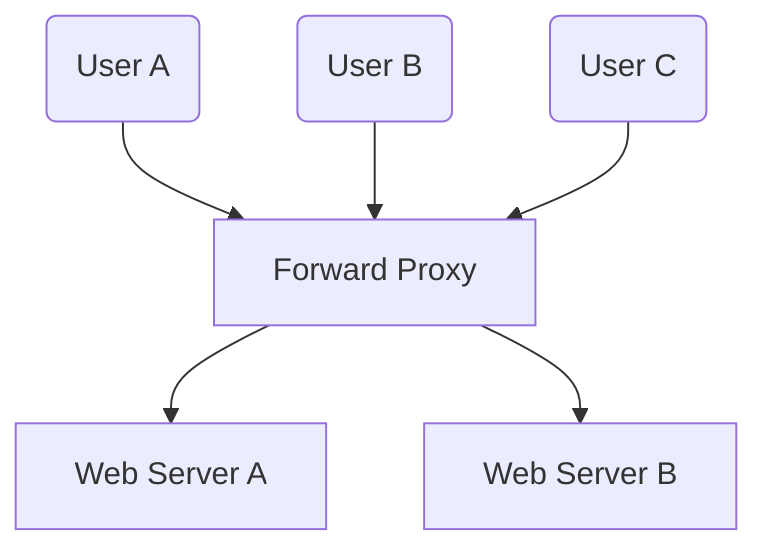
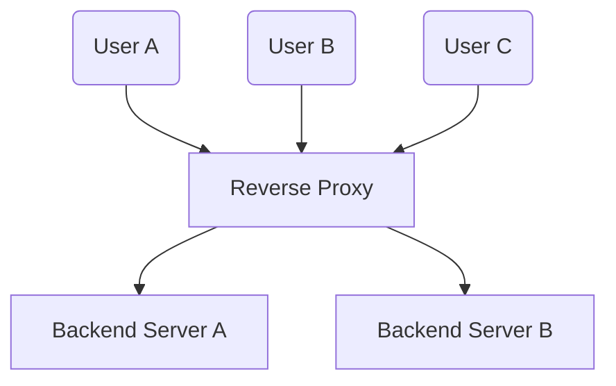

### **Understanding Forward Proxy vs. Reverse Proxy: Detailed Explanation**

Proxies are an essential part of modern networking, offering solutions to improve security, enhance performance, and enable access control. Two commonly used types of proxies are **Forward Proxies** and **Reverse Proxies**, each serving distinct purposes. This article explores their roles, functionality, and use cases in detail.

---

### **What is a Forward Proxy?**

A **Forward Proxy** is a server that sits between client devices (e.g., laptops, phones) and the internet. It acts as an intermediary by forwarding requests from the clients to the web servers they want to access. The client’s identity can remain hidden, as the forward proxy interacts with the servers on their behalf.

#### **How It Works**:
1. The user sends a request to the forward proxy instead of directly accessing the target server.
2. The forward proxy evaluates the request (e.g., for access control).
3. The proxy forwards the request to the appropriate web server on the internet.
4. The web server responds to the proxy, which then forwards the response back to the user.

#### **Key Use Cases**:
1. **Protecting Clients**:  
   - Hides the client’s IP address and identity when accessing the internet.
   - Provides anonymity, enhancing online privacy.

2. **Circumventing Browsing Restrictions**:  
   - Enables users to bypass regional restrictions or censorship by routing traffic through servers in different regions.

3. **Blocking Access to Certain Content**:  
   - Organizations can configure forward proxies to restrict access to specific websites or online services (e.g., social media or adult content).

---

### **What is a Reverse Proxy?**

A **Reverse Proxy** is a server that sits between client devices and a group of backend servers. Instead of forwarding client requests directly to the target web server, the reverse proxy handles the request, interacts with the backend server(s), and sends the server’s response back to the client as if it originated from the proxy itself.

#### **How It Works**:
1. A client sends a request to the reverse proxy instead of directly contacting the backend server.
2. The reverse proxy evaluates and processes the request.
3. The proxy forwards the request to one of the backend servers (based on load balancing or other criteria).
4. The backend server responds to the proxy, which then returns the response to the client.

#### **Key Use Cases**:
1. **Protecting Servers**:  
   - Shields backend servers by acting as a single entry point, hiding their identities and IP addresses from clients.

2. **Load Balancing**:  
   - Distributes incoming client requests across multiple servers to prevent overloading any single server and ensure high availability.

3. **Caching Static Content**:  
   - Stores frequently requested resources (e.g., images, scripts) to serve them quickly without querying the backend servers repeatedly.

4. **Encrypting and Decrypting SSL Communications**:  
   - Offloads SSL/TLS encryption and decryption processes from the backend servers, improving their performance.

---

### **Key Differences Between Forward Proxy and Reverse Proxy**

| **Aspect**             | **Forward Proxy**                                | **Reverse Proxy**                                |
|------------------------|--------------------------------------------------|--------------------------------------------------|
| **Purpose**            | Protects and represents the **client**           | Protects and represents the **server**           |
| **Placement**          | Between clients and the internet                 | Between clients and backend servers              |
| **Use Cases**          | - Circumventing browsing restrictions            | - Load balancing                                 |
|                        | - Blocking content                               | - Caching static content                         |
|                        | - Anonymizing client requests                    | - Protecting backend servers                     |
| **Client Awareness**   | The client must know the proxy’s existence       | The client does not need to know about the proxy |
| **Examples**           | - Web content filters in corporate networks      | - NGINX or HAProxy                               |
|                        | - VPNs                                           | - Cloudflare                                     |

---

### **Forward Proxy vs. Reverse Proxy: Visualization**

#### **Forward Proxy**:
- **Scenario**: Multiple users (e.g., User A, User B, User C) on a corporate network send requests through a forward proxy.  
- **Benefits**: Ensures controlled access to web resources, hides user identities, and enforces browsing policies.

#### **Reverse Proxy**:
- **Scenario**: Multiple clients (e.g., User A, User B, User C) send requests to a reverse proxy, which distributes them to backend servers (e.g., Web Server A, Web Server B).  
- **Benefits**: Optimizes server performance, provides load balancing, and secures backend servers.

---

### **Conclusion**

Both forward proxies and reverse proxies play critical roles in networking and security.  
- **Forward Proxies** are client-facing and focus on privacy, control, and bypassing restrictions.  
- **Reverse Proxies** are server-facing and focus on security, scalability, and performance optimization.

Understanding their differences and use cases helps in designing robust and efficient network architectures for both clients and servers. Whether you're looking to enhance server performance with a reverse proxy or protect client privacy with a forward proxy, proxies are powerful tools in modern network design.
