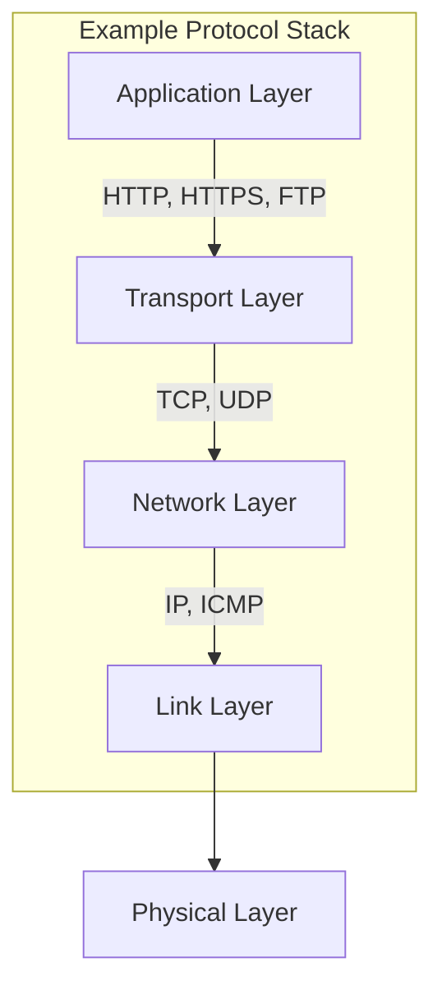

### 网络协议概述
- [网络协议概述](https://www.youtube.com/watch?v=eVkVuwpyd_I&list=PLXpbygNYgVwKF2gS280Y9D6kE_uoWfi-h&index=1)

网络协议是计算机网络中用于通信的一套规则和标准。这些规则定义了数据传输的格式、顺序和处理方式。常见的网络协议包括TCP/IP、HTTP、HTTPS、FTP等。

### TCP/IP协议栈
TCP/IP协议栈是互联网的基础协议栈，分为四层：链路层、网络层、传输层和应用层。每一层都提供特定的功能，并与其他层协作完成数据传输。

#### 链路层（Link Layer）
链路层负责在物理网络上发送和接收数据帧。它包括网络接口卡（NIC）、以太网等。链路层协议有：
- Ethernet
- Wi-Fi
- PPP

#### 网络层（Network Layer）
网络层负责数据包的路由选择和转发。它使用IP协议来标识数据包的源地址和目的地址。网络层协议有：
- IP（Internet Protocol）
- ICMP（Internet Control Message Protocol）
- ARP（Address Resolution Protocol）

#### 传输层（Transport Layer）
传输层提供端到端的通信服务，确保数据包的完整传输。主要的传输层协议有：
- TCP（Transmission Control Protocol）
- UDP（User Datagram Protocol）

#### 应用层（Application Layer）
应用层是网络协议栈的最高层，负责具体的应用程序通信。常见的应用层协议有：
- HTTP（HyperText Transfer Protocol）
- HTTPS（HTTP Secure）
- FTP（File Transfer Protocol）
- SMTP（Simple Mail Transfer Protocol）

### 网络协议工作原理
#### TCP协议
TCP是面向连接的协议，提供可靠的数据传输服务。TCP连接通过三次握手建立，数据传输完成后通过四次挥手关闭连接。

- **三次握手建立连接：**
  1. 客户端发送SYN（同步序列号）包给服务器。
  2. 服务器回复SYN-ACK（同步确认）包。
  3. 客户端发送ACK（确认）包，连接建立。

- **四次挥手关闭连接：**
  1. 客户端发送FIN（结束）包。
  2. 服务器回复ACK包。
  3. 服务器发送FIN包。
  4. 客户端回复ACK包，连接关闭。

#### UDP协议
UDP是无连接的协议，不保证数据包的顺序和可靠性，但它的传输速度快，适用于对实时性要求高的场景，如视频流、在线游戏。

#### HTTP协议
HTTP是超文本传输协议，用于在Web浏览器和服务器之间传输数据。HTTP请求由请求行、请求头和请求体组成，服务器响应包括状态行、响应头和响应体。

### 网络协议图解


### 示例代码：使用Node.js实现HTTP请求
以下是使用Node.js发送HTTP请求的示例代码：

```javascript
const http = require('http');

// 发送HTTP GET请求
const options = {
  hostname: 'www.example.com',
  port: 80,
  path: '/',
  method: 'GET'
};

const req = http.request(options, (res) => {
  console.log(`状态码: ${res.statusCode}`);

  res.on('data', (chunk) => {
    console.log(`响应体: ${chunk}`);
  });

  res.on('end', () => {
    console.log('请求已完成');
  });
});

req.on('error', (e) => {
  console.error(`请求遇到问题: ${e.message}`);
});

// 结束请求
req.end();
```

### 网络协议比较
以下是常见网络协议的比较：

| 协议     | 类型         | 特点                                           | 适用场景                       |
|----------|--------------|-----------------------------------------------|------------------------------|
| TCP      | 传输层协议   | 面向连接，可靠，保证数据顺序                    | 文件传输、电子邮件、Web浏览   |
| UDP      | 传输层协议   | 无连接，不保证数据顺序和可靠性，速度快           | 视频流、在线游戏、语音传输   |
| HTTP     | 应用层协议   | 无状态，易于实现，广泛用于Web应用                | Web浏览、API通信              |
| HTTPS    | 应用层协议   | 在HTTP基础上增加SSL/TLS加密，保证数据安全       | 安全Web浏览、在线交易        |
| FTP      | 应用层协议   | 用于文件传输，支持用户认证和目录操作             | 文件上传/下载                 |

通过理解网络协议的基本原理和实现方法，可以更好地设计和优化网络应用，确保其高效、可靠和安全。
