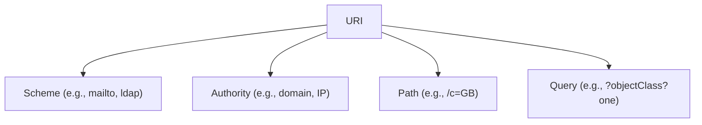
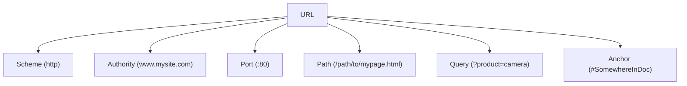
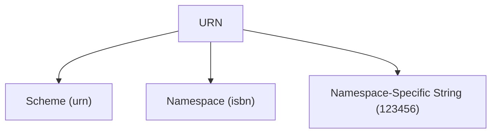

### **Understanding URL, URI, and URN: Detailed Explanation**

The terms **URL**, **URI**, and **URN** are often used interchangeably, but they have distinct meanings and roles in identifying and locating resources on the web. This article provides a clear explanation of their differences, components, and how they relate to one another.

---

### **What is a URI?**

**URI (Uniform Resource Identifier)** is the overarching term used to identify resources. A URI can be further categorized into two types:
- **URL (Uniform Resource Locator)**: Specifies the location of a resource.
- **URN (Uniform Resource Name)**: Specifies the name of a resource independent of its location.

A URI includes several components:
- **Scheme**: Defines the protocol or mechanism (e.g., `mailto`, `ldap`, `http`).
- **Authority**: Includes domain names, IP addresses, or other identifying information.
- **Path**: Indicates the specific location or hierarchical structure of the resource.
- **Query**: Additional parameters or instructions for retrieving the resource.

---

### **What is a URL?**

**URL** is a type of URI that provides both an identifier and the means to locate a resource on the web. URLs include information such as the protocol to use (`http`, `https`), the domain name, port, and the path to the specific resource.

#### **URL Components**:
1. **Scheme**: Indicates the protocol (e.g., `http`, `https`).
2. **Authority**: Contains the domain name or IP address (e.g., `www.mysite.com`).
3. **Port**: Specifies the port number, if applicable (e.g., `:80`).
4. **Path**: Refers to the file path or location on the server (e.g., `/path/to/mypage.html`).
5. **Query**: Provides additional parameters for the request (e.g., `?product=camera`).
6. **Anchor**: Specifies a fragment or section within the resource (e.g., `#SomewhereInDoc`).

**Example**:  
`http://www.mysite.com:80/path/to/mypage.html?product=camera#SomewhereInDoc`

---

### **What is a URN?**

**URN** is another type of URI, but instead of specifying the location of a resource, it defines a resource by its unique name, independent of where it is hosted or stored. URNs are often used in scenarios where the resource's location may change but its identity remains constant.

#### **URN Components**:
1. **Scheme**: Identifies it as a URN (e.g., `urn`).
2. **Namespace**: Specifies the type of resource (e.g., `isbn` for books).
3. **Namespace-Specific String**: A unique identifier within the namespace (e.g., `123456`).

**Example**:  
`urn:isbn:123456`

---

### **Key Differences Between URL, URI, and URN**

| **Aspect**              | **URI**                                  | **URL**                                 | **URN**                                      |
|-------------------------|------------------------------------------|-----------------------------------------|---------------------------------------------|
| **Definition**           | Generic term for identifying resources  | Identifies and locates resources        | Identifies resources by name                |
| **Type**                | Broad category                          | Subtype of URI                          | Subtype of URI                              |
| **Purpose**             | General resource identification         | Provides location and access methods    | Names a resource, independent of location  |
| **Components**          | Scheme, authority, path, query, etc.    | Scheme, authority, path, query, anchor | Scheme, namespace, namespace-specific string |
| **Example**             | `mailto:Alice@mysite.com`               | `http://www.mysite.com:80/...`          | `urn:isbn:123456`                           |

---

### **Visualization**

#### **URI**
- **Purpose**: To identify resources.
- **Examples**:
  - `mailto://Alice@mysite.com`
  - `ldap://2001:db8::7/c=GB?objectClass?one`

#### **URL**
- **Purpose**: To identify and locate resources.
- **Example**: `http://www.mysite.com:80/path/to/mypage.html?product=camera#SomewhereInDoc`

#### **URN**
- **Purpose**: To identify resources by name, independent of location.
- **Example**: `urn:isbn:123456`

---

### **Conclusion**

- **URI** is the umbrella term that includes both **URL** and **URN**.
- **URL** focuses on identifying and locating resources, making it practical for web access.
- **URN** provides a unique, location-independent identifier, useful in cases where the resource's location may change.

Understanding the differences between URL, URI, and URN is essential for designing and working with systems that involve resource identification and web communication.
