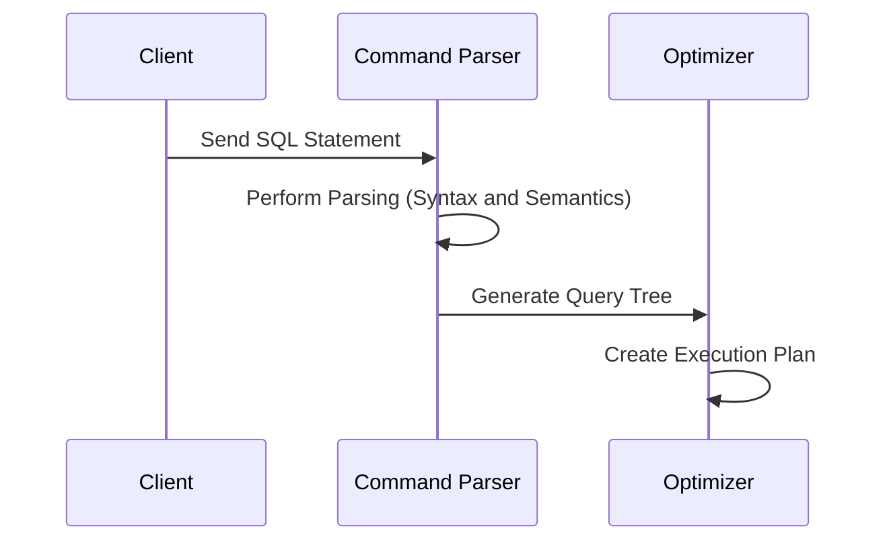
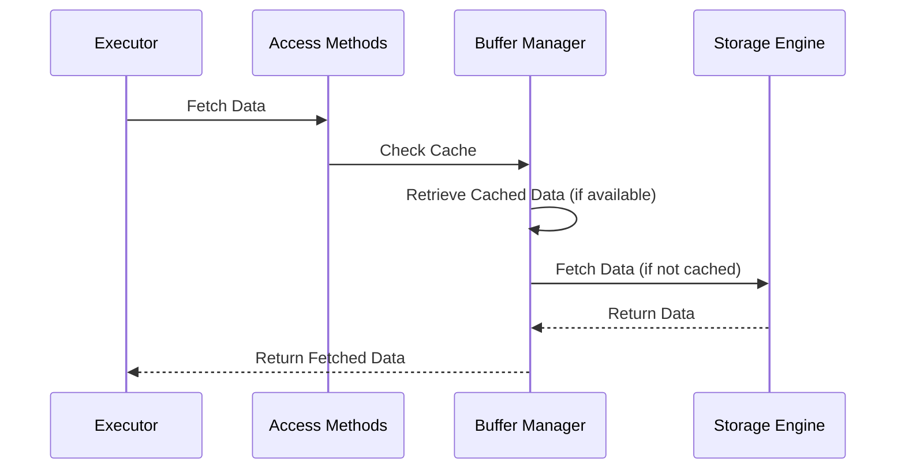
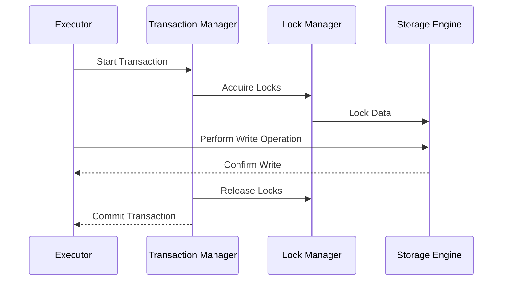

### **How a SQL Statement is Processed by a Database System**

Processing a SQL statement involves several structured steps, each responsible for ensuring the statement is syntactically and semantically valid, optimized for execution, and safely processed while maintaining the database's integrity. This article walks through the journey of a SQL statement in a database system.

---

### **Step-by-Step SQL Query Execution**

#### **Step 1: Sending the SQL Statement**
- **Process**: The client sends a SQL statement to the database over a transport protocol, such as **TCP**.
- **Purpose**: This step establishes communication between the client and the database.

---

#### **Step 2: Command Parsing**
- **Process**: 
  1. The SQL statement is passed to the **command parser**.
  2. The parser performs **syntactic analysis** (to check for grammatical correctness) and **semantic analysis** (to verify logical validity).
  3. A **query tree** is generated, representing the logical structure of the SQL statement.
- **Purpose**: Ensures the SQL query is valid and constructs a representation for further processing.

---

#### **Step 3: Query Optimization**
- **Process**: The **query tree** is passed to the **optimizer**, which generates an **execution plan**. 
- **Purpose**: The optimizer evaluates multiple potential execution paths to determine the most efficient way to execute the query, minimizing resource usage and maximizing performance.

**Sequence Diagram**:

---

#### **Step 4: Query Execution**
- **Process**: The **executor** receives the execution plan and begins execution by retrieving the required data.
- **Purpose**: Translates the optimized plan into actionable steps for data retrieval and manipulation.

---

#### **Step 5: Data Retrieval**
- **Process**: 
  - **Access methods** provide the logic for fetching data from the **storage engine**. 
  - These methods determine how the data is accessed and processed.
- **Purpose**: Abstracts the complexity of data storage and retrieval.

---

#### **Step 6: Read-Only Queries (SELECT)**
- **Process**: 
  - If the SQL statement is a **read-only query** (e.g., SELECT), it is passed to the **buffer manager**. 
  - The buffer manager looks for the requested data in the **cache** or **data files**.
- **Purpose**: Optimizes performance by avoiding redundant disk I/O when cached data is available.

**Sequence Diagram for SELECT**:

---

#### **Step 7: Write Queries (INSERT/UPDATE)**
- **Process**: 
  - If the SQL statement modifies data (e.g., INSERT or UPDATE), it is sent to the **transaction manager** for processing.
- **Purpose**: Ensures that changes to the database are handled as part of a transaction, maintaining data consistency and integrity.

---

#### **Step 8: Transaction Management and Locking**
- **Process**: 
  - During a transaction, the **lock manager** ensures the data is in lock mode, preventing concurrent changes that could violate **ACID properties**.
  - The lock manager also ensures that each transaction is isolated, atomic, consistent, and durable.
- **Purpose**: Maintains transactional integrity and prevents conflicts between simultaneous operations.

**Sequence Diagram for INSERT/UPDATE**:

---

### **Summary of Key Components**

| **Step**             | **Component**          | **Purpose**                                                                                     | **Example Use**                          |
|-----------------------|------------------------|-------------------------------------------------------------------------------------------------|------------------------------------------|
| Step 1               | Transport Layer        | Sends the SQL statement from the client to the database server.                                 | TCP connection                           |
| Step 2               | Command Parser         | Validates and parses the SQL statement, generating a query tree.                                | Syntax checking                          |
| Step 3               | Optimizer              | Generates an efficient execution plan.                                                         | Query optimization                       |
| Step 4               | Executor               | Executes the optimized query plan and retrieves/manipulates data.                              | Query execution                          |
| Step 5               | Access Methods         | Provides logic to fetch data from the storage engine.                                           | Data access abstraction                  |
| Step 6 (SELECT)      | Buffer Manager         | Retrieves cached data or fetches it from the storage engine.                                    | Cache management                         |
| Step 7 (INSERT/UPDATE)| Transaction Manager    | Handles write operations and ensures transactional integrity.                                   | Transaction handling                     |
| Step 8               | Lock Manager           | Ensures data is locked and maintains ACID properties during a transaction.                     | Data locking                             |

---

### **Conclusion**

SQL statement processing is a highly structured, multi-step operation involving parsing, optimization, execution, and data retrieval. Each component of the database system contributes to ensuring efficiency, integrity, and performance. By understanding these steps and their interactions, developers and database administrators can optimize queries and diagnose potential performance bottlenecks effectively.
