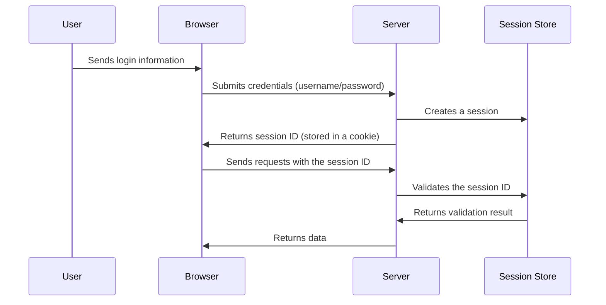
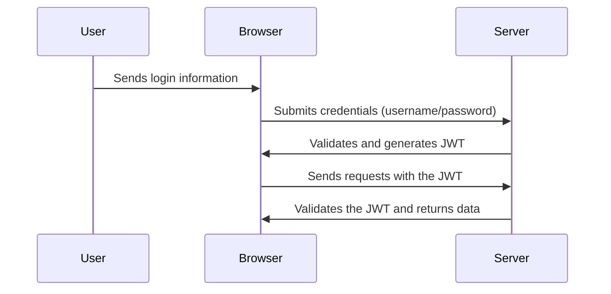
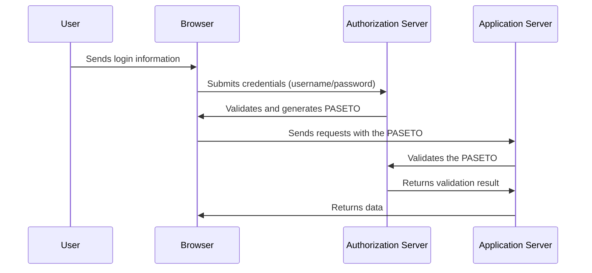

### **In-Depth Exploration of Authentication Mechanisms: Technical Insights and Practical Use Cases**

Authentication is the first line of defense in modern applications, playing a critical role in verifying user identity and restricting access to sensitive resources or key operations. This article dives deep into the most common authentication mechanisms, including Cookies, Sessions, JWT, and PASETO. We’ll analyze their technical implementations, applicable scenarios, and practical examples, along with flow diagrams (Mermaid) illustrating how each mechanism works.

---

### **1. Fundamentals of Authentication**

Authentication is a cornerstone of application security, answering the fundamental question: “Who are you?” Through authentication, systems validate user identity and regulate resource access.

Key authentication mechanisms include:

- **Cookies**
- **Sessions**
- **JWT (JSON Web Token)**
- **PASETO (Platform-Agnostic Security Token)**

The choice of an appropriate mechanism depends on the security requirements, performance demands, and user experience goals of the system.

---

### **2. Cookies and Sessions**

#### **2.1 Cookies**

**Description**  
Cookies are a stateless authentication mechanism where the server stores authentication information in the user’s browser after the initial login. On every subsequent request, the browser automatically sends the stored cookie, allowing the server to validate the user’s identity.

**Advantages**:
- No need for server-side state storage, reducing storage overhead.
- Easy to use and integrate between front-end and back-end.

**Disadvantages**:
- Data stored in the browser can be tampered with (requires encryption and signing).
- Susceptible to attacks like Cross-Site Scripting (XSS).

**Use Case**  
- **E-commerce platforms**: After a user logs in, cookies store authentication information, enabling persistent login across pages.

**Flow Diagram**  

---

#### **2.2 Sessions**

**Description**  
Sessions rely on server-side state management. When a user logs in, the server creates a session and returns a session ID to the user. The session ID is stored in the browser (typically in a cookie) and is used for subsequent requests.

**Advantages**:
- Server-controlled session data provides higher security.
- Facilitates role-based access control and session timeout functionality.

**Disadvantages**:
- Requires additional server-side storage.
- Limited scalability in large distributed systems.

**Use Case**  
- **Banking applications**: Session IDs track user activity, ensuring secure requests while enabling session timeouts.

**Flow Diagram**  

---

### **3. JWT (JSON Web Token)**

**Description**  
JWT is a stateless authentication mechanism that encodes user identity into a token, which is signed digitally. The token is sent with every request and validated by the server without requiring server-side state storage.

**Advantages**:
- Stateless authentication simplifies scalability for distributed systems.
- Can carry custom payload data, such as roles and permissions.

**Disadvantages**:
- Tokens with long expiration times can pose security risks.
- Token size may increase bandwidth usage in complex scenarios.

**Use Case**  
- **Mobile applications**: JWT is stored on the client side (e.g., local storage) and supports multi-device and high-concurrency environments.

**Flow Diagram**  

---

### **4. PASETO (Platform-Agnostic Security Token)**

**Description**  
PASETO is a modern authentication mechanism similar to JWT but designed to be more secure by default. It eliminates common pitfalls of JWT, such as insecure algorithms and misconfigurations.

**Advantages**:
- Higher security with enforced safe cryptographic algorithms.
- Simpler to use with a clear security model.

**Disadvantages**:
- Ecosystem and community support are less extensive than JWT.
- Limited native support in some languages and frameworks.

**Use Case**  
- **Healthcare systems**: PASETO ensures secure access to electronic health records, complying with stringent privacy and security regulations like HIPAA.

**Flow Diagram**  

---

### **5. Comparison Table**

| **Mechanism**      | **Advantages**                                           | **Disadvantages**                                      | **Use Case**                                   | **State**      |
|---------------------|---------------------------------------------------------|-------------------------------------------------------|-----------------------------------------------|----------------|
| **Cookies**         | Stateless, easy to use                                  | Prone to XSS attacks, tampering risks                 | E-commerce platforms                          | Stateless      |
| **Sessions**        | Higher security, supports session timeouts              | Requires server-side storage, limited scalability     | Banking applications                          | Stateful       |
| **JWT**             | Stateless, scalable, supports custom payloads           | Longer tokens increase bandwidth, prone to misuse     | Mobile applications, distributed systems      | Stateless      |
| **PASETO**          | Secure by default, avoids JWT pitfalls                  | Limited ecosystem support, new adoption curve         | Healthcare systems, high-security environments| Stateless      |

---

### **Conclusion**

Choosing the right authentication mechanism requires balancing security, user experience, and performance:

1. **Cookies and Sessions**: Best for small to medium monolithic applications with manageable user bases.
2. **JWT**: Ideal for distributed systems requiring stateless authentication.
3. **PASETO**: The best choice for applications with high-security demands, such as healthcare or financial platforms.

Developers must carefully evaluate application requirements, evolving security threats, and user expectations when implementing authentication solutions. By selecting the right mechanism, applications can ensure robust security while delivering an excellent user experience.
