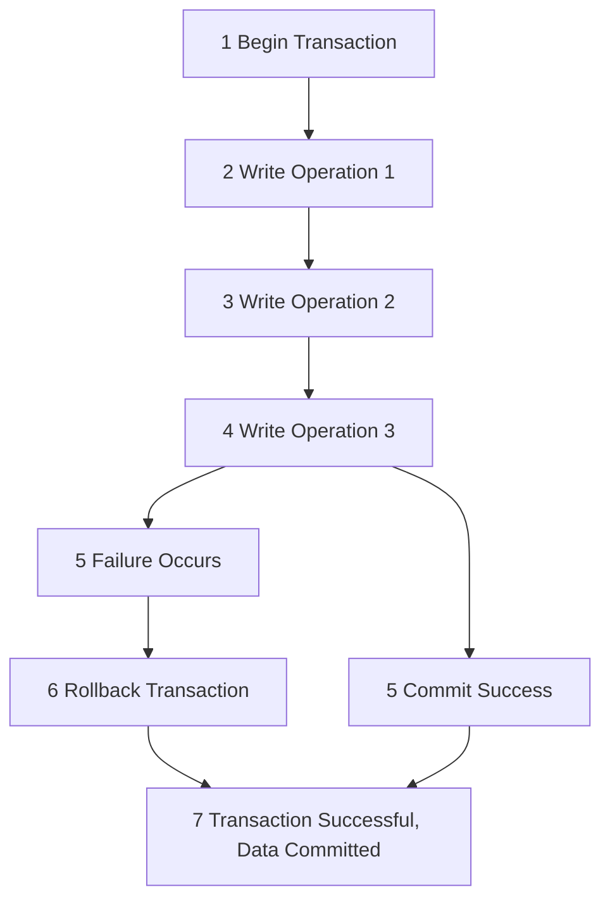
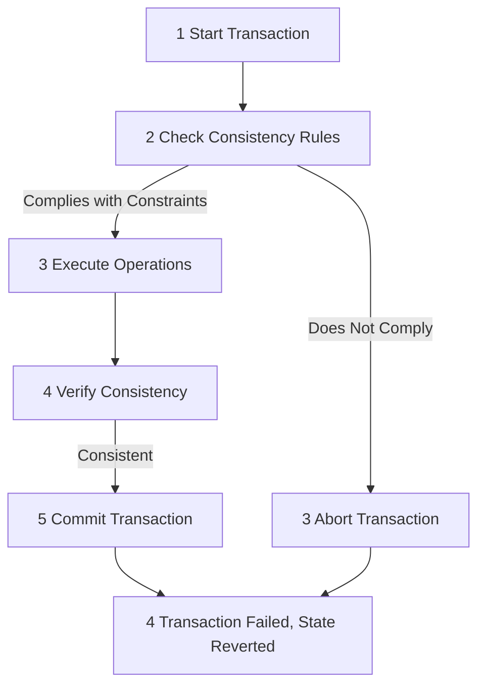
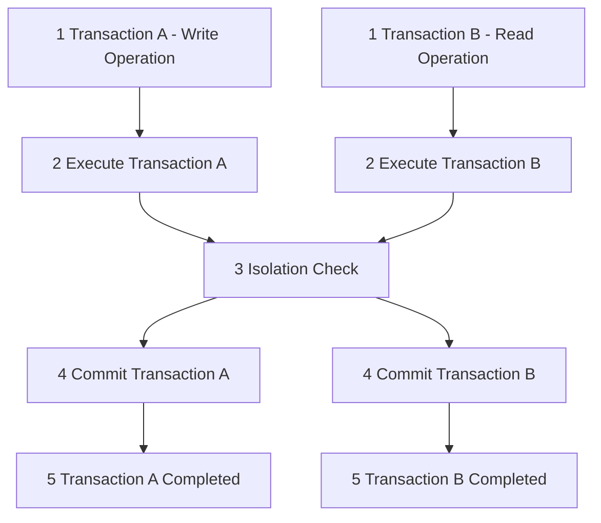
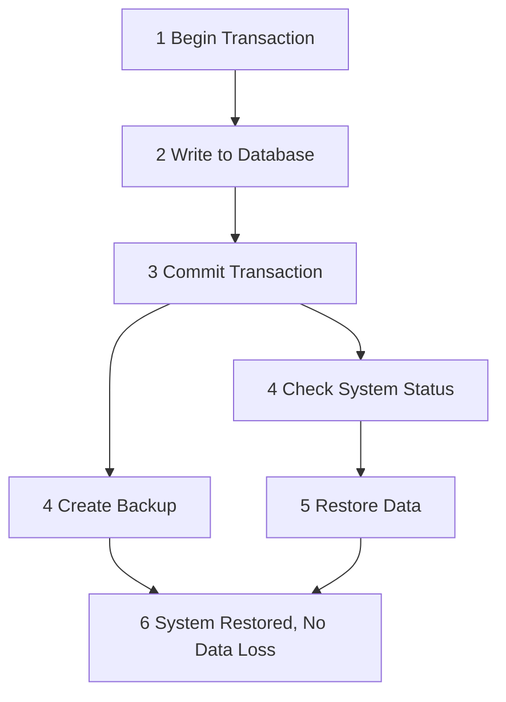

### ACID principles

---

### 1. Atomicity

Atomicity means that all operations in a transaction must either succeed completely or fail entirely. If any operation in the transaction fails, the entire transaction is rolled back, leaving the database unchanged.

### 2. Consistency

Consistency ensures that the database's state remains consistent before and after a transaction. The transaction must comply with database integrity constraints, ensuring no corrupt data is written to the database.

### 3. Isolation

Isolation ensures that concurrent transactions do not interfere with each other. The execution of one transaction should not affect the other concurrent transactions, maintaining the database's independence.

### 4. Durability

Durability means that once a transaction is successfully committed, its changes to the database will be permanently saved. Even in the event of a system crash or power loss, the data will not be lost.

---

### Summary of ACID Principles

- **Atomicity**: All operations in a transaction must either succeed together or fail together.
- **Consistency**: The execution of a transaction should not violate the database's integrity constraints.
- **Isolation**: Concurrent transactions do not interfere with each other.
- **Durability**: Once a transaction is committed, its data changes are permanently saved.

These principles are critical in database transaction management, ensuring data reliability and consistency, and they are commonly implemented in relational database systems like MySQL, PostgreSQL, and Oracle.
