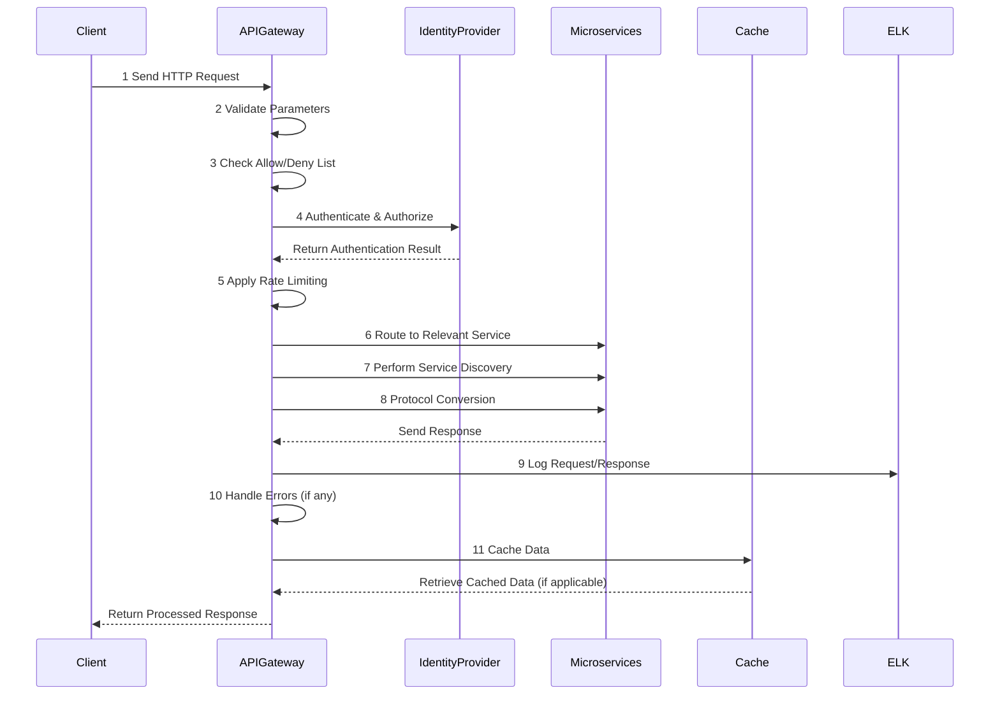

### API Gateway

```mermaid
flowchart TD
    Client[Client: Web / Mobile / PC] -->|1 HTTP Request| API_Gateway[API Gateway]
    API_Gateway -->|2 Parameter Validation| Step2[Parameter Validation]
    Step2 -->|3 Allow/Deny List Check| Step3[Allow/Deny List]
    Step3 -->|4 Authentication & Authorization| Step4[Authentication/Authorization]
    Step4 -->|5 Apply Rate Limiting| Step5[Rate Limiting]
    Step5 -->|6 Route to Relevant Service| Step6[Dynamic Routing]
    Step6 -->|7 Discover Services| Step7[Service Discovery]
    Step7 -->|8 Convert Protocols| Step8[Protocol Conversion]
    Step8 --> Microservices[Microservices]
    API_Gateway -->|9 Handle Errors| Step9[Error Handling]
    API_Gateway -->|10 Circuit Break| Step10[Circuit Break]
    API_Gateway -->|11 Logging & Monitoring| Step11[ELK Stack (Elastic-Logstash-Kibana)]
    API_Gateway -->|12 Cache Data| Step12[Redis Cache]
```




---

### **Detailed Explanation of Steps**

#### Step 1: Client Sends HTTP Request
- A client (e.g., web browser, mobile app, or PC) sends an HTTP request to the API Gateway. 
- This request includes headers, parameters, and the desired resource.

#### Step 2: Parameter Validation
- The API Gateway checks the request for required parameters and ensures they are in the correct format.
- For example, it verifies if the query parameters or body payload are valid.

#### Step 3: Allow/Deny List Check
- The API Gateway checks if the request's origin (e.g., IP address, domain) is allowed or denied based on pre-configured rules.
- If the request is from a denied source, it is rejected immediately.

#### Step 4: Authentication & Authorization
- The API Gateway communicates with an identity provider (e.g., OAuth, JWT) to validate the client's identity.
- It also checks whether the client has the necessary permissions to access the requested resource.

#### Step 5: Apply Rate Limiting
- Rate limiting rules are applied to control how many requests a client can make within a specific time period.
- If the client exceeds the limit, the request is rejected to prevent abuse or overload.

#### Step 6: Route to Relevant Service
- Based on the request's path or endpoint, the API Gateway determines which backend service should handle the request.
- For example, `/users` might route to the user service, while `/orders` routes to the order service.

#### Step 7: Service Discovery
- If the relevant service is part of a dynamic microservices environment, the API Gateway discovers the service's location or instance (e.g., via service registries like Consul or Eureka).

#### Step 8: Protocol Conversion
- The API Gateway converts the request into a protocol or format understood by the backend service.
- For instance, it may convert an HTTP request into a gRPC or SOAP request.

#### Step 9: Handle Errors
- If an error occurs during processing, the API Gateway handles it gracefully by returning an appropriate error response to the client.
- It may also include retry logic if applicable.

#### Step 10: Circuit Break
- If a service is unavailable or slow to respond, the API Gateway activates a circuit breaker mechanism.
- This prevents further requests from overloading the failing service and provides fallback responses if configured.

#### Step 11: Logging & Monitoring
- The API Gateway logs requests and responses using monitoring tools like the ELK stack (ElasticSearch, Logstash, Kibana).
- These logs are used for performance analysis, debugging, and system health monitoring.

#### Step 12: Cache Data
- Frequently accessed data (e.g., user details, product lists) is cached in the API Gateway to reduce backend load and improve response times.
- Cached data is retrieved if available, bypassing the need to contact the backend service.

### **Summary**

These steps illustrate how the API Gateway processes and optimizes incoming requests while ensuring security, performance, and reliability. Using tools like ELK for logging and Redis for caching further enhances the system's scalability and observability. The combination of these features makes API Gateways indispensable in modern microservices architectures.
